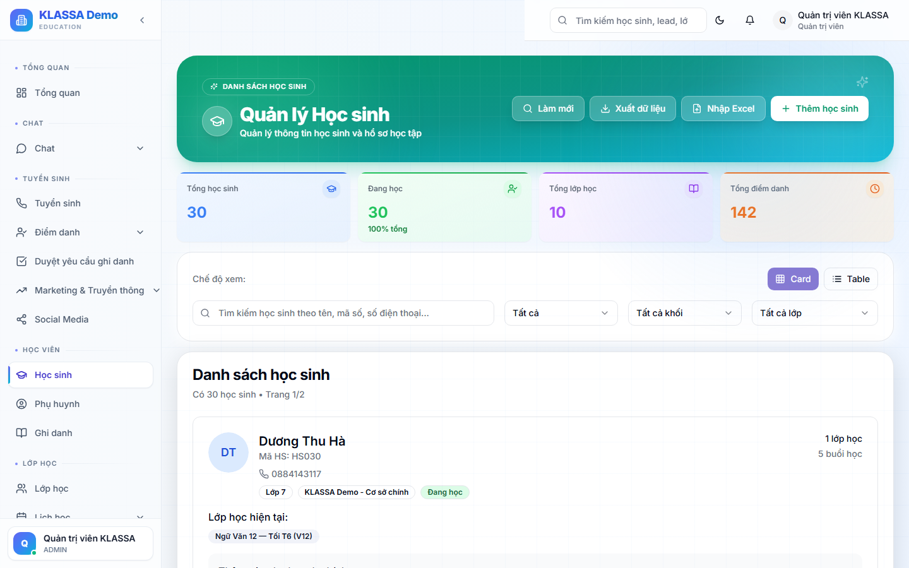
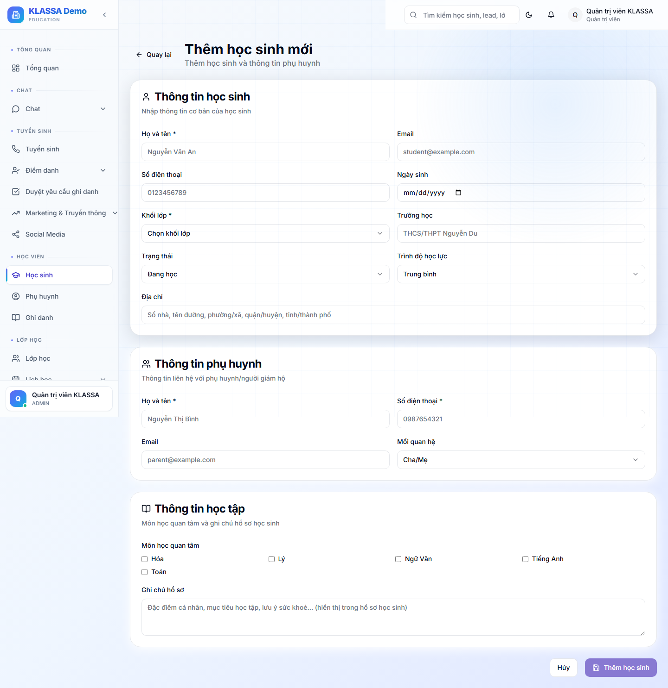
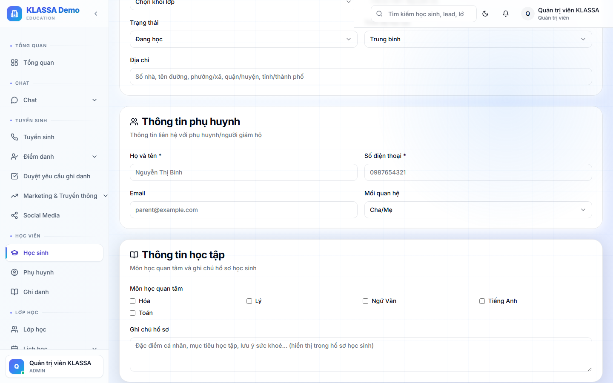
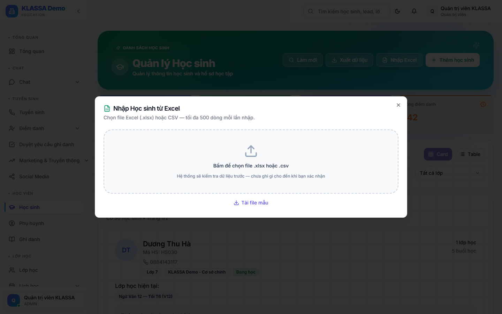
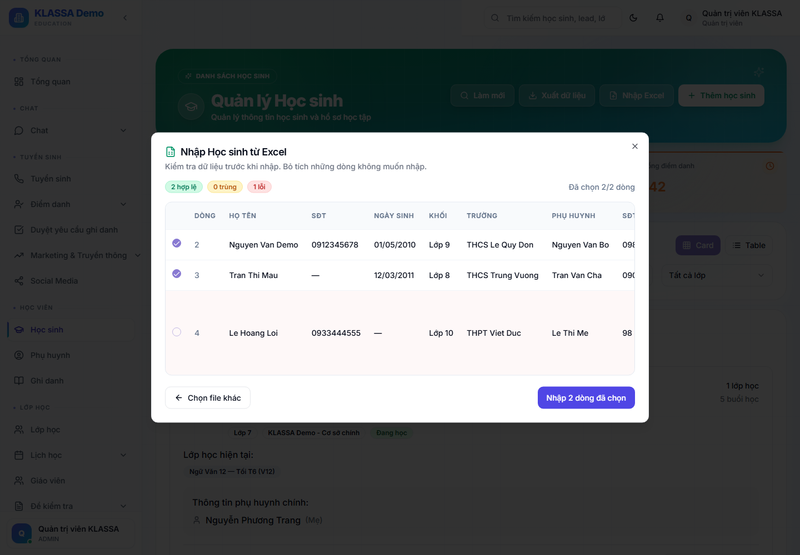

# Tạo hồ sơ học sinh mới

## Khi nào dùng

- Học sinh chính thức đăng ký (đã đóng học phí hoặc cam kết)
- Nhập danh sách học sinh cũ vào hệ thống khi mới triển khai phần mềm

> **Lưu ý quan trọng:** Học sinh từ Lead (khách quan tâm) thì KHÔNG tạo ở đây — dùng nút **"Chuyển thành học sinh"** trong trang Lead. Xem [Chuyển Lead thành Học sinh](../tuyen-sinh/chuyen-lead-thanh-hoc-sinh.md).

## Cách 1 — Tạo thủ công 1 học sinh

### Bước 1 — Mở form

Vào **Học sinh** → bấm nút **"Thêm học sinh"** ở góc phải dải tiêu đề (cũng hiện ở giữa màn hình khi danh sách trống). Phần mềm chuyển sang trang **"Thêm học sinh mới"**.

Nút này chỉ hiện với tài khoản có quyền tạo học sinh (Chủ trung tâm / Quản lý / Lễ tân).

### Bước 2 — Điền 3 phần thông tin

Form gồm đúng **3 thẻ**. Trường có dấu **\*** là bắt buộc.

#### Thẻ 1 — Thông tin học sinh
- **Họ và tên \*** — bắt buộc
- **Khối lớp \*** — bắt buộc (chọn từ Tiền tiểu học → Lớp 12)
- Email, Số điện thoại học sinh, Ngày sinh, Trường học, Địa chỉ — **tuỳ chọn**
- Trạng thái — mặc định "Đang học"
- Trình độ học lực — mặc định "Trung bình"

> Form **KHÔNG có** ô Giới tính và **KHÔNG có** upload ảnh chân dung.

#### Thẻ 2 — Thông tin phụ huynh
- **Họ và tên phụ huynh \*** — bắt buộc
- **Số điện thoại phụ huynh \*** — bắt buộc
- Email phụ huynh, Mối quan hệ (mặc định "Cha/Mẹ") — tuỳ chọn

> Form **chỉ nhập 1 phụ huynh**, không có nút thêm phụ huynh thứ 2 và không có ô gợi ý phụ huynh đã có — anh chị gõ tay. Nếu phụ huynh đã tồn tại (trùng SĐT/email), **phần mềm tự nhận diện và gộp** vào hồ sơ phụ huynh sẵn có.

#### Thẻ 3 — Thông tin học tập
- Môn học quan tâm (tick chọn), Ghi chú hồ sơ — tuỳ chọn

### Bước 3 — Bấm "Thêm học sinh"

Nút lưu ở cuối trang có nhãn **"Thêm học sinh"**. Khi lưu, phần mềm tự động:

- Sinh **mã học sinh** dạng `HQ-L{khối}-{số thứ tự}` (ví dụ `HQ-L9-001`)
- Tạo hồ sơ học sinh (trạng thái Đang học)
- Nếu phụ huynh chưa có → tạo **hồ sơ phụ huynh + tài khoản đăng nhập**

> **Tài khoản phụ huynh tạo mới có mật khẩu mặc định `12345678`** và đăng nhập được ngay (không bắt đổi mật khẩu). Đây là chủ đích để phụ huynh — đối tượng không rành công nghệ — vào app dễ dàng. Nếu phụ huynh không nhập email, phần mềm tự đặt email theo số điện thoại.

> **Học sinh tạo ra CHƯA thuộc lớp nào.** Form tạo học sinh KHÔNG có bước ghi danh vào lớp. Sau khi tạo xong, vào [Ghi danh học sinh vào lớp](../lop-hoc/ghi-danh.md) để thêm em vào lớp. Hoá đơn học phí cũng tạo riêng sau đó.

## Cách 2 — Nhập hàng loạt từ Excel

Phù hợp khi nhập danh sách lớn (chuyển từ phần mềm cũ, đầu năm học mới). Trang **Học sinh** → bấm nút **"Nhập Excel"** (cạnh nút Thêm học sinh). Mỗi lần tối đa **500 dòng**.

**File không cần đúng khuôn mẫu.** Phần mềm tự đọc file, tự ghép cột của anh chị về đúng thông tin của hệ thống — kể cả khi tên cột đặt tự do, họ và tên tách hai cột, hay một ô ghi chung cả tên lẫn số điện thoại phụ huynh. Anh chị xem lại việc ghép ở bước 2, sửa từng ô ở bước 3 rồi mới xác nhận.

Bốn bước và cách xử lý các ca đặc biệt: xem [Nhập dữ liệu hàng loạt từ Excel](../bat-dau/nhap-du-lieu-hang-loat.md).

**Bắt buộc phải có:** Họ tên, Khối (hiểu được "Lớp 6", "Khối 6", "6A1", "Tiền tiểu học"), **Tên phụ huynh**, **SĐT phụ huynh**. Các cột SĐT học sinh, ngày sinh, trường, email phụ huynh, ghi chú là tuỳ chọn.

Ở bảng duyệt, mỗi dòng có nhãn màu — 🟢 hợp lệ (tích sẵn), 🟡 trùng (bỏ tích sẵn), 🔴 lỗi kèm lý do — và anh chị **sửa thẳng vào ô** để chữa dòng lỗi, hoặc bấm **Nhờ AI đề xuất cho dòng lỗi** rồi duyệt từng đề xuất.

Cuối cùng phần mềm báo số tạo thành công / bỏ qua kèm lý do từng dòng. Tài khoản phụ huynh từ nhập Excel cũng dùng mật khẩu mặc định `12345678`.

## Lưu ý

- **Bắt buộc tối thiểu 1 phụ huynh** (tên + SĐT) — không thể tạo học sinh không có phụ huynh.
- **Chống trùng**: phần mềm chặn nếu trùng bộ ba Tên HS + SĐT HS + phụ huynh (báo lỗi kèm mã HS đã tồn tại).
- **Vượt giới hạn gói**: nếu trung tâm vượt số học sinh cho phép của gói (hoặc gói hết hạn), phần mềm chặn tạo và báo nâng cấp gói.

## Câu hỏi thường gặp

**Phụ huynh có 2 con cùng học thì sao?**
Tạo con thứ nhất bình thường. Tạo con thứ hai với **cùng SĐT phụ huynh** → phần mềm tự nhận diện và gắn cả 2 con vào một tài khoản phụ huynh.

**Tạo xong sao chưa thấy em trong lớp nào?**
Đúng. Tạo hồ sơ và ghi danh vào lớp là 2 bước riêng. Vào [Ghi danh học sinh vào lớp](../lop-hoc/ghi-danh.md) để thêm em vào lớp.

**Phụ huynh đăng nhập bằng gì?**
Bằng email (hoặc số điện thoại) đã nhập + mật khẩu mặc định **`12345678`**. Khuyến khích phụ huynh đổi mật khẩu sau lần đầu.
