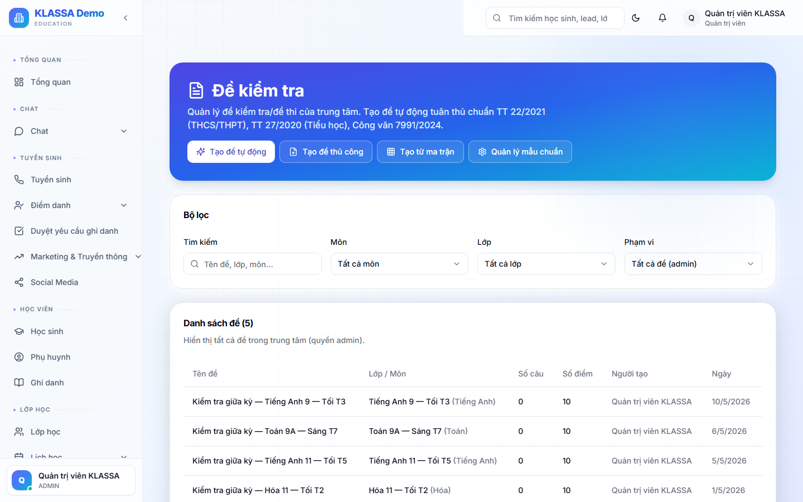

# Bài đánh giá định kỳ

## Khái niệm

**Bài đánh giá** (assessment) là bài kiểm tra để đo trình độ học sinh:

- Kiểm tra miệng đầu giờ
- Bài 15 phút
- Bài 1 tiết
- Kiểm tra giữa khoá / cuối khoá

KLASSA cho phép tạo bài đánh giá, gán cho lớp, nhập điểm và phân tích kết quả.

## Truy cập

Menu trái → **Bài đánh giá** (hoặc trong chi tiết lớp → tab Bài đánh giá).

## Tạo bài đánh giá mới

### Bước 1 — Bấm "+ Tạo bài đánh giá"

### Bước 2 — Điền thông tin

- **Tên bài** — ví dụ "Kiểm tra giữa kỳ — Toán 9A"
- **Lớp** — chọn lớp làm bài
- **Loại bài** — Miệng / 15 phút / 1 tiết / Giữa khoá / Cuối khoá
- **Ngày làm bài**
- **Thang điểm** — 10 / 100 / pass-fail
- **Hệ số** — bài cuối khoá hệ số 3, bài thường hệ số 1 (phục vụ tính trung bình)
- **Mô tả** — chủ đề kiểm tra, nội dung

### Bước 3 — Đính kèm đề (tuỳ chọn)

- Upload file PDF đề
- Hoặc soạn đề trong [Ngân hàng câu hỏi](ngan-hang-cau-hoi.md)
- Hoặc dùng [Ma trận đề thi](ma-tran-de-thi.md) tự sinh

### Bước 4 — Lưu

## Nhập điểm

Sau khi học sinh làm bài, vào chi tiết bài → tab **"Nhập điểm"**:

- Bảng danh sách học sinh trong lớp
- Cột "Điểm" — gõ điểm từng em
- Cột "Nhận xét" — tuỳ chọn, ghi nhận xét riêng

Bấm **"Lưu"** → điểm tự cập nhật vào hồ sơ học sinh.

## Phụ huynh xem điểm

Sau khi lưu, phụ huynh thấy điểm + nhận xét trong **Cổng Phụ huynh → Điểm số**.

Có thể bật **"Gửi Zalo thông báo điểm"** ngay khi nhập xong.

## Lưu ý

- **Hệ số** quyết định bài đó ảnh hưởng nhiều ít đến điểm trung bình.
- **Không xoá bài** sau khi đã nhập điểm — nếu sai, sửa từng điểm chứ không xoá.
- **In bảng điểm** ra giấy: chi tiết bài → bấm "In".

## Câu hỏi thường gặp

**Tôi muốn tạo cùng 1 bài cho 3 lớp khác nhau, có cách nhanh không?**
Sau khi tạo bài cho lớp 1, vào chi tiết → bấm **"Sao chép sang lớp khác"** → chọn 2 lớp còn lại.

**Học sinh vắng buổi kiểm tra, làm sao?**
Để trống điểm hoặc nhập "Vắng" — bài sẽ không tính vào trung bình. Sau khi học sinh làm bù, sửa điểm vào.

**Bảo mật đề**: phụ huynh có xem được file đề không?
Mặc định không. Chỉ hiển thị điểm + nhận xét, không hiển thị file đề.
