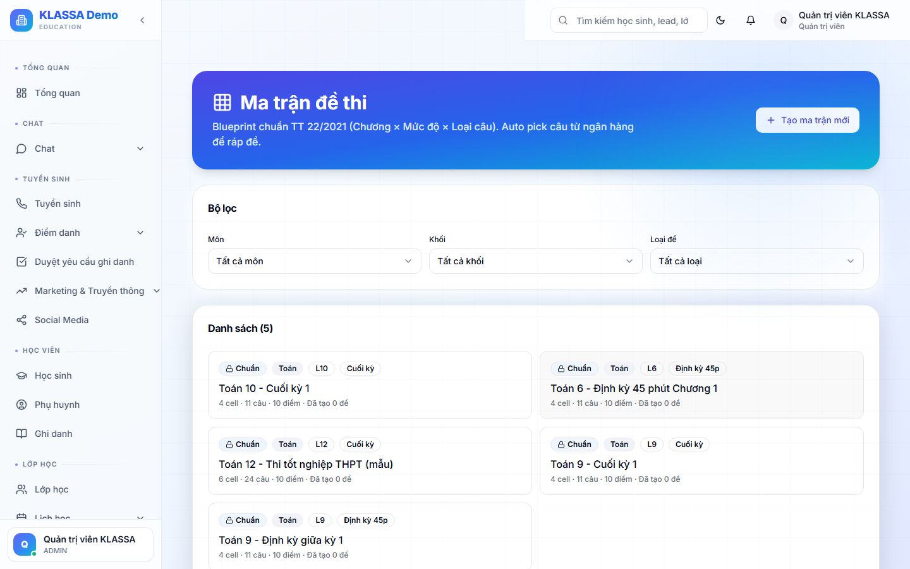

# Ma trận đề thi

## Khái niệm

**Ma trận đề** là quy tắc cấu trúc đề thi — quy định mỗi đề có bao nhiêu câu, ở chủ đề nào, độ khó ra sao. Phần mềm dùng ma trận để **tự sinh đề** từ Ngân hàng câu hỏi.

Ví dụ ma trận:
- 5 câu Đại số (Dễ)
- 3 câu Hình học (TB)
- 2 câu Số học (Khó)
- → Tổng 10 câu

## Khi nào dùng

- Cần ra đề kiểm tra nhanh từ kho câu sẵn có
- Muốn mỗi học sinh có đề khác nhau (chống nhìn bài)
- Đảm bảo đề cân bằng giữa các chủ đề

## Tạo ma trận

### Bước 1 — Vào trang Ma trận đề

Menu trái → **Ma trận đề thi**.

### Bước 2 — Bấm "+ Tạo ma trận"

### Bước 3 — Điền

- **Tên ma trận** — ví dụ "Kiểm tra giữa kỳ Toán 9"
- **Môn** — Toán
- **Tổng số câu**
- **Thời gian làm bài**

### Bước 4 — Định nghĩa từng dòng ma trận

Mỗi dòng = 1 nhóm câu hỏi:

| Chủ đề | Độ khó | Số câu | Điểm/câu |
|--------|--------|--------|----------|
| Đại số | Dễ | 5 | 1 |
| Hình học | TB | 3 | 1.5 |
| Số học | Khó | 2 | 2.5 |

### Bước 5 — Lưu

## Sinh đề từ ma trận

Sau khi có ma trận, tạo bài đánh giá:

1. **Bài đánh giá → +Tạo bài đánh giá → Dùng ma trận**
2. Chọn ma trận đã tạo
3. Phần mềm tự rút câu hỏi từ Ngân hàng theo ma trận:
   - Nếu thiếu câu trong Ngân hàng → cảnh báo "Còn thiếu 2 câu Hình TB"
   - Đủ → bấm **"Sinh đề"** → tạo bộ đề ngẫu nhiên

### Sinh nhiều đề khác nhau

Bật **"Mỗi học sinh một đề khác nhau"** — phần mềm sinh N đề (N = sĩ số lớp), mỗi đề rút câu khác nhau nhưng theo cùng cấu trúc.

→ Chống nhìn bài nhưng vẫn đảm bảo công bằng.

## Lưu ý

- **Ngân hàng đủ câu**: ma trận đòi 5 câu Đại số Dễ → Ngân hàng phải có ít nhất 5 câu Đại số Dễ. Khuyến nghị nhiều hơn để có chỗ rút ngẫu nhiên.
- **Tránh trùng câu**: nếu sinh nhiều đề + Ngân hàng ít, có thể bị trùng. Phần mềm cố gắng tránh nhưng không đảm bảo 100%.

## Câu hỏi thường gặp

**Một ma trận dùng được cho nhiều bài kiểm tra không?**
Có. Tạo 1 ma trận "Kiểm tra 15 phút Đại số" → dùng nhiều lần, mỗi lần sinh đề khác.

**Tôi không muốn dùng ma trận, tự chọn câu được không?**
Được. Khi tạo bài đánh giá, bỏ qua bước chọn ma trận → tự chọn câu thủ công từ Ngân hàng.
