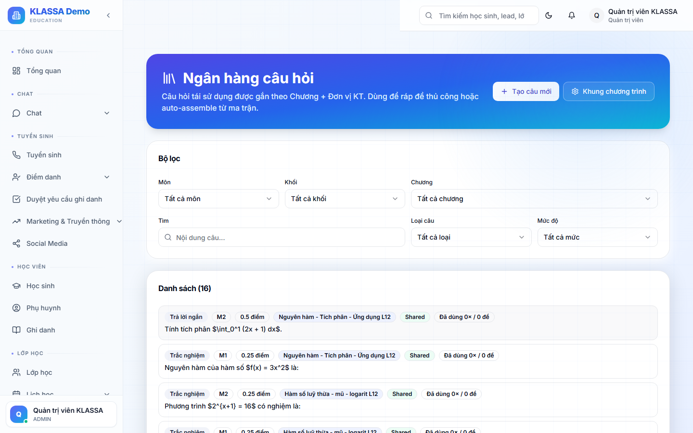

# Ngân hàng câu hỏi

## Khái niệm

**Ngân hàng câu hỏi** lưu trữ tất cả câu hỏi/bài tập của trung tâm theo cấu trúc khoa học:

- Phân theo môn, lớp, chủ đề, độ khó
- Gắn nhãn để tìm nhanh
- Tái sử dụng nhiều lần
- Dùng làm nguồn cho **Ma trận đề** tự sinh đề kiểm tra

## Khi nào dùng

- Tích luỹ kho câu hỏi nội bộ
- Trộn câu để ra đề khác nhau cho từng lớp / từng kỳ
- Chia sẻ kho câu hỏi giữa giáo viên cùng trung tâm

## Truy cập

Menu trái → **Ngân hàng câu hỏi**.

## Thêm câu hỏi mới

### Bước 1 — Bấm "+ Thêm câu hỏi"

### Bước 2 — Chọn dạng câu hỏi

- **Trắc nghiệm 1 đáp án** (A/B/C/D)
- **Trắc nghiệm nhiều đáp án**
- **Đúng / Sai**
- **Điền khuyết** (gõ đáp án ngắn)
- **Tự luận** (giáo viên chấm tay)

### Bước 3 — Nhập nội dung

- Đề bài (hỗ trợ công thức Toán LaTeX, ảnh, video)
- Các phương án (cho trắc nghiệm)
- Đáp án đúng
- Lời giải / giải thích (gửi cho HS sau khi làm bài)

### Bước 4 — Gán thuộc tính

- **Môn** — Toán / Văn / Tiếng Anh…
- **Lớp** — Lớp 6, 7, 8, 9…
- **Chủ đề** — Hình học / Đại số / Số học…
- **Độ khó** — Dễ / TB / Khó / Rất khó
- **Nhãn tự do** — gắn tag tuỳ chọn

## Tìm câu hỏi

Bộ lọc:

- Theo môn / lớp / chủ đề / độ khó
- Tìm theo từ khoá trong đề
- Theo người tạo
- Theo lần dùng (chưa dùng / dùng dưới X lần)

## Nhập câu hỏi từ Excel

Khi có sẵn ngân hàng câu hỏi (file Word / Excel), có thể nhập hàng loạt:

1. **Ngân hàng → Nhập Excel**
2. Tải file mẫu
3. Điền theo cột
4. Tải lên

Phù hợp khi chuyển từ phần mềm cũ sang KLASSA.

## Chia sẻ giữa các giáo viên

Mặc định câu hỏi do giáo viên tạo chỉ chính giáo viên đó dùng. Có thể:

- **Chia sẻ với cả khoá** — các giáo viên cùng dạy khoá đều dùng được
- **Công khai trong trung tâm** — toàn trung tâm dùng

## Lưu ý

- **Không trùng câu hỏi**: phần mềm cảnh báo nếu phát hiện đề giống y hệt câu đã có.
- **Bảo mật**: học sinh không truy cập được ngân hàng câu hỏi.
- **Lời giải** xuất hiện sau khi HS làm xong bài, không hiển thị lúc đang làm.

## Câu hỏi thường gặp

**Tôi muốn ngân hàng câu hỏi dùng chung cho nhiều trung tâm, được không?**
Hiện tại ngân hàng riêng từng trung tâm. Tính năng "Ngân hàng câu hỏi cộng đồng" đang phát triển.

**Câu hỏi có hình ảnh / video, dùng được không?**
Được. Upload ảnh trực tiếp trong editor đề bài, hoặc dán link YouTube cho video.
