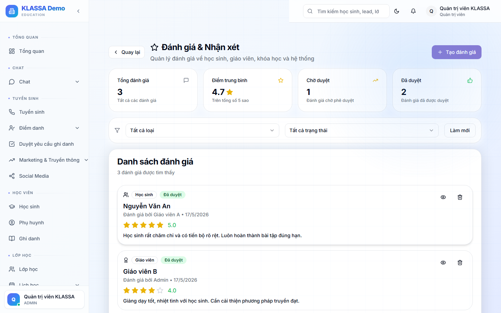

# Đánh giá học sinh — nhận xét, điểm số

## Khái niệm

Khác với **bài đánh giá** (kiểm tra cụ thể), **đánh giá học sinh** là ghi nhận tổng hợp của giáo viên về một học sinh sau một giai đoạn (tuần, tháng, học kỳ).

Gồm:
- Điểm số (nếu áp dụng)
- Nhận xét bằng văn bản
- Kỹ năng (chuyên cần, thái độ, tiếp thu, sáng tạo…)

## Khi nào dùng

- Cuối tuần: giáo viên gửi nhận xét nhanh cho phụ huynh
- Cuối tháng: báo cáo tiến bộ tổng quan
- Cuối khoá: đánh giá xếp loại + đề xuất khoá tiếp theo

## Cách dùng

### Cách 1 — Đánh giá nhanh trong buổi học

Sau khi chấm điểm danh, giáo viên có thể bấm **"+ Nhận xét"** trên từng học sinh:

- Gõ vài câu nhận xét
- Tick các kỹ năng (Tiếp thu nhanh / Cần hỏi nhiều / Tích cực phát biểu…)

### Cách 2 — Đánh giá định kỳ

1. Vào **Đánh giá học sinh** → bấm **"+ Tạo đánh giá định kỳ"**
2. Chọn:
   - Lớp / Học sinh cần đánh giá
   - Loại đánh giá (Tuần / Tháng / Học kỳ / Cuối khoá)
   - Kỳ đánh giá (ví dụ Tháng 5/2026)
3. Điền:
   - Điểm các kỹ năng (5 sao)
   - Nhận xét chi tiết
   - Đề xuất (Lên lớp / Học lại / Khoá khác)

### Cách 3 — Đánh giá hàng loạt cả lớp

Trang chi tiết lớp → tab Đánh giá → **"Đánh giá hàng loạt"** → mở giao diện bảng:

- Hàng = học sinh
- Cột = các kỹ năng + ô nhận xét

Phù hợp khi cần đánh giá cuối tháng cho cả lớp.

## Mẫu nhận xét có sẵn

Phần mềm có **thư viện mẫu** để giáo viên không phải viết lại:

- "Học sinh có tiến bộ rõ rệt về..."
- "Cần luyện tập thêm phần..."
- "Tích cực phát biểu trong giờ học"
- "Tiếp thu nhanh nhưng còn ẩu khi..."

Có thể tự thêm mẫu mới trong **Cài đặt → Mẫu nhận xét**.

## Phụ huynh xem ở đâu?

- Cổng Phụ huynh → **"Học tập"** → xem nhận xét + kỹ năng theo từng kỳ
- Có thể nhận thông báo Zalo mỗi lần có nhận xét mới (nếu trung tâm bật)

## Lưu ý

- **Nhận xét phải xây dựng** — tránh ngôn từ tiêu cực ảnh hưởng tâm lý học sinh.
- **Đánh giá đúng thực tế** — không tô hồng, không nói quá xấu, ảnh hưởng tin tưởng của phụ huynh khi đối chiếu thực tế.
- **Bảo mật**: nhận xét chỉ phụ huynh + giáo viên + Quản lý xem được. Học sinh khác không thấy.

## Câu hỏi thường gặp

**Tôi có thể đánh giá ẩn danh không (phụ huynh không thấy)?**
Có. Bật **"Đánh giá nội bộ"** khi tạo — chỉ Quản lý xem được, dùng để theo dõi nội bộ.

**Có thể đánh giá ngược (học sinh chấm giáo viên) không?**
Có, dùng [Phản hồi](../phan-hoi/tiep-nhan.md) — học sinh / phụ huynh chấm sao giáo viên + ý kiến.
