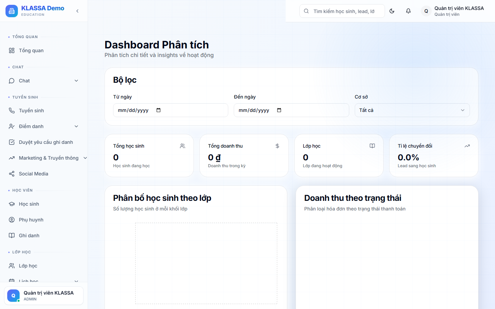

# Phân tích kết quả học tập

## Khi nào dùng

- Đánh giá tiến độ học sinh trong khoá
- So sánh trình độ giữa các lớp
- Báo cáo cho phụ huynh / hội đồng chuyên môn
- Phát hiện học sinh đang chững / tiến bộ

## Truy cập

Menu trái → **Phân tích** (Analytics) — hoặc từ chi tiết lớp → tab Phân tích.

## Các biểu đồ chính

### 1. Biểu đồ điểm theo thời gian

Đường thể hiện điểm trung bình của 1 học sinh hoặc 1 lớp qua từng kỳ kiểm tra.

- Xu hướng đi lên = tiến bộ
- Xu hướng đi xuống = cần can thiệp

### 2. Phân bố điểm

Biểu đồ cột thể hiện phân bố điểm trong lớp:

- Bao nhiêu em giỏi (>=8)
- Bao nhiêu em khá (7-8)
- Bao nhiêu em trung bình (5-7)
- Bao nhiêu em yếu (<5)

### 3. So sánh lớp với khoá

So sánh điểm trung bình lớp A vs lớp B vs lớp C (cùng khoá) → biết lớp nào học tốt hơn.

### 4. Heatmap kỹ năng

Hiển thị **điểm mạnh - điểm yếu** theo từng chủ đề (ví dụ Hình học vs Đại số) — chỉ áp dụng khi đề thi có gán chủ đề.

## Bộ lọc

- Học sinh / Lớp / Khoá
- Khoảng thời gian
- Loại bài đánh giá (Kiểm tra miệng / 15 phút / 1 tiết / Cuối khoá)

## Xuất báo cáo

- **PDF cho phụ huynh** — chỉ chứa thông tin của 1 học sinh, không hiển thị HS khác
- **Excel cho hội đồng chuyên môn** — chi tiết theo lớp

## Lưu ý

- **Cần nhập điểm đầy đủ** thì biểu đồ mới chính xác — nếu chỉ có 1-2 điểm, biểu đồ không có ý nghĩa.
- **Chỉ giáo viên + Quản lý xem được** phân tích chi tiết.

## Câu hỏi thường gặp

**Phụ huynh có thấy phân tích này không?**
Phụ huynh chỉ thấy điểm + nhận xét của con mình trong Cổng Phụ huynh, không thấy so sánh với các HS khác.

**Có thể dự đoán điểm cuối khoá không?**
Có (tính năng thử nghiệm). Vào **Báo cáo AI** — phần mềm dùng AI dự đoán dựa trên các bài đã làm. Chỉ tham khảo, không phải con số chính xác.
