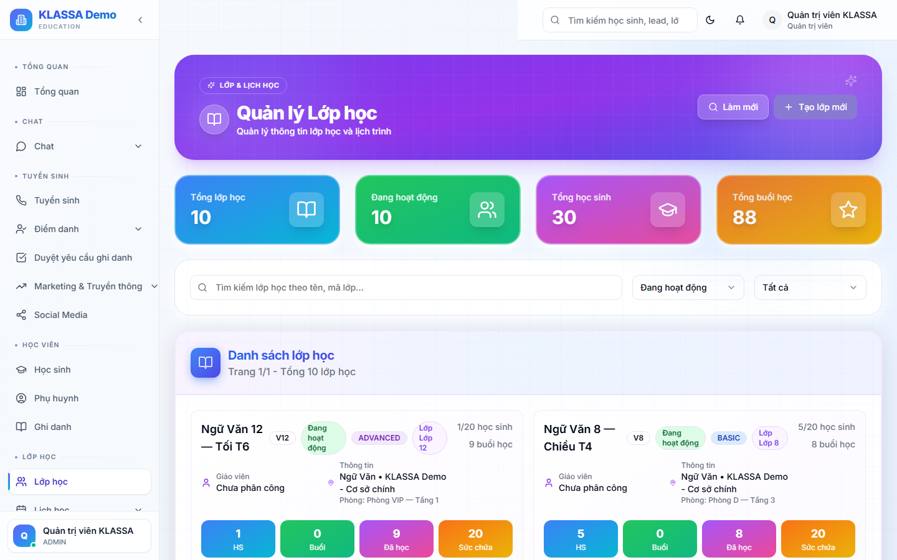

# Chi tiết lớp — học sinh, giáo viên, lịch

## Khi nào dùng

- Xem ai đang trong lớp
- Sửa lịch dạy
- Đổi giáo viên / phòng cho một buổi
- Theo dõi tỷ lệ chuyên cần của lớp

## Cách mở

Từ **Danh sách lớp** → bấm vào lớp.

## Bố cục

### Phần đầu — Tổng quan lớp

- Tên lớp + Khoá + Cơ sở + Phòng
- Giáo viên + Trợ giảng
- Số học sinh đang ghi danh / Sức chứa
- Tỷ lệ chuyên cần trung bình
- Số buổi đã học / Tổng buổi của khoá

### Tab "Học sinh"

Danh sách học sinh trong lớp:
- Bấm vào tên để mở [chi tiết học sinh](../hoc-sinh/chi-tiet.md)
- Bấm **"+ Thêm học sinh"** để ghi danh
- Bấm dấu **❌** để gỡ học sinh khỏi lớp

### Tab "Lịch dạy"

Bảng tất cả buổi học của lớp:
- Ngày, giờ, phòng
- Giáo viên dạy
- Trạng thái: Sắp tới / Đang diễn ra / Đã kết thúc / Đã huỷ
- Tỷ lệ điểm danh nếu đã chấm

Bấm vào buổi để xem chi tiết / chấm điểm danh.

### Tab "Điểm danh"

Bảng tổng hợp điểm danh theo buổi:
- Hàng = học sinh
- Cột = buổi học
- Ô = trạng thái (Có mặt / Vắng / Đi muộn / Học bù)

Phục vụ in báo cáo gửi phụ huynh cuối tháng.

### Tab "Bài đánh giá"

Các bài kiểm tra của lớp:
- Tên bài, ngày làm
- Điểm trung bình
- Bấm để xem điểm từng em

### Tab "Tài liệu lớp"

File giáo trình, bài tập về nhà, ảnh lớp...

## Thao tác nhanh

- **✏️ Sửa lớp** — đổi tên, giáo viên, lịch
- **📋 Sao chép lớp** — tạo lớp mới giống lớp hiện tại
- **⏸ Tạm dừng** — không chạy lịch dạy nữa nhưng giữ học sinh
- **🛑 Kết thúc lớp** — đóng lớp, học sinh chuyển sang "Hoàn thành"

## Lưu ý

- **Đổi giáo viên giữa khoá**: vào tab Lịch dạy → chọn các buổi từ ngày X trở đi → đổi giáo viên hàng loạt.
- **Huỷ 1 buổi** (giáo viên ốm, lễ): chọn buổi → bấm "Huỷ" → chọn lý do → phần mềm tự lên lịch dạy bù.

## Câu hỏi thường gặp

**Tôi muốn gửi tin Zalo cho phụ huynh cả lớp, ở đâu?**
Tab Học sinh → tick chọn tất cả → bấm "Gửi tin Zalo" → chọn mẫu hoặc tự soạn.

**Lớp đang chạy, có thể đổi sang phòng khác không?**
Có. Sửa lớp → đổi phòng → phần mềm hỏi áp dụng từ buổi nào trở đi.
