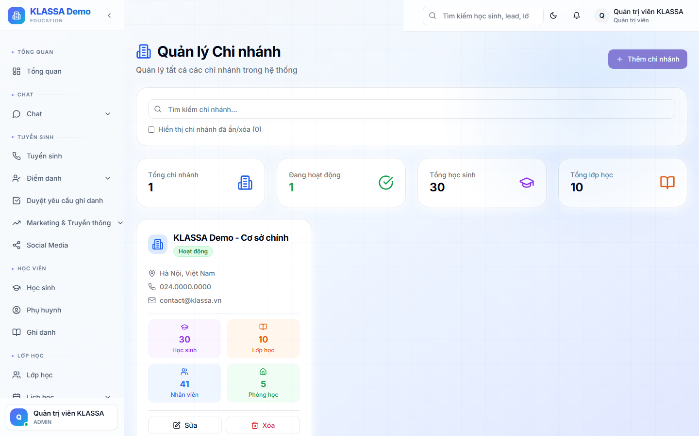

# Quản lý cơ sở (nhiều chi nhánh)

## Khi nào dùng

Khi trung tâm có **2 hoặc nhiều chi nhánh** (cơ sở vật chất khác nhau). Mỗi cơ sở có:

- Địa chỉ riêng
- Phòng học riêng
- Đội ngũ riêng (giáo viên, lễ tân)
- Có thể có quản lý chi nhánh riêng

Trung tâm 1 cơ sở thì không cần dùng chức năng này — mọi thứ mặc định cùng 1 cơ sở.

## Truy cập

Menu **Lớp học → Cơ sở** (hoặc **Cài đặt → Quản lý cơ sở** cho Admin).

## Thông tin một cơ sở

- Tên cơ sở (ví dụ "Cơ sở Cầu Giấy")
- Địa chỉ
- Số điện thoại liên hệ
- Email
- Người quản lý chi nhánh
- Số phòng học
- Sức chứa tối đa
- Trạng thái (Đang hoạt động / Tạm đóng)

## Tạo cơ sở mới

Bấm **"+ Tạo cơ sở"**, điền thông tin trên. Sau khi tạo:

1. Vào tab **"Phòng học"** → thêm các phòng của cơ sở
2. Tab **"Nhân sự"** → gán nhân viên thuộc cơ sở
3. Tab **"Cài đặt"** → tuỳ chỉnh logo, mẫu hoá đơn riêng cho cơ sở (nếu cần)

## Cách dữ liệu được phân theo cơ sở

| Loại dữ liệu | Phân theo cơ sở? |
|--------------|:----------------:|
| Học sinh | ✅ |
| Lớp học | ✅ |
| Giáo viên | ✅ |
| Hoá đơn | ✅ |
| Báo cáo doanh thu | ✅ |
| Lead | ❌ (chung toàn trung tâm) |
| Cài đặt phần mềm | ❌ (chung) |

## Vai trò quan trọng

- **Quản lý chi nhánh** chỉ thấy dữ liệu của cơ sở mình
- **Quản lý** (toàn trung tâm) thấy tất cả cơ sở
- **Chủ trung tâm** có quyền cao nhất

## Lưu ý

- **Không xoá cơ sở** có học sinh đang học — phải chuyển hết học sinh sang cơ sở khác trước.
- **Tạm đóng cơ sở**: vẫn giữ dữ liệu, chỉ ngừng tạo lớp mới và ghi danh.
- **Học sinh chuyển cơ sở**: sửa hồ sơ học sinh → đổi cơ sở. Lịch sử cũ vẫn lưu.

## Câu hỏi thường gặp

**Một học sinh có thể học ở 2 cơ sở khác nhau không?**
Có. Hồ sơ học sinh gắn với cơ sở chính, nhưng có thể ghi danh vào lớp ở cơ sở khác.

**Mỗi cơ sở có giá học phí khác nhau, làm sao?**
Tạo khoá học riêng cho mỗi cơ sở, hoặc dùng cùng khoá nhưng đổi giá khi tạo lớp.
