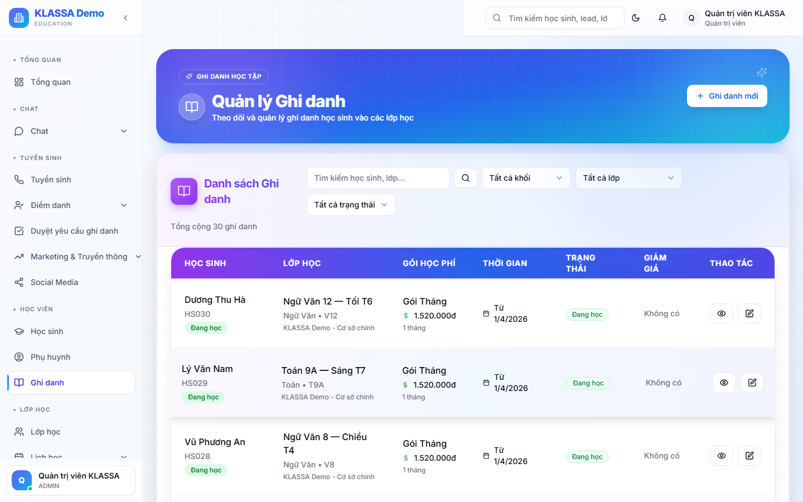

# Ghi danh học sinh vào lớp

## Khái niệm

**Ghi danh** (enrollment) là hành động gắn 1 học sinh với 1 lớp. Khác với "tạo hồ sơ học sinh" — một học sinh có thể ghi danh nhiều lớp (Toán + Tiếng Anh + Văn).

## Khi nào dùng

- Học sinh mới đăng ký khoá học
- Học sinh hiện tại ghi danh thêm môn / khoá
- Đổi lớp (kết thúc lớp cũ + ghi danh lớp mới)
- Học sinh học thử miễn phí trong 1-2 buổi

## Cách 1 — Từ trang chi tiết học sinh

1. Mở chi tiết học sinh
2. Tab **"Lớp & Ghi danh"** → bấm **"+ Ghi danh thêm lớp"**
3. Chọn:
   - **Khoá học**
   - **Lớp cụ thể** (chỉ hiện lớp còn chỗ)
   - **Ngày bắt đầu**
   - **Loại ghi danh** — Chính thức / Học thử / Học bù
4. **Học phí** — phần mềm tự tính theo khoá, có thể đổi để áp khuyến mãi
5. **Tạo hoá đơn ngay** (tuỳ chọn)
6. Bấm **"Ghi danh"**

## Cách 2 — Từ trang chi tiết lớp

1. Mở chi tiết lớp
2. Tab **"Học sinh"** → bấm **"+ Thêm học sinh"**
3. Tìm học sinh có sẵn (gõ tên / SĐT phụ huynh) hoặc bấm **"+ Tạo mới"** để thêm hồ sơ học sinh đồng thời
4. Điền thông tin ghi danh tương tự cách 1

## Trạng thái ghi danh

- **Đang học (ACTIVE)** — bình thường
- **Tạm dừng (PAUSED)** — học sinh tạm nghỉ
- **Đã rút (DROPPED)** — học sinh thôi học
- **Hoàn thành (COMPLETED)** — học sinh học hết khoá

Trạng thái ghi danh **độc lập** với trạng thái học sinh:
- Một học sinh có thể ACTIVE ở lớp Toán nhưng DROPPED ở lớp Tiếng Anh.

## Lưu ý

- **Lớp đầy**: phần mềm cảnh báo nhưng không chặn — Quản lý vẫn ghi danh được nếu cần.
- **Hoá đơn theo ghi danh**: mỗi lần ghi danh có thể sinh 1 hoá đơn riêng — không gộp với lớp khác.
- **Hoàn tiền khi rút**: nếu học sinh rút giữa khoá, phần mềm tự tính phần học phí dư để hoàn lại.

## Câu hỏi thường gặp

**Học sinh học thử 1 buổi miễn phí, ghi danh thế nào?**
Chọn loại "Học thử" — không tính học phí, không tạo hoá đơn. Sau khi học thử nếu khách đăng ký chính thức, đổi loại sang "Chính thức" và tạo hoá đơn.

**Ghi danh nhiều lớp một lần, có cách nhanh không?**
Trang chi tiết học sinh → tab Lớp & Ghi danh → bấm **"Ghi danh hàng loạt"** → chọn nhiều lớp cùng lúc.
