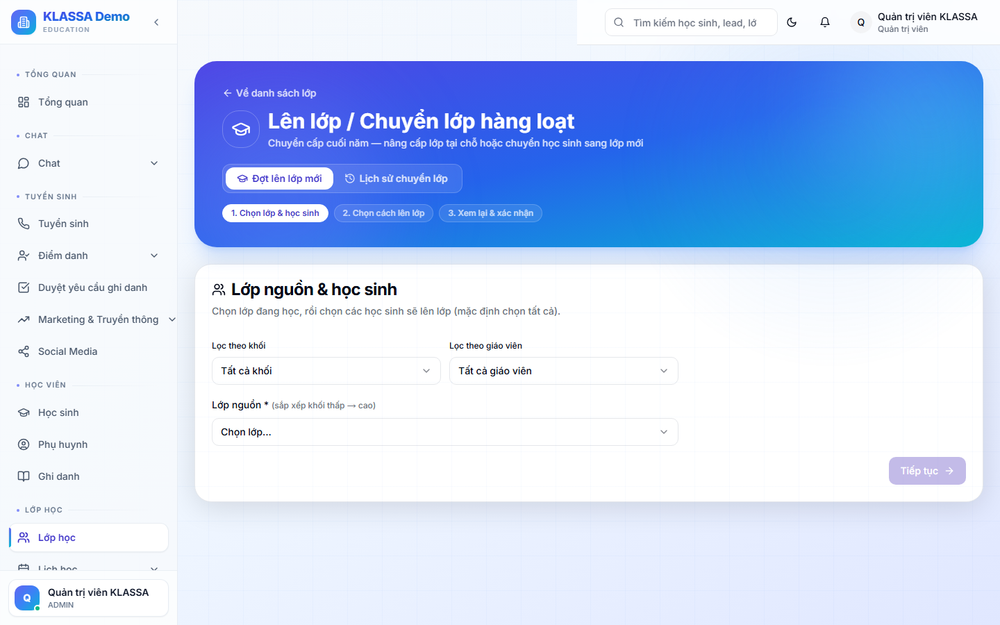

# Lên lớp / Chuyển lớp hàng loạt

## Khi nào dùng

Cuối năm học hoặc mùa **chuyển cấp** (đầu năm học mới), trung tâm cần:
- Học sinh lớp 9 lên lớp 10 → chuyển sang khoá Lớp 10
- Học sinh lớp 12 ra trường → kết thúc khoá
- Học sinh giữa kỳ cần chuyển lớp khác (cùng môn, đổi giáo viên, đổi ca)

Trợ lý lên lớp / chuyển lớp **HÀNG LOẠT** thay vì phải vào từng hồ sơ HS đổi.

## Truy cập

Menu trái → **Lớp học → Lên lớp / Chuyển lớp** (hoặc **/classes/promote**).

## Quy trình

### Bước 1 — Chọn lớp nguồn

Lớp đang muốn xử lý — ví dụ "Toán 9A — Sáng T7".

### Bước 2 — Lọc học sinh

Có thể chọn:
- **Tất cả HS** trong lớp
- **Lọc theo trạng thái** (chỉ đang ACTIVE, đã hoàn thành khoá)
- **Lọc theo khối lớp năm tới** (HS đang lớp 9 → lên lớp 10)
- **Tick chọn thủ công** từng em

### Bước 3 — Chọn lớp đích

- **Lớp đã có** trong hệ thống — ví dụ "Toán 10A — Sáng T7"
- **Tạo lớp mới** ngay từ trang này (gắn cùng GV, cùng ca, đổi khối lớp)

### Bước 4 — Áp dụng quy tắc chuyển

- **Giữ học phí cũ** (nếu HS đã đóng dài hạn, không tính thêm)
- **Tính học phí mới** (theo bảng giá lớp đích)
- **Áp dụng khuyến mãi tiếp tục** (giảm 10% cho HS cũ)

### Bước 5 — Xem trước + Xác nhận

Bảng preview hiển thị:
- HS nào sẽ chuyển từ đâu → đến đâu
- Hoá đơn mới phải tạo (nếu có)
- Buổi học dở dang xử lý thế nào

Bấm **"Xác nhận chuyển"** → hệ thống thực hiện hàng loạt.

## Lịch sử + Bộ lọc

Tab **"Lịch sử"** ghi lại mỗi đợt chuyển:
- Ai thực hiện + Khi nào
- Bao nhiêu HS đã chuyển
- Từ lớp nào sang lớp nào

Có thể **lọc** theo: ngày, người thực hiện, lớp nguồn, lớp đích.

## Lưu ý

- **Thông báo phụ huynh** — bật để gửi Zalo / email báo HS đã chuyển lớp
- **Hoàn tác** trong 24h nếu nhầm lẫn
- **Khuyến nghị** chạy thử với 1-2 HS trước khi áp dụng hàng loạt

## Câu hỏi thường gặp

**HS đang nợ học phí có chuyển được không?**
Có nhưng phần mềm cảnh báo. Phải xử lý nợ (cho gia hạn / hoãn) trước khi chuyển.

**HS chuyển sang lớp khác cơ sở, được không?**
Được nếu lớp đích thuộc cơ sở khác — phải có quyền truy cập cơ sở đó (Chủ trung tâm hoặc Quản lý nhiều cơ sở).
