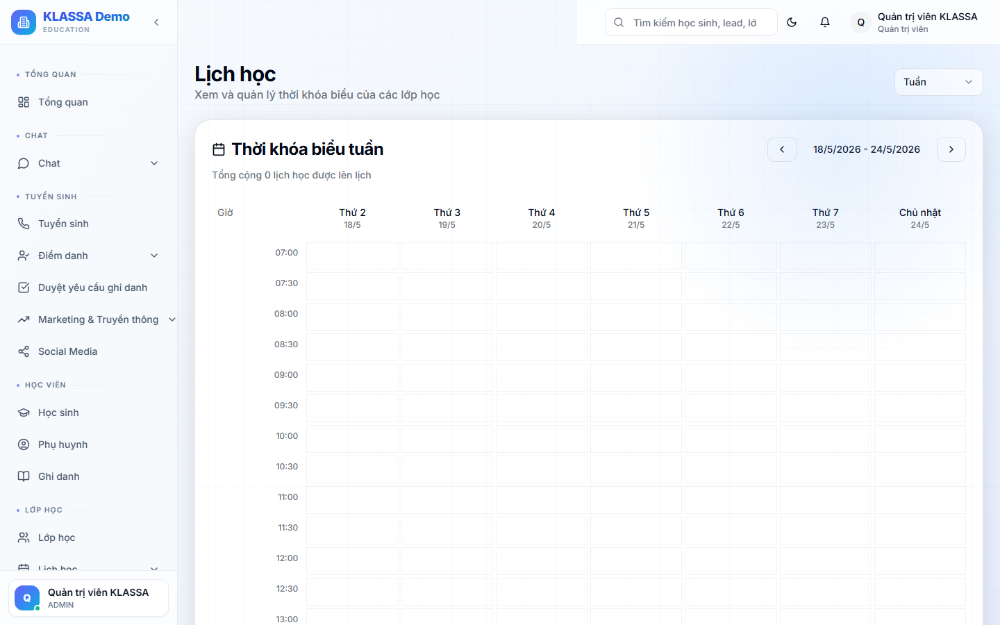

# Lịch dạy toàn trung tâm

## Khi nào dùng

- Quản lý xem hôm nay / tuần này có bao nhiêu buổi
- Lễ tân kiểm tra phòng trống lúc nào
- Giáo viên xem lịch dạy của mình
- Phát hiện trùng giờ giữa các lớp

## Truy cập

Menu trái → **Lớp học → Lịch dạy** (hoặc trực tiếp **/dashboard/schedule**).

## Các chế độ xem

### 1. Theo tuần (mặc định)

Bảng 7 cột (T2 → CN), mỗi ô là 1 buổi học. Nhìn ra lịch tổng thể trong tuần.

### 2. Theo ngày

Hiển thị các buổi của ngày được chọn theo giờ. Phù hợp xem chi tiết 1 ngày bận.

### 3. Theo tháng

Lịch tháng kiểu Google Calendar — chỉ tóm tắt số lớp / ngày.

### 4. Theo phòng

Cột = phòng, hàng = giờ. Xem nhanh phòng nào trống lúc nào.

### 5. Theo giáo viên

Cột = giáo viên, hàng = giờ. Phát hiện giáo viên bị xếp quá tải.

## Bộ lọc

- **Cơ sở** — nếu nhiều chi nhánh
- **Khoá học**
- **Lớp**
- **Giáo viên**
- **Phòng**

## Thông tin trên 1 ô buổi học

- Tên lớp
- Khoá học (màu phân biệt)
- Giáo viên
- Phòng
- Trạng thái điểm danh:
  - ⚪ Chưa chấm
  - 🟡 Đang chấm
  - 🟢 Đã chấm
  - ❌ Buổi bị huỷ

Bấm vào ô → mở chi tiết buổi học hoặc đi thẳng vào màn hình điểm danh.

## Thao tác

- **Kéo & thả** một buổi sang ô khác → đổi giờ / ngày (Quản lý mới được phép)
- **Bấm chuột phải** vào buổi → menu nhanh: Sửa / Huỷ / Sao chép / Báo nhắc phụ huynh

## Lưu ý

- **Phát hiện trùng**: phần mềm bôi đỏ các buổi trùng giờ (cùng phòng hoặc cùng giáo viên).
- **In lịch dạy** ra giấy: bấm "In" ở góc phải — có sẵn mẫu A4 đẹp.

## Câu hỏi thường gặp

**Lịch dạy có tự gửi cho giáo viên / phụ huynh không?**
Nếu trung tâm bật trong **Cài đặt → Thông báo**, hệ thống tự gửi:
- Email/Zalo cho giáo viên đầu tuần
- Zalo cho phụ huynh nhắc buổi học trước 1-2 giờ

**Tôi muốn in lịch dạy treo bảng văn phòng, làm sao?**
Chế độ xem **"Theo tuần"** → bấm **"In"** → chọn khổ A3 ngang.
