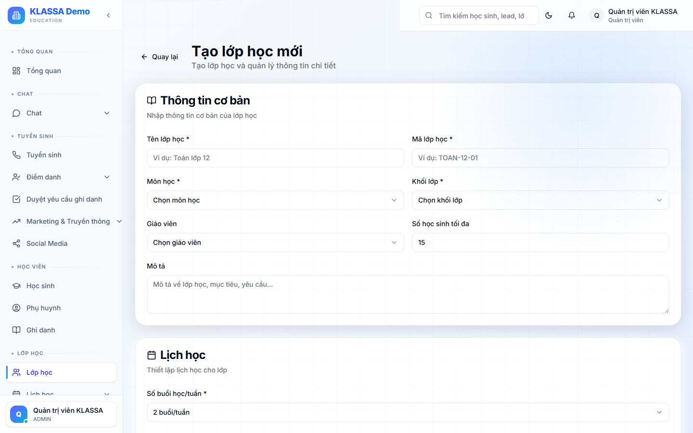

# Tạo lớp mới

## Khi nào dùng

- Mở khoá học mới
- Tách lớp cũ vì đầy hoặc chia trình độ
- Tạo lớp đặc biệt (ôn thi, học hè, học bù)

## Các bước

### Bước 1 — Mở form tạo lớp

Trang **Lớp học** → bấm **"+ Tạo lớp mới"**.

### Bước 2 — Điền thông tin

**Bắt buộc:**
- **Tên lớp** — ví dụ "Toán 9A — Sáng T7"
- **Khoá học** — chọn từ danh sách (Toán 9, Toán nâng cao…)
- **Cơ sở** — nếu có nhiều chi nhánh
- **Phòng học**
- **Giáo viên chính**

**Khuyến nghị:**
- **Trợ giảng** — nếu lớp có
- **Sức chứa tối đa** (mặc định 25)
- **Học phí mặc định** (lấy từ khoá học, có thể đổi)
- **Mô tả ngắn** — ghi chú đặc biệt về lớp

### Bước 3 — Lịch học cố định

Chọn ngày trong tuần + giờ:

- VD: "Thứ 7 — 8:00 đến 10:00"
- Có thể chọn **nhiều ngày trong tuần** cho lớp học nhiều buổi

### Bước 4 — Ngày khai giảng + kết thúc

- **Ngày khai giảng** — bắt đầu chạy lịch dạy
- **Ngày kết thúc** — chọn nếu khoá có thời hạn cố định (3 tháng, 6 tháng) hoặc để trống nếu lớp dài hạn

### Bước 5 — Bấm "Tạo"

Phần mềm sẽ:

- Tạo lớp
- Sinh **lịch dạy tự động** từ ngày khai giảng đến ngày kết thúc theo lịch cố định
- Gán giáo viên + trợ giảng vào tất cả các buổi

## Mẹo

- **Sao chép lớp cũ**: từ trang chi tiết lớp đang chạy → bấm "Sao chép" → đổi tên + ngày, các thông tin khác tự copy.
- **Nhiều lớp cùng khoá**: nếu mở 3 lớp Toán 9 (sáng T7, chiều T7, tối CN), tạo 3 lớp riêng — không gộp 1 lớp.

## Lưu ý

- **Phòng học trùng giờ**: phần mềm cảnh báo nếu phòng đã có lớp khác cùng giờ.
- **Giáo viên trùng giờ**: tương tự, cảnh báo nếu giáo viên đã dạy lớp khác cùng giờ.
- **Lịch nghỉ lễ**: phần mềm tự bỏ qua ngày nghỉ lễ khi sinh lịch dạy (xem [Cài đặt ngày nghỉ lễ](../cai-dat/ngay-nghi-le.md)).

## Câu hỏi thường gặp

**Tôi muốn lớp tổ chức không theo lịch cố định (mỗi tuần đổi giờ), có được không?**
Tạo lớp với "Không lịch cố định", rồi vào chi tiết lớp → tab Lịch dạy → bấm "+ Thêm buổi" thủ công cho từng buổi.

**Sau khi tạo, tôi sửa lịch học có ảnh hưởng đến lịch đã sinh sẵn không?**
Có. Phần mềm sẽ hỏi: cập nhật lịch của các buổi **chưa diễn ra** hay **giữ nguyên**? Mặc định là cập nhật để tránh trùng.
