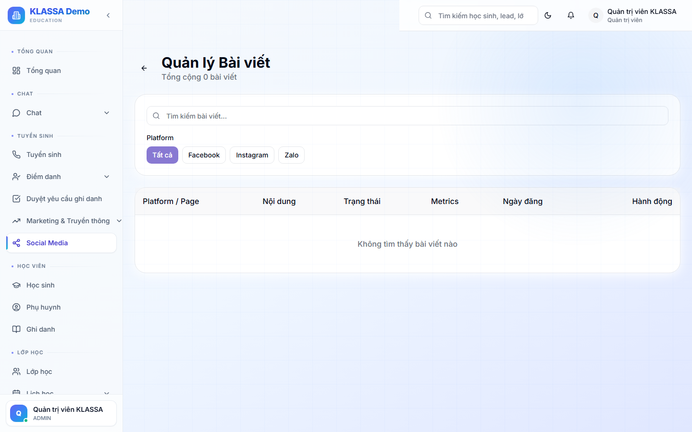

# Tạo bài đăng mới

## Các bước

### Bước 1 — Bấm "+ Tạo bài đăng"

Trang **Marketing → Bài đăng → + Tạo bài đăng** (hoặc **/social-media/post**).

### Bước 2 — Soạn nội dung

- **Tiêu đề** (cho FB / IG có)
- **Nội dung** chính (hỗ trợ emoji, hashtag)
- **Ảnh / Video** — kéo thả hoặc chọn từ Media của AI Hub
- **Link** kèm theo (URL landing page, form đăng ký)

### Bước 3 — Chọn kênh

Tick các kênh cần đăng:
- Facebook Page
- Instagram (nếu liên kết FB)
- TikTok

Nội dung sẽ tự điều chỉnh cho phù hợp từng nền tảng (ảnh vuông cho IG, ngang cho FB).

### Bước 4 — Lên lịch

- Đăng ngay
- Hoặc đặt giờ cụ thể (vd 19:30 hôm nay)
- Hoặc đặt định kỳ (mỗi T2 9h)

### Bước 5 — Lưu / Đăng

- **Lưu nháp** — chưa đăng, chờ duyệt
- **Đăng / Lên lịch** — chính thức

## Lưu ý

- Bài đăng cần tuân thủ chính sách mỗi nền tảng — FB không thích bài có quá nhiều link.
- Test A/B 2 phiên bản (nếu plugin có) để biết cái nào hiệu quả hơn.

## Câu hỏi thường gặp

**Đã đăng rồi có sửa được không?**
Mỗi nền tảng có chính sách riêng. FB cho sửa, IG cho sửa caption không sửa ảnh, TikTok không cho sửa.
