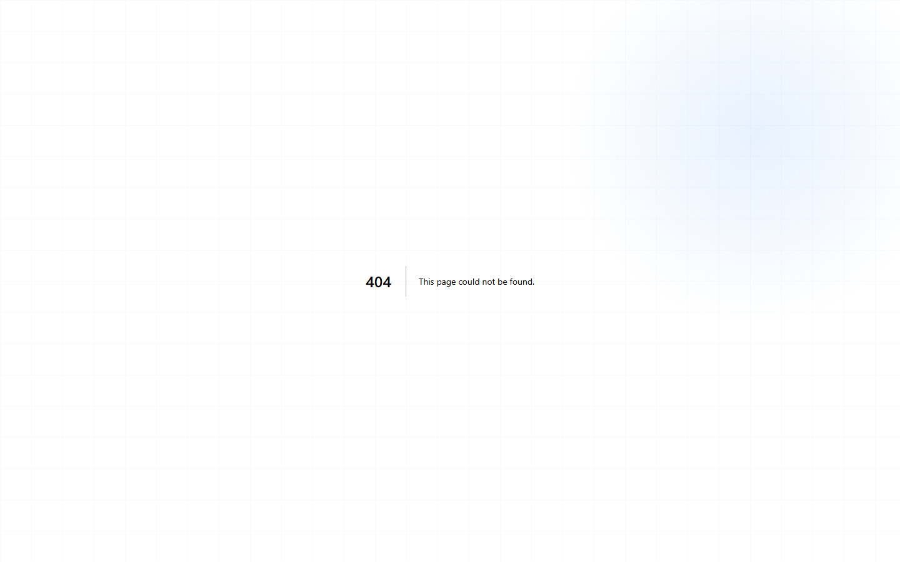

# Giáo viên chấm điểm danh bằng điện thoại

## Khi nào dùng

- Giáo viên dạy ngoài văn phòng (tại nhà phụ huynh, lớp online)
- Đứng trên lớp không tiện mở laptop
- Cần chấm điểm danh nhanh ngay đầu giờ

## Truy cập

URL: **/mobile/teacher** (hoặc đăng nhập tài khoản GV trên điện thoại).

## Cách dùng

### Mở buổi học

- Trang chủ mobile → bấm vào buổi sắp dạy
- Hoặc quét **QR code** in trên giấy lớp học

### Chấm điểm danh

- Danh sách HS hiện ra theo dọc
- Mặc định tất cả **"Có mặt"**
- Vuốt **trái** từng HS = đổi sang trạng thái khác (Vắng / Muộn / Học bù)
- Bấm **"Lưu"**

### Ghi chú nhanh

- Bấm vào HS → ghi chú ngắn ("Vắng do ốm", "Đi muộn 15 phút")

## Tính năng khác

- Xem lịch dạy tuần
- Xem phiếu lương
- Chat phụ huynh

## Câu hỏi thường gặp

**Mất sóng giữa lúc chấm, có lưu không?**
Có. Phần mềm lưu offline, khi có mạng tự đồng bộ.
