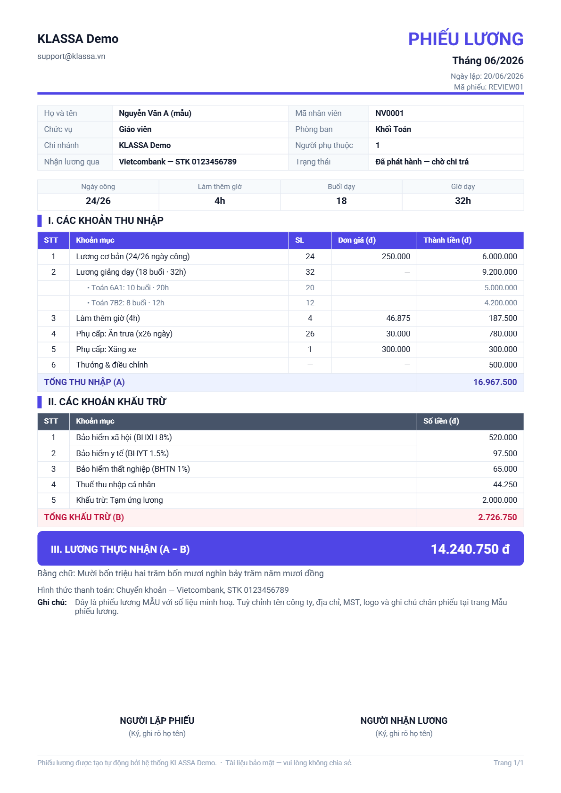

# Bảng lương — tính lương hàng tháng

## Khi nào dùng

Cuối mỗi tháng, HR / Kế toán / Quản lý chạy **một kỳ lương** trọn vòng đời: tạo kỳ → sinh phiếu cho từng nhân sự → kiểm tra → duyệt → chi trả → gửi phiếu cho nhân viên.

## Truy cập

Menu trái → **Nhân sự → Quản lý lương** (`/hr/payroll`). Cần bật **plugin Lương** + tài khoản có quyền nhân sự.

Trang có **5 tab**:

| Tab | Dùng để |
|-----|---------|
| **Tính lương** | Tạo / duyệt / chi trả kỳ lương, xem bảng phiếu, gửi phiếu (tab chính của bài này) |
| **Bảng lương GV** | Cấu hình bảng giá lương giáo viên theo sĩ số (rate band) + chế độ tính lương dạy |
| **Lương nhân viên** | Cấu hình lương theo chức vụ × loại hợp đồng (lương cơ bản, lương giờ…) |
| **Tạm ứng** | Duyệt [tạm ứng lương](tam-ung-luong.md), tự trừ vào kỳ |
| **Lịch sử gửi phiếu** | Tra ai đã được gửi phiếu, nháp/chính thức, thành công/lỗi |

## Vòng đời một kỳ lương

**Kỳ lương** đi qua 4 trạng thái: **Nháp → Chờ duyệt → Đã duyệt → Đã chi trả**.
**Phiếu lương** từng người: Chưa tính → Nháp → Chờ duyệt → Đã duyệt → Đã gửi → Đã chi trả.

## Bước 1 — Tạo kỳ lương

Ở tab **Tính lương**, góc phải có 3 nút:

- **"Tính lương mới"** — tạo kỳ và **sinh phiếu cho TẤT CẢ nhân sự** cùng lúc. Hộp thoại yêu cầu chọn **Tháng**, **Năm** và **chế độ trừ bảo hiểm/thuế** (xem dưới). Bấm **"Tính lương"** → có **thanh tiến độ** ở góc dưới phải hiển thị "đã xong / tổng số người".
- **"Tạo kỳ trống"** — tạo kỳ rỗng, chưa sinh phiếu ai (để tính lẻ từng người).
- **"Lương tháng 13"** — tạo kỳ thưởng Tết riêng (nhập Năm, Hệ số thưởng, tuỳ chọn chia theo số tháng làm).

### 3 chế độ trừ BHXH / BHYT / BHTN + thuế TNCN

| Chế độ | Ý nghĩa |
|--------|---------|
| **Chỉ NV Full-time** (mặc định) | Đúng luật — chỉ trừ bảo hiểm cho nhân sự toàn thời gian |
| **Mọi nhân viên** | Trừ bảo hiểm cho cả part-time |
| **Không tự trừ** | Bảng lương gộp, không trừ bảo hiểm/thuế tự động |

> **Lưu ý:** đổi chế độ ở kỳ đang xem **chỉ lưu lại, KHÔNG tự tính lại** (tránh treo máy khi nhiều nhân sự). Phải bấm **"Tính lại"** để áp dụng. Khoá khi kỳ đã duyệt/đã chi trả.

## Bước 2 — Xem & chỉnh phiếu

Bảng phiếu lương có các cột: Mã NV · Họ tên · Chức vụ · **Lương cơ bản · Lương giảng dạy · Phụ cấp · Thưởng · Khấu trừ · Thực nhận** · Thao tác.

Mỗi dòng: **Xem chi tiết** (icon mắt) · **Chỉnh sửa** (sửa tay từng khoản, khoá khi đã chi trả) · menu **⋯** (Xuất PDF / Xuất Excel / Gửi bản nháp / Gửi bản chính thức).

**Danh sách nhân sự kỳ này** (phía dưới) hiển thị cả người **chưa có phiếu** (nhãn "Chưa tính" màu xám) — bấm **"Tính lương"** trên dòng đó để sinh phiếu lẻ cho riêng người này.

## Bước 3 — Duyệt → Chi trả

- Kỳ ở **Chờ duyệt** → bấm **"Phê duyệt"** → thành **Đã duyệt**.
- Kỳ **Đã duyệt** → bấm **"Xác nhận chi trả"** → thành **Đã chi trả**. Lúc này các khoản [tạm ứng](tam-ung-luong.md) đã duyệt của kỳ tự động trừ vào phiếu.

## Bước 4 — Xuất & gửi phiếu hàng loạt

- **Export CSV** — tải file Excel tổng hợp cả kỳ (`payroll_<tháng>_<năm>.xlsx`, có dòng tổng cộng). *Lưu ý: nút tên "Export CSV" nhưng tải về file Excel.*
- **Bộ lọc** (Vai trò / Chức vụ / Loại HĐ / Trạng thái phiếu) → tích chọn phiếu → 2 nút:
  - **"Tải .zip"** — nén tất cả PDF phiếu đã chọn thành 1 file zip.
  - **"Gửi email"** — gửi phiếu lương qua email **lần lượt từng người, cách nhau 5–10 giây** (chống spam). **Phải giữ trang mở** đến khi xong; có thanh tiến độ ✓ thành công / ✕ lỗi.

> Trước khi gửi email, phải đã cấu hình **mẫu email phiếu lương** (ở Tích hợp → Mẫu email & thông báo → "Email gửi phiếu lương"), nếu chưa thì hệ thống chặn gửi.

## Bước 5 — Theo dõi lịch sử gửi

Tab **"Lịch sử gửi phiếu"** → lọc theo Tháng/Năm → bảng: Nhân viên · Loại (Chính thức/Nháp) · Email nhận · Kết quả · Người gửi · Thời gian.

## Bảng lương mẫu (ví dụ tháng 6/2026)

Ví dụ một kỳ lương 4 nhân sự với các cách tính khác nhau (thực nhận = thu nhập − khấu trừ − tạm ứng):

| Nhân sự | Chức vụ | Lương cơ bản | Lương buổi dạy | Phụ cấp | Thưởng | Bảo hiểm (10.5%) | Thuế TNCN | Tạm ứng | **Thực nhận** |
|---------|---------|-------------:|---------------:|--------:|-------:|-----------------:|----------:|--------:|-------------:|
| Nguyễn Văn An | Giáo viên (theo buổi, FT) | 6.000.000 | 9.200.000 | 1.080.000 | 500.000 | 682.500 | 44.250 | 2.000.000 | **14.053.250** |
| Trần Thị Bình | Giáo viên (cố định/buổi, PT) | 0 | 8.400.000 | 0 | 0 | 0 | 0 | 0 | **8.400.000** |
| Lê Thị Cúc | Lễ tân (lương cố định, FT) | 8.000.000 | 0 | 500.000 | 300.000 | 840.000 | 0 | 0 | **7.960.000** |
| Phạm Thị Diệp | Kế toán (lương cố định, FT) | 9.000.000 | 0 | 500.000 | 0 | 945.000 | 95.000 | 1.000.000 | **7.460.000** |

> Bảo hiểm = BHXH 8% + BHYT 1.5% + BHTN 1% (chỉ trừ cho nhân sự full-time). Giáo viên part-time theo thoả thuận có thể không trừ bảo hiểm. Số liệu chỉ minh hoạ.

## Phiếu lương sau khi xuất trông như thế nào

Mỗi nhân viên nhận một **phiếu lương PDF** chuẩn. Dưới đây là phiếu lương mẫu hệ thống tự sinh:

Phiếu gồm: tiêu đề **PHIẾU LƯƠNG** + tháng + mã phiếu → bảng thông tin nhân viên (chức vụ, phòng ban, tài khoản nhận lương) → 4 ô tóm tắt công (ngày công, làm thêm giờ, buổi dạy, giờ dạy) → **I. Các khoản thu nhập** (lương cơ bản, lương giảng dạy có chi tiết từng lớp, phụ cấp, thưởng) → **II. Các khoản khấu trừ** (BHXH/BHYT/BHTN/thuế/tạm ứng) → **III. Lương thực nhận** (kèm số tiền bằng chữ) → chữ ký 2 bên → chân phiếu.

Tên file PDF có sẵn tên nhân viên: `Họ tên - Phiếu lương - MM.YYYY.pdf`. Tuỳ chỉnh thông tin in trên phiếu tại [Mẫu phiếu lương](mau-phieu-luong.md).

## Lưu ý quan trọng

- Nút **"Export CSV"** tải file **Excel** (.xlsx), không phải CSV.
- Đổi **chế độ khấu trừ** phải bấm **"Tính lại"** mới áp dụng.
- Đổi **bộ lọc** sẽ tự bỏ tích các phiếu đang chọn — chọn lại trước khi tải/gửi.
- **Gửi email hàng loạt**: giữ trang mở đến khi xong (gửi tuần tự, cách 5–10 giây/phiếu).
- **"Gửi bản chính thức"** chỉ bật khi kỳ đã duyệt / đã chi trả.
- **Xoá bảng lương** (kỳ chưa chi trả) yêu cầu nhập **mật khẩu tài khoản** để xác nhận.

## Câu hỏi thường gặp

**Vì sao lương hiển thị 0?**
Nhân sự chưa được cấu hình lương. Vào tab **Lương nhân viên** (lương cố định theo chức vụ) và **Bảng lương GV** (đơn giá buổi dạy theo sĩ số) để thiết lập, rồi bấm **"Tính lại"**.

**Sửa nhầm phiếu sau khi đã chốt?**
Kỳ đã chi trả không sửa được. Làm điều chỉnh (thưởng/trừ) ở kỳ sau.

**Gửi email báo lỗi "chưa cấu hình mẫu"?**
Vào **Tích hợp → Mẫu email & thông báo → Email gửi phiếu lương** để tạo mẫu trước khi gửi.
