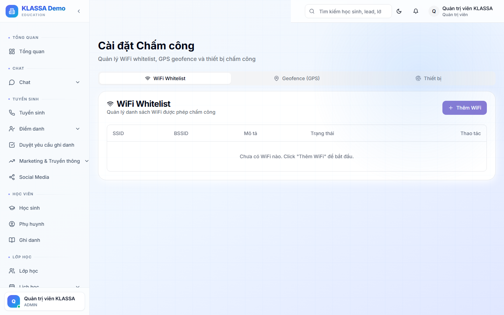

# Cấu hình chấm công

## Khi nào dùng

Thiết lập các phương thức chấm công + quy tắc xác thực cho nhân viên:
- **WiFi** — chỉ chấm khi đang nối Wi-Fi của trung tâm
- **Geofence** — chỉ chấm khi GPS trong bán kính X mét quanh cơ sở
- **Thiết bị được phép** — chỉ chấm từ máy đã đăng ký (chống share tài khoản)
- **QR Code** — quét mã ở văn phòng để xác thực

## Truy cập

Menu trái → **Nhân sự → Chấm công → Cài đặt** (hoặc **/hr/attendance/settings**).

## 4 phương thức xác thực

### 1. WiFi của trung tâm

- Khai báo **tên Wi-Fi (SSID)** của trung tâm
- Có thể nhiều SSID (mỗi cơ sở 1 SSID)
- Khi NV bấm Check-in, hệ thống đọc Wi-Fi đang nối → so sánh

Ưu: chống chấm công từ nhà.

### 2. Geofence (vị trí GPS)

- Khai báo **toạ độ** từng cơ sở (lấy từ Google Maps)
- Đặt **bán kính cho phép** (mặc định 50m)
- NV bấm Check-in → app đọc GPS → kiểm tra trong vùng

Ưu: linh hoạt khi NV ra ngoài đi sự kiện gần trung tâm. Nhược: GPS sai số nội đô.

### 3. Thiết bị được phép

Mỗi NV chỉ chấm công từ thiết bị **đã đăng ký**:
- Lần đầu Check-in trên máy mới → yêu cầu HR duyệt
- Sau khi duyệt, máy đó vĩnh viễn được phép cho user đó
- Mất máy → HR thu hồi quyền

Ưu: chống share tài khoản. Nhược: NV đổi máy phải làm thủ tục.

### 4. QR Code văn phòng

- In QR code dán ở cửa văn phòng
- NV mở app → quét QR → check-in

Ưu: đảm bảo NV đã đến văn phòng. Nhược: ai cũng quét được nếu QR bị chụp lại.

## Kết hợp nhiều phương thức

Có thể bật **AND** (NV phải đạt CẢ 2 điều kiện) hoặc **OR** (đạt 1 trong 2):
- Ví dụ: Wi-Fi **AND** Geofence — vừa nối Wi-Fi văn phòng vừa trong bán kính
- Ví dụ: QR **OR** Geofence — quét QR hoặc trong bán kính đều OK

## Cấu hình thêm

- **Cho phép check-in trước giờ làm** — bao nhiêu phút (mặc định 30 phút)
- **Bắt buộc chụp ảnh selfie** khi check-in
- **Ghi nhật ký vị trí** trong ca làm để theo dõi

## Lưu ý

- **Bật quá nhiều phương thức** → khó NV → mất thời gian
- **Đi công tác**: NV báo trước trong **Cổng Nhân viên → Đi công tác** → không bị cảnh báo

## Câu hỏi thường gặp

**Quên Wi-Fi văn phòng đổi mật khẩu, NV không check-in được?**
Phải vào trang này khai báo SSID mới (Wi-Fi mới). Hệ thống không tự nhận.

**NV bị mất điện thoại, máy mới chưa duyệt — chấm công thế nào?**
HR truy cập trang này → Quản lý thiết bị → Duyệt thiết bị mới của NV.
