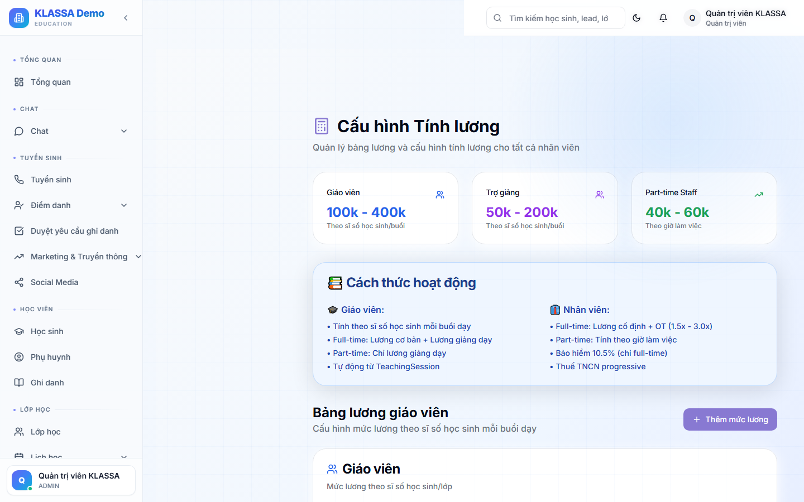

# Cấu hình lương căn bản

## Khái niệm

KLASSA hỗ trợ **3 cơ chế lương** cho giáo viên và nhân viên:

1. **Lương cố định / tháng** — phổ biến cho lễ tân, kế toán, quản lý
2. **Lương theo buổi dạy** — phổ biến cho giáo viên
3. **Lương theo số học sinh** (headcount-based) — đặc thù trung tâm dạy học

## Truy cập

Menu trái → **Nhân sự → Cấu hình lương** (hoặc **/hr/salary-config**).

## Cấu hình theo từng nhân viên

### Cách 1 — Lương cố định

Áp dụng cho: lễ tân, kế toán, quản lý.

- **Lương cơ bản** — VD 8,000,000 VNĐ / tháng
- **Phụ cấp** — phụ cấp ăn trưa, đi lại, điện thoại
- **Thưởng** — KPI theo doanh thu cá nhân (nếu áp dụng)

Tổng lương tháng = Cơ bản + Phụ cấp + Thưởng - Trừ.

### Cách 2 — Lương theo buổi

Áp dụng cho: giáo viên.

- **Đơn giá / buổi** — VD 300,000 VNĐ / buổi 2 tiếng
- **Hệ số theo trình độ** — giáo viên giỏi nhân hệ số 1.2
- **Phụ cấp buổi đặc biệt** — buổi cuối tuần, lễ nhân hệ số 1.5

Tổng lương = Tổng buổi đã dạy trong tháng × đơn giá × hệ số.

Cần kết hợp với [điểm danh](../diem-danh/cham-hang-ngay.md) — chỉ tính buổi đã chấm "đã diễn ra".

### Cách 3 — Lương theo số học sinh (headcount)

Áp dụng cho: giáo viên dạy lớp đông (giáo viên hưởng theo doanh thu lớp).

- **Tỷ lệ chia doanh thu** — VD giáo viên hưởng 40% doanh thu lớp
- Hoặc **Bậc thang** — < 15 HS: 30%, 15-25 HS: 35%, > 25 HS: 40%

Tổng lương = Doanh thu lớp × tỷ lệ.

## Các khoản trừ chung

- **Tạm ứng tháng trước**
- **BHXH** — 10.5% lương cơ bản (mặc định theo luật)
- **Thuế TNCN** — nếu lương đến mức chịu thuế
- **Phạt** — vi phạm nội quy

## Áp dụng

Sau khi cấu hình, lương được tính tự động trong [Bảng lương](bang-luong.md) hàng tháng.

## Lưu ý

- **Thay đổi cấu hình lương** áp dụng cho **kỳ lương sau**, không hồi tố.
- **Mỗi nhân viên 1 cấu hình** — có thể khác nhau.

## Câu hỏi thường gặp

**Trung tâm tôi dùng cả 3 cách lương cho các nhóm khác nhau, được không?**
Được. Mỗi nhân viên cấu hình riêng — không bắt buộc đồng nhất.

**Lương theo buổi nhưng giáo viên nghỉ phép, có tính buổi đó không?**
Tuỳ chính sách. Mặc định: nghỉ phép = không tính lương buổi (vì không dạy). Có thể đổi nếu trung tâm chi trả phép cho giáo viên.
