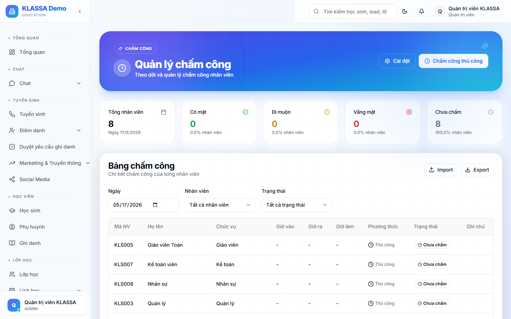

# Chấm công nhân viên

## Khái niệm

KLASSA hỗ trợ 3 cách chấm công, áp dụng tuỳ vai trò:

| Vai trò | Cách chấm công |
|---------|-----------------|
| Giáo viên | Tự động — từ buổi dạy đã chấm điểm danh |
| Lễ tân / Kế toán | Check-in / check-out theo giờ làm |
| Quản lý / Chủ trung tâm | Theo công cố định (không cần check-in) |

## Truy cập

Menu trái → **Nhân sự → Chấm công** (hoặc **/hr/attendance**).

## Check-in / check-out

Lễ tân / Kế toán đi làm → vào Cổng Nhân viên → bấm **"Check-in"**:

- Phần mềm ghi nhận: thời gian + vị trí (GPS điện thoại, nếu cho phép)
- Có thể bật **chấm bằng QR** — quét mã ở văn phòng để xác thực có mặt
- Hoặc **vân tay / nhận diện khuôn mặt** (nếu trung tâm có thiết bị)

Cuối ngày bấm **"Check-out"**.

## Theo dõi giờ làm

Trang Chấm công hiển thị:

- **Bảng chấm công tháng**: hàng = nhân viên, cột = ngày — màu sắc thể hiện trạng thái
- ✅ Có mặt đủ giờ
- 🕐 Đi muộn / về sớm
- ❌ Vắng
- 🛌 Nghỉ phép

## Quy tắc chấm công

Cấu hình trong **Cài đặt → Chấm công**:

- **Giờ làm việc** — VD 8:30 - 17:30
- **Đi muộn**: quá X phút bị tính
- **Đi sớm**: quá X phút bị tính
- **Số ngày công chuẩn / tháng** — VD 26 ngày

Phần mềm tự tính:
- Tổng giờ làm
- Số ngày công thực tế / chuẩn
- Lương theo tỷ lệ

## Cảnh báo bất thường

Phần mềm tự phát hiện:

- Đi muộn > 3 lần / tuần
- Quên check-out (cả ngày)
- Check-in xa văn phòng (sai vị trí)
- Pattern bất thường

Quản lý nhận thông báo, xem [Phát hiện bất thường chấm công](bat-thuong-cham-cong.md).

## Lưu ý

- **Quên check-in**: nhân viên báo HR → HR sửa thủ công kèm lý do.
- **Chấm công từ xa**: nếu trung tâm cho phép WFH (work from home), tắt yêu cầu GPS.

## Câu hỏi thường gặp

**Giáo viên dạy tại nhà phụ huynh, chấm công thế nào?**
Giáo viên dùng app điện thoại → check-in tại địa chỉ buổi học. Vị trí được ghi nhận, hoặc dùng QR code in trên phiếu của phụ huynh.

**Nhân viên ốm đột xuất không kịp xin phép, chấm công sao?**
Đánh dấu **"Nghỉ không lương"** hôm đó. Sau khi đi làm lại, nhân viên nộp giấy bệnh viện → HR đổi sang **"Nghỉ ốm có phép"**.
