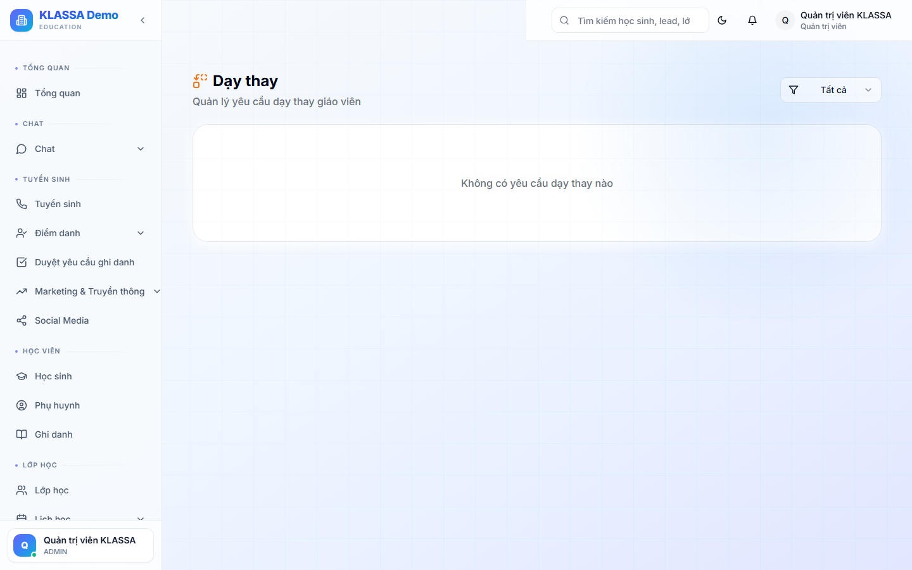

# Dạy thay

## Khái niệm

Khi một buổi học cần **đổi người dạy** (giáo viên chính bận, ốm, đi công tác…), quản lý tạo một **yêu cầu dạy thay** cho buổi đó — chọn giáo viên / trợ giảng thay (hoặc để "không có"), rồi Quản lý duyệt. Khi duyệt, buổi tự đổi người dạy và **lương buổi tính cho người dạy thay**.

> Quy trình gồm **2 nơi**: tạo yêu cầu ở trang **Điểm danh**, duyệt ở **Nhân sự → Dạy thay**.

## Bước 1 — Tạo yêu cầu dạy thay (ở trang Điểm danh)

Người quản lý (Chủ trung tâm / Quản lý / Quản lý chi nhánh) vào **Điểm danh** (`/attendance`) → tìm buổi cần đổi người → bấm **"Dạy thay"** → mở hộp thoại:

- **GV dạy thay** — chọn:
  - *Giữ nguyên GV* (không đổi giáo viên)
  - *Không có GV* (buổi diễn ra không có giáo viên chính)
  - hoặc chọn **một giáo viên** trong danh sách để thay
- **TG dạy thay** — tương tự: *Giữ nguyên TG* / *Không có TG* / chọn một trợ giảng
- **Lý do dạy thay** \* — bắt buộc

Bấm tạo → yêu cầu chuyển sang trạng thái **"Chờ duyệt"**.

> Người tạo **tự chọn** ai dạy thay ngay trong hộp thoại — hệ thống KHÔNG tự gợi ý và KHÔNG cần người dạy thay bấm đồng ý.

## Bước 2 — Duyệt yêu cầu (ở Nhân sự → Dạy thay)

Vào **Nhân sự → Dạy thay** (`/hr/substitute-requests`). Chỉ **Chủ trung tâm / Quản lý / Quản lý chi nhánh** vào được.

Mỗi yêu cầu hiển thị: trạng thái, tên lớp + ngày, **GV gốc → GV thay** (hoặc "Không có GV"), lý do, người yêu cầu. Lọc theo trạng thái ở góc phải (Tất cả / Chờ duyệt / Đã duyệt / Từ chối); số **"N chờ duyệt"** nổi ở đầu trang.

Với yêu cầu **"Chờ duyệt"** có 2 nút:
- **"Duyệt"** — chấp nhận đổi người dạy
- **"Từ chối"** — mở hộp thoại **bắt buộc nhập lý do từ chối**

## Bước 3 — Sau khi duyệt

Khi bấm "Duyệt", hệ thống tự động:
- Đổi trạng thái yêu cầu thành **"Đã duyệt"**
- **Ghi đè người dạy của buổi**: gán giáo viên / trợ giảng thay (hoặc để trống nếu chọn "Không có GV/TG")
- **Lương buổi** tính cho **người dạy thay** (không tính cho GV gốc); nếu "Không có GV" thì buổi đó không phát sinh lương giáo viên

Nếu **Từ chối**: buổi giữ nguyên người dạy cũ, ghi lại lý do từ chối.

## Trường hợp không có ai dạy thay

Chọn **"Không có GV"** (và/hoặc "Không có TG") khi tạo yêu cầu → buổi vẫn được ghi nhận nhưng không gán giáo viên. Dùng khi buổi bị dồn/huỷ hoặc trợ giảng đứng lớp một mình.

## Lưu ý

- **Tạo yêu cầu ở trang Điểm danh, duyệt ở trang Dạy thay** — hai nơi khác nhau.
- **Chỉ Quản lý trở lên** thao tác (tạo + duyệt). Giáo viên không tự tạo/duyệt yêu cầu dạy thay.
- **Từ chối phải nêu lý do** — lưu lại để truy vết.

## Câu hỏi thường gặp

**Giáo viên có tự xin dạy thay được không?**
Không. Yêu cầu dạy thay do quản lý tạo từ trang Điểm danh. Nếu giáo viên bận, báo quản lý để tạo yêu cầu.

**Đã duyệt rồi muốn đổi lại?**
Yêu cầu đã duyệt/từ chối không xử lý lại được. Nếu cần đổi tiếp, tạo một yêu cầu dạy thay mới cho buổi đó.

**Lương của giáo viên gốc và giáo viên thay tính thế nào?**
Sau khi duyệt, buổi thuộc về người dạy thay → lương buổi tính cho người thay. Xem cách tính ở [Bảng lương](bang-luong.md).
