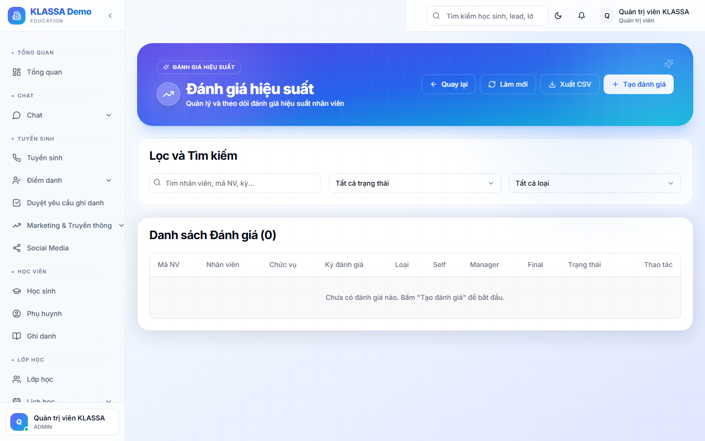

# Đánh giá hiệu suất

## Khái niệm

Đánh giá định kỳ năng lực + thái độ làm việc của nhân viên — phục vụ:

- Tăng lương / thăng chức
- Phát hiện nhân viên cần đào tạo thêm
- Quyết định gia hạn / chấm dứt hợp đồng

## Truy cập

Menu trái → **Nhân sự → Hiệu suất** (hoặc **/hr/performance**).

## Khung đánh giá KLASSA gợi ý

### 4 nhóm tiêu chí

1. **Kết quả công việc** — KPI (giáo viên: chuyên cần lớp, kết quả học; lễ tân: số Lead chuyển đổi)
2. **Năng lực chuyên môn** — kỹ năng theo vị trí
3. **Thái độ + tinh thần** — chấm công, hợp tác, đề xuất sáng kiến
4. **Phát triển bản thân** — đào tạo đã tham gia, chứng chỉ mới

### Thang điểm

5 mức từ "Yếu" → "Xuất sắc". Mỗi mức có mô tả cụ thể (rubric).

## Tần suất đánh giá

- **Hàng quý** — đánh giá nhanh, 15 phút / NV
- **Hàng năm** — đánh giá đầy đủ + phỏng vấn

## Quy trình

1. **Tự đánh giá**: nhân viên tự chấm + viết nhận xét
2. **Quản lý trực tiếp đánh giá**: chấm độc lập
3. **Họp 1-1**: gặp gỡ trao đổi
4. **Tổng hợp**: HR + Quản lý thống nhất kết quả cuối

## Kết quả

Kết quả đánh giá gắn liền với:

- **Thưởng / phạt** cuối quý
- **Tăng lương** đầu năm
- **Đào tạo** đề xuất khoá học bù năng lực thiếu
- **Promotion** đề xuất thăng chức

## Lưu ý

- **Khách quan**: dùng số liệu (KPI) làm gốc, tránh chủ quan.
- **Phản hồi liên tục**: không đợi đến cuối kỳ mới góp ý — góp ý ngay khi thấy vấn đề.

## Câu hỏi thường gặp

**Nhân viên không đồng ý kết quả đánh giá, làm sao?**
Có quy trình **phản đối đánh giá** — nộp đơn lên cấp trên của Quản lý trực tiếp. HR điều tra + quyết định cuối.
