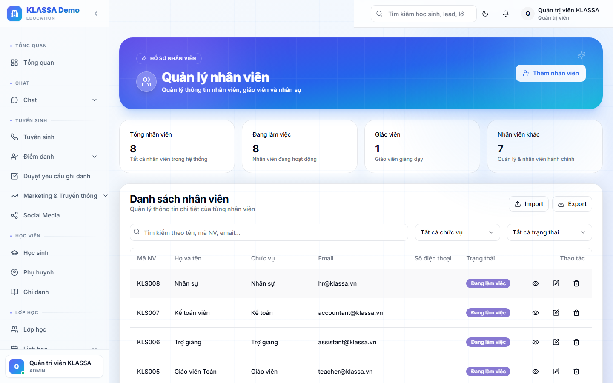

# Danh sách nhân viên

## Khi nào dùng

- Tra cứu thông tin liên hệ đồng nghiệp
- Quản lý cập nhật hồ sơ
- Xuất danh sách nhân viên cho cấp trên

## Truy cập

Menu trái → **Nhân sự → Nhân viên** (hoặc **/hr/employees**).

## Bộ lọc

- **Phòng ban** — Giảng dạy / Lễ tân / Kế toán / Quản lý / Hỗ trợ
- **Cơ sở** — nếu nhiều chi nhánh
- **Trạng thái** — Đang làm / Đã nghỉ / Đang thử việc / Tạm nghỉ
- **Loại hợp đồng** — Thử việc / Chính thức / Cộng tác / Thời vụ

## Bảng danh sách

Mỗi dòng có:

- Ảnh + Họ tên + Mã NV
- Chức vụ
- Phòng ban
- Cơ sở
- Loại hợp đồng
- Ngày vào làm
- Trạng thái

## Hồ sơ nhân viên chứa gì?

Bấm vào nhân viên → trang chi tiết:

- **Tổng quan** — thông tin cá nhân, liên hệ
- **Hợp đồng** — lịch sử các hợp đồng
- **Lương** — lương căn bản + lương thưởng / kỳ
- **Chấm công** — bảng chấm công các tháng
- **Phép** — số phép còn lại + lịch sử đơn phép
- **Đánh giá** — hiệu suất công việc
- **Tài liệu** — CV, bản sao CMND, bằng cấp...

## Thêm nhân viên mới

Bấm **"+ Thêm nhân viên"**. Xem [Onboarding](onboarding.md) — quy trình tiếp nhận chuẩn.

## Nhập nhiều nhân viên cùng lúc

Bấm **"Nhập Excel"** ở đầu trang. Phần mềm tự đọc file của anh chị dù tên cột đặt kiểu gì, đưa bảng để xem lại và sửa từng ô trước khi tạo hồ sơ. Mỗi lần tối đa **200 người**. Cũng dán thẳng bảng copy từ Excel được.

**Bắt buộc phải có:** Họ tên và Chức vụ. Chức vụ phải khớp tên đã khai trong [Cấu hình nhân sự](cau-hinh-hr.md) — chưa có thì tạo chức vụ trước.

**Cần để ý:** dòng nào bỏ trống cột loại hình làm việc sẽ được lưu là **Toàn thời gian**; bảng duyệt đánh dấu 🔵 *Cần lưu ý* cho những dòng như vậy, anh chị kiểm lại trước khi xác nhận. Loại hình ghi tiếng Việt đều đọc được: *Toàn thời gian, Bán thời gian, Thời vụ, Thực tập, Thử việc*. Lương ghi `8.000.000` hay `8tr` đều được.

Người có email sẽ được tạo luôn tài khoản đăng nhập (mật khẩu `12345678`, bắt đổi ở lần đầu).

Bốn bước chi tiết: xem [Nhập dữ liệu hàng loạt từ Excel](../bat-dau/nhap-du-lieu-hang-loat.md).

## Lưu ý

- **Thông tin cá nhân nhạy cảm** (CMND, lương, bệnh sử) chỉ HR + cấp trên trực tiếp xem được, đồng nghiệp khác không thấy.
- **Không xoá nhân viên đã nghỉ** — giữ lại để lịch sử lương, hợp đồng.

## Câu hỏi thường gặp

**Xuất danh sách nhân viên ra Excel cho BHXH, được không?**
Được. Bộ lọc → "Xuất Excel" → có sẵn cột chuẩn để khai báo BHXH.
