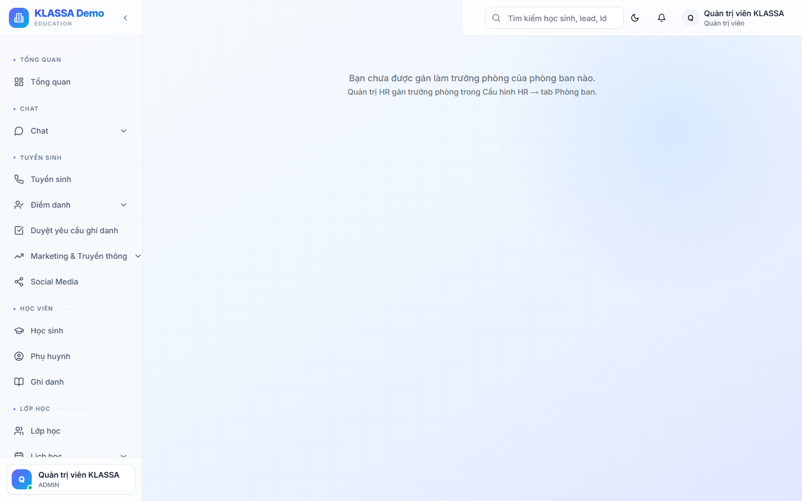

# Đội nhóm (Team)

## Khi nào dùng

Tổ chức nhân viên thành các **đội nhóm** nhỏ hơn phòng ban — phục vụ:
- Dự án ngắn hạn (Hè 2026, Khai giảng tháng 9)
- Đội phụ trách 1 chương trình cụ thể (Đội luyện thi ĐH, Đội tiếng Anh cấp 2)
- Đội theo cơ sở khi 1 cơ sở có nhiều phòng ban

## Truy cập

Menu trái → **Nhân sự → Đội nhóm** (hoặc **/hr/team**).

## Khác Phòng ban thế nào?

| Tiêu chí | Phòng ban | Đội nhóm |
|----------|-----------|----------|
| Mục đích | Cấu trúc tổ chức **chính thức** | Nhóm dự án **linh hoạt** |
| Số lượng | Cố định (~5-10) | Tuỳ ý (có thể nhiều, ngắn hạn) |
| Một người thuộc | **1** phòng ban | **Nhiều** đội |
| Báo cáo | Trưởng phòng | Trưởng đội (có thể không phải sếp chính thức) |

## Tạo đội mới

Bấm **"+ Tạo đội"**:
- Tên đội
- Trưởng đội
- Phạm vi (Cố định / Theo dự án + ngày kết thúc)
- Mô tả

### Thêm thành viên

- Kéo NV từ danh sách bên trái → thả vào đội
- Hoặc bấm "+ Thêm" → chọn NV

### Vai trò trong đội

Có thể gán vai trò:
- **Trưởng đội** — điều phối, ra quyết định
- **Thành viên** — tham gia chuyên môn
- **Cố vấn** — không thuộc đội nhưng hỗ trợ

## Liên kết với module khác

- **Workflow tự động** — gửi thông báo cho cả đội (vd "Cả đội Hè 2026 đến họp 14h thứ 6")
- **Chat nội bộ** — mỗi đội tự sinh 1 nhóm chat riêng
- **Báo cáo** — đo hiệu quả từng đội (số HS chuyển đổi, số buổi dạy...)

## Lưu ý

- **Đừng tạo quá nhiều đội** — khó quản lý, NV bị spam thông báo
- **Đặt ngày kết thúc** cho đội dự án — tự đóng khi xong

## Câu hỏi thường gặp

**Đội đóng rồi có truy cập được lịch sử chat không?**
Có. Đội archived nhưng lịch sử vẫn lưu, truy cập read-only.

**Có thể tự động sinh đội theo tiêu chí (vd toàn bộ GV Toán)?**
Có. Trong **Cài đặt → Đội tự động** → đặt rule (vai trò TEACHER + môn Toán) → đội tự cập nhật khi có thêm/bớt NV match.
