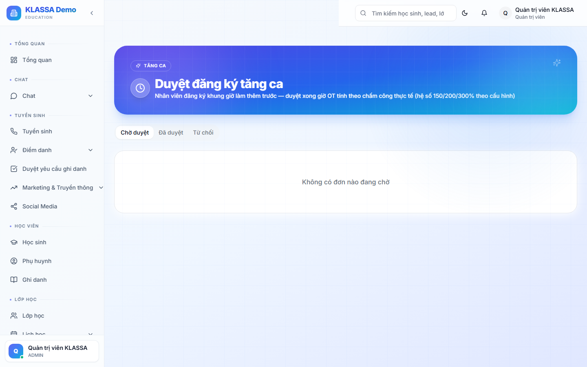

# Đơn tăng ca (OT)

## Khi nào dùng

Nhân viên làm ngoài giờ chính thức (ở lại sau giờ tan ca, vào ngày nghỉ, lễ) → cần đăng ký tăng ca để:
- Được duyệt + ghi nhận giờ làm
- Tính lương tăng ca (hệ số 1.5x ngày thường, 2x cuối tuần, 3x ngày lễ theo Luật Lao động)
- Có cơ sở pháp lý nếu thanh tra lao động kiểm tra

## Truy cập

Menu trái → **Nhân sự → Đơn tăng ca** (hoặc **/hr/ot-requests**).

## Quy trình

### 1. NV đăng ký

Trong **Cổng Nhân viên → Tăng ca** → bấm **"+ Đăng ký"**:
- Ngày + Giờ bắt đầu / kết thúc
- Lý do (Hoàn thành báo cáo gấp, Hỗ trợ sự kiện, Dạy bù...)
- Loại tăng ca: Ngày thường (1.5x) / Cuối tuần (2x) / Ngày lễ (3x)
- Bấm gửi → đơn chuyển sang Quản lý duyệt

### 2. Quản lý duyệt

Quản lý nhận thông báo + email → vào trang này:
- Xem đơn + ghi chú
- ✅ Duyệt → tự ghi vào bảng công + tính lương
- ❌ Từ chối → ghi lý do, gửi NV
- 🔁 Đề xuất sửa giờ (ví dụ chỉ duyệt 2h thay vì 3h NV đăng ký)

### 3. NV thực hiện + chấm công

- Đến giờ tăng ca, NV check-in như bình thường
- Hệ thống ghi nhận giờ vào / giờ ra trong vùng OT đã duyệt
- Vượt giờ duyệt → cảnh báo, không tính thêm

## Báo cáo

- Tổng giờ OT theo tháng / quý
- Tổng lương OT trên quỹ lương
- Top NV làm OT nhiều nhất (có thể dấu hiệu quá tải)
- Phân bổ OT theo phòng ban

## Quy định Luật Lao động Việt Nam

Hệ thống cảnh báo nếu vi phạm:
- **>40h OT / tháng** — mức trần theo luật
- **>200h OT / năm** — mức trần
- **Không nghỉ bù** sau khi làm cuối tuần — vi phạm

## Lưu ý

- **OT không xin trước** = NV làm thêm tự nguyện, không được tính lương OT
- **Hệ số OT cấu hình** trong **[Cấu hình HR](cau-hinh-hr.md)** — mặc định theo luật
- **Tạm ứng OT** không được — NV phải hoàn thành công mới thanh toán

## Câu hỏi thường gặp

**OT của giáo viên dạy thêm buổi tính theo OT hay lương buổi?**
Phụ thuộc thoả thuận trung tâm. Mặc định: GV dạy thêm tính theo **lương buổi** (đơn giá × hệ số), không phải OT giờ hành chính.

**Khẩn cấp, không xin OT trước được?**
Đăng ký sau, ghi rõ "OT khẩn cấp" + lý do. Quản lý duyệt + ghi nhận. Tránh lạm dụng.
