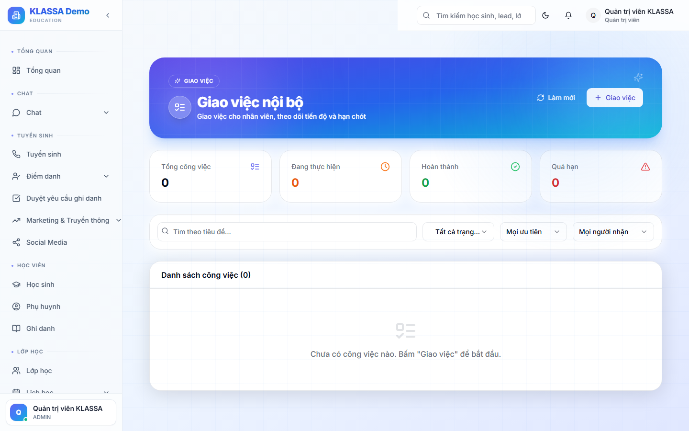
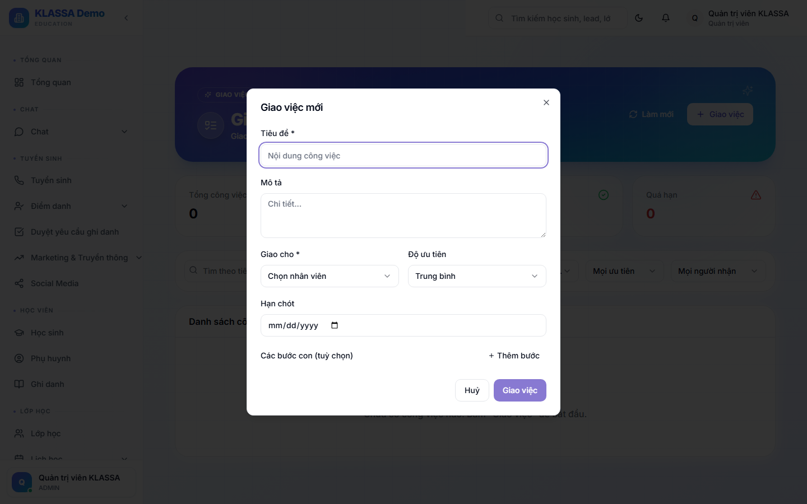

# Giao việc nội bộ

## Khi nào dùng

Quản lý giao việc cho nhân viên và theo dõi tiến độ — khác với "Việc cần làm hôm nay" tự sinh trên dashboard (nhắc chấm điểm danh, nhận xét buổi học…). Đây là module **giao việc thật**: có người giao, người nhận, hạn chót, mức ưu tiên, các bước con.

Ví dụ: giao lễ tân gọi 20 lead tồn, giao kế toán đối soát công nợ cuối tháng, giao giáo viên soạn đề kiểm tra giữa kỳ.

## Điều kiện

- Trung tâm đã bật **plugin "Giao việc Nội bộ"**. Chưa bật → trang trắng / menu ẩn (vào Plugin Marketplace bấm "Liên hệ KLASSA").
- **Ai giao được việc:** Chủ trung tâm, Quản lý, Quản lý chi nhánh (thấy menu **"Giao việc"** trong Nhân sự).
- **Ai nhận việc:** mọi nhân viên (xem việc của mình trong **Cổng nhân viên → Việc của tôi**).

## Truy cập

Menu trái → **Nhân sự → Giao việc** (`/hr/tasks`).

Trang có:
- **4 thẻ thống kê**: Tổng công việc · Đang thực hiện · Hoàn thành · Quá hạn
- **Thanh lọc**: tìm theo tiêu đề + lọc trạng thái + mức ưu tiên + người nhận
- **Danh sách việc**: mỗi việc có dropdown đổi trạng thái + nút xoá

## Giao một việc mới

Bấm **"+ Giao việc"** → hộp thoại **"Giao việc mới"**:

- **Tiêu đề \*** — bắt buộc (nội dung công việc)
- **Mô tả** — chi tiết
- **Giao cho \*** — chọn nhân viên nhận việc
- **Độ ưu tiên** — Thấp / Trung bình / Cao / Gấp
- **Hạn chót** — ngày phải xong
- **Các bước con** (tuỳ chọn) — bấm **"+ Thêm bước"** để chia việc lớn thành nhiều bước nhỏ

Bấm **"Giao việc"** → nhân viên nhận thông báo (trong app, và email/Zalo nội bộ nếu trung tâm đã bật).

## Trạng thái công việc

- **Chờ thực hiện** → **Đang thực hiện** → **Hoàn thành**
- **Quá hạn** — quá ngày hạn chót mà chưa xong (đếm vào thẻ thống kê)

Người giao đổi trạng thái bằng dropdown trên dòng việc; người nhận cập nhật tiến độ trong Cổng nhân viên.

## Nhân viên xem việc của mình

Nhân viên vào **Cổng nhân viên → Việc của tôi** để thấy danh sách việc được giao, hạn chót, mức ưu tiên, và tick hoàn thành từng bước con.

## Phân biệt với "Việc cần làm hôm nay"

| | **Giao việc** (bài này) | **Việc cần làm hôm nay** |
|--|------------------------|--------------------------|
| Nguồn | Người quản lý giao thủ công | Hệ thống tự sinh từ dữ liệu (lead chưa gọi, buổi chưa chấm…) |
| Có hạn/ưu tiên | Có | Không |
| Giao cho người khác | Có | Không (chỉ việc của chính mình) |
| Lưu lịch sử | Có | Không |

## Câu hỏi thường gặp

**Giao 1 việc cho nhiều người cùng lúc?**
Hiện mỗi việc giao cho 1 người. Để giao nhóm, tạo nhiều việc hoặc dùng các bước con phân cho từng người.

**Nhân viên không thấy việc được giao?**
Kiểm tra họ đã đăng nhập đúng tài khoản + có hồ sơ nhân viên. Việc hiện trong Cổng nhân viên → Việc của tôi.

**Xoá việc giao nhầm?**
Người giao bấm nút xoá trên dòng việc trong trang Giao việc.
