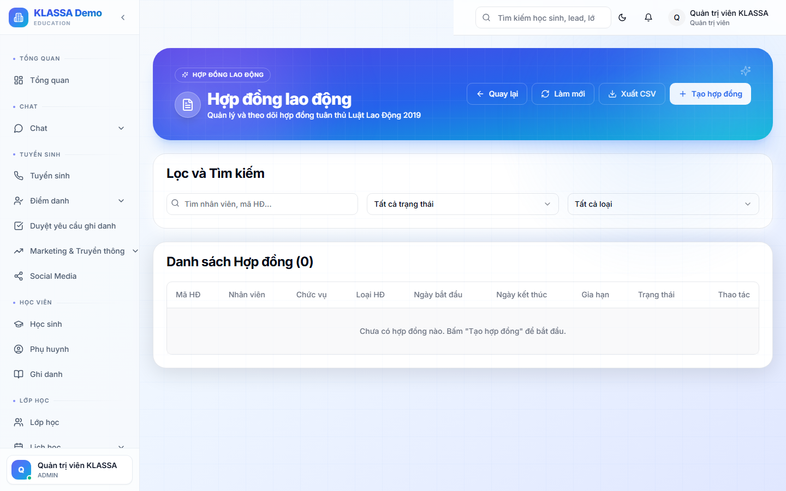

# Hợp đồng lao động

## Khi nào dùng

- Tạo hợp đồng cho nhân viên mới (thử việc + chính thức)
- Gia hạn hợp đồng sắp hết hạn
- Cập nhật điều khoản (đổi lương, đổi vị trí)
- Theo dõi nghĩa vụ hết hạn (BHXH, đóng góp)

## Truy cập

Menu trái → **Nhân sự → Hợp đồng** (hoặc **/hr/contracts**).

## Các loại hợp đồng

| Loại | Thời hạn | Dùng cho |
|------|----------|----------|
| **Thử việc** | 1-2 tháng | Nhân viên mới giai đoạn đầu |
| **Có thời hạn** | 12-36 tháng | Hợp đồng tiêu chuẩn |
| **Không xác định thời hạn** | Không hạn | Nhân viên gắn bó lâu dài |
| **Cộng tác viên** | Theo dự án | GV cộng tác, freelancer |
| **Thời vụ** | <12 tháng | Hè, trại tập huấn |

## Tạo hợp đồng

### Bước 1 — Chọn nhân viên

Vào hồ sơ nhân viên → tab Hợp đồng → **"+ Tạo hợp đồng"**.

### Bước 2 — Điền thông tin

- **Loại hợp đồng**
- **Số hợp đồng** (tự sinh, có thể đổi)
- **Vị trí**
- **Phòng ban + cơ sở**
- **Ngày bắt đầu / kết thúc**
- **Lương cơ bản**
- **Phúc lợi** (BHXH, thưởng tết, du lịch...)
- **Điều khoản đặc biệt** (cấm cạnh tranh, bảo mật, v.v.)

### Bước 3 — Sinh PDF + ký

Bấm **"Sinh PDF"** → tải về để in + ký tay. Hoặc dùng **chữ ký số / chữ ký điện tử** nếu trung tâm có.

Upload bản đã ký vào hệ thống → hợp đồng chuyển trạng thái **"Đã ký"**.

## Cảnh báo hết hạn

Phần mềm tự gửi cảnh báo cho HR khi hợp đồng sắp hết hạn:

- 60 ngày trước — cảnh báo lần 1
- 30 ngày trước — cảnh báo lần 2
- 7 ngày trước — gấp

→ Để HR kịp gia hạn hoặc thông báo kết thúc.

## Gia hạn

Trên hợp đồng cũ → bấm **"Gia hạn"** → tạo hợp đồng mới giữ nguyên thông tin, chỉ đổi ngày + có thể đổi lương.

## Chấm dứt hợp đồng

- **Đến hạn không gia hạn** — tự chuyển trạng thái "Đã kết thúc"
- **Chấm dứt trước hạn** — bấm "Chấm dứt" → điền lý do (đơn phương từ NV / đơn phương từ trung tâm / thoả thuận / vi phạm)

## Lưu ý

- **Hợp đồng đã ký không sửa được** — chỉ chấm dứt + ký mới.
- **Mỗi nhân viên có thể có nhiều hợp đồng theo thời gian** — phần mềm lưu lịch sử đầy đủ.

## Câu hỏi thường gặp

**Mẫu hợp đồng tuỳ chỉnh được không?**
Có. Cài đặt → Mẫu hợp đồng → tải lên file Word có placeholder {ho_ten}, {luong}, {ngay_bat_dau}... phần mềm tự điền khi sinh PDF.

**Lưu trữ hợp đồng đã ký dạng giấy + scan, KLASSA có quản lý không?**
Có. Upload PDF scan vào tab Tài liệu của hợp đồng. Bản giấy gốc lưu ở văn phòng.
