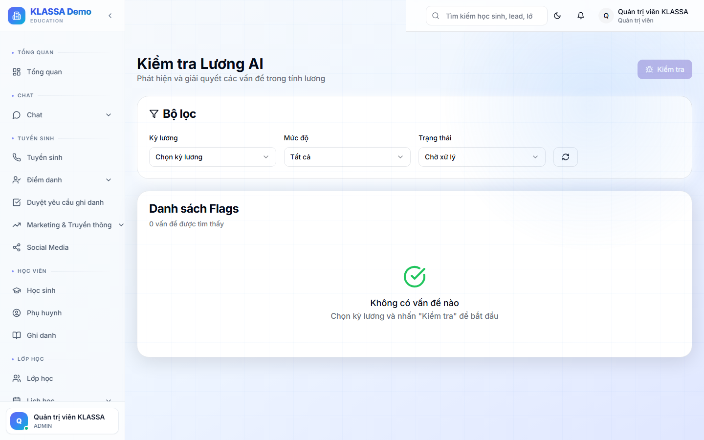

# Kiểm tra lương trước khi chi trả

## Khái niệm

Trước khi chốt [bảng lương](bang-luong.md), KLASSA có công cụ **Payroll Checker** tự động kiểm tra các bất thường — tránh sai số lớn ảnh hưởng nhân viên hoặc trung tâm.

## Truy cập

Menu trái → **Nhân sự → Kiểm tra lương** (hoặc **/hr/payroll-checker**).

## Các kiểm tra tự động

### 1. Lương âm

Lương sau khi trừ các khoản < 0 → có thể sai cấu hình hoặc trừ quá nhiều.

### 2. Lương đột biến

Lương tháng này gấp / nửa tháng trước → có thể tính sai buổi dạy.

### 3. Nhân viên thiếu chấm công

Nhân viên cố định không check-in đủ ngày → kiểm tra chấm công.

### 4. Buổi dạy chưa chấm điểm danh

Có buổi đã diễn ra nhưng giáo viên chưa chấm → lương buổi đó chưa tính.

### 5. Cấu hình lương thiếu

Nhân viên mới chưa cấu hình lương → cảnh báo HR.

### 6. Tổng lương bất thường

Quỹ lương tháng này tăng / giảm >20% so với tháng trước → cảnh báo Quản lý.

## Cách xử lý cảnh báo

Mỗi cảnh báo có:

- **Loại bất thường**
- **Nhân viên / mục bị ảnh hưởng**
- **Đề xuất hành động**:
  - Sửa cấu hình lương
  - Chấm điểm danh thiếu
  - Bổ sung công thiếu
  - Bỏ qua (nếu thực sự đúng)

Bấm **"Xử lý"** → đi thẳng đến trang cần sửa.

## Lưu ý

- **Nên kiểm tra trước khi chốt** — sau khi chốt khó sửa.
- **Không bỏ qua tất cả cảnh báo** — đọc kỹ từng cái.

## Câu hỏi thường gặp

**Nhân viên hỏi tại sao lương giảm bất thường, đi đâu xem?**
Trang Kiểm tra lương ghi lại lịch sử cảnh báo + hành động đã xử lý. Có thể dùng để giải trình cho nhân viên.
