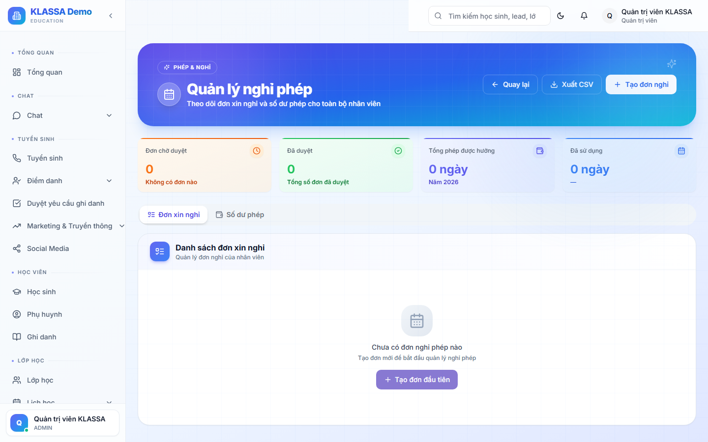

# Quản lý ngày phép

## Khái niệm

KLASSA quản lý 5 loại phép:

1. **Phép năm** — phép có lương theo luật (12 ngày / năm cho NV chính thức)
2. **Phép ốm** — nghỉ ốm, có giấy bệnh viện
3. **Phép việc riêng** — không lương
4. **Phép thai sản** — nghỉ sinh con
5. **Phép đặc biệt** — cưới, tang…

## Truy cập

Menu trái → **Nhân sự → Phép** (hoặc **/hr/leave**).

## Quy trình xin phép

### Nhân viên nộp đơn

Trong **Cổng Nhân viên → Phép**:

1. Bấm **"+ Tạo đơn phép"**
2. Chọn:
   - Loại phép
   - Ngày bắt đầu / kết thúc
   - Lý do
   - Đính kèm giấy tờ (giấy bệnh viện cho ốm dài)
3. Bấm **"Gửi duyệt"** → đơn chuyển sang Quản lý trực tiếp.

### Quản lý duyệt

Quản lý nhận thông báo → vào **Phép → Đơn chờ duyệt**:

- Xem đơn + lịch dạy của nhân viên
- Bấm **"Duyệt"** hoặc **"Từ chối"** kèm lý do
- Nếu giáo viên nghỉ → tự gợi ý **dạy thay** (xem [Đơn xin dạy thay](dan-day-thay.md))

### Tự động xử lý

- Đơn được duyệt → ngày phép trừ vào số dư phép năm
- Nhân viên nhận email + Zalo xác nhận
- Lịch dạy trong những ngày nghỉ được đánh dấu "Chờ dạy thay"

## Số dư phép

Mỗi nhân viên có:

- **Phép năm còn lại** — theo luật: 12 ngày / năm chính thức + 1 ngày / 5 năm thâm niên
- **Phép cộng dồn từ năm trước** (nếu trung tâm cho phép)
- **Đã dùng trong năm**

Xem ở **Cổng Nhân viên → Phép → Số dư**.

## Lịch nghỉ chung

Trang **Lịch phép toàn trung tâm** hiển thị ai đang nghỉ tuần này / tháng này — để Quản lý lên kế hoạch tránh trống nhân sự.

## Lưu ý

- **Đơn phép cấp tốc** (xin nghỉ trong ngày): vẫn nộp qua hệ thống, ghi rõ "Khẩn cấp" để Quản lý xử lý nhanh.
- **Nghỉ không xin phép** → đánh dấu "Vắng không phép" — ảnh hưởng đánh giá cuối kỳ.

## Câu hỏi thường gặp

**Giáo viên nghỉ phép, lương buổi đó tính sao?**
Mặc định: nghỉ phép = không có buổi dạy → không tính lương buổi. Nếu trung tâm muốn trả phép cho giáo viên, cấu hình trong **Cài đặt → Lương → Lương phép cho giáo viên**.

**Quá hạn nộp đơn phép (nghỉ rồi mới xin), được không?**
Được, nhưng Quản lý có quyền từ chối. Hệ thống ghi nhận "Đơn phép muộn" — ảnh hưởng đánh giá.
