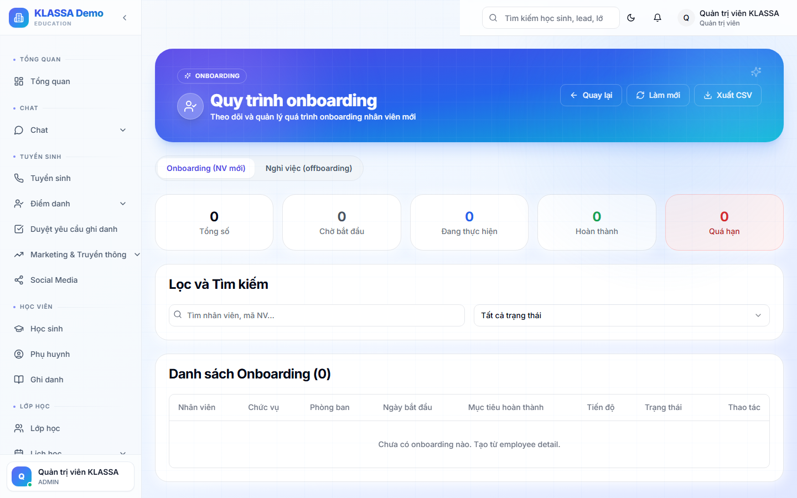

# Quy trình tiếp nhận (onboarding)

## Khái niệm

**Onboarding** = quy trình tiếp nhận nhân viên mới — từ nộp hồ sơ → ký hợp đồng → đào tạo → bắt đầu làm việc chính thức.

## Truy cập

Menu trái → **Nhân sự → Onboarding** (hoặc **/hr/onboarding**).

## Các bước onboarding chuẩn KLASSA gợi ý

### Bước 1 — Nhập hồ sơ ứng viên

- Họ tên, ngày sinh, SĐT, email
- CMND / CCCD (upload ảnh 2 mặt)
- Bằng cấp (upload PDF)
- CV
- Ảnh chân dung

### Bước 2 — Kiểm tra hồ sơ

HR kiểm tra:
- Bằng cấp đúng yêu cầu vị trí?
- CMND còn hạn?
- Không trùng nhân viên cũ?

### Bước 3 — Phỏng vấn

Có thể có nhiều vòng. Ghi lại kết quả từng vòng + người phỏng vấn.

### Bước 4 — Đề xuất offer

- Vị trí
- Lương dự kiến
- Phúc lợi
- Ngày bắt đầu thử việc

Phần mềm sinh thư offer PDF gửi email cho ứng viên.

### Bước 5 — Ký hợp đồng thử việc

Tạo hợp đồng (xem [Hợp đồng lao động](hop-dong.md)). Thử việc thường 1-2 tháng.

### Bước 6 — Cấp tài khoản KLASSA

- Tạo tài khoản với vai trò phù hợp
- Gán cơ sở làm việc
- Phát mật khẩu khởi tạo

### Bước 7 — Đào tạo

Checklist đào tạo:

- [ ] Giới thiệu công ty + nội quy
- [ ] Hướng dẫn dùng KLASSA
- [ ] Đào tạo nghiệp vụ (giáo viên dạy thử, lễ tân tư vấn thử)
- [ ] Gặp đồng nghiệp + sếp trực tiếp

### Bước 8 — Bàn giao

- Phát thiết bị (laptop, key thẻ ra vào)
- Bàn giao tài liệu

### Bước 9 — Theo dõi thử việc

Sau 1 tháng / 2 tháng — đánh giá thử việc:

- **Đạt** → ký hợp đồng chính thức
- **Chưa đạt** → kéo dài thử việc hoặc chấm dứt

## Lưu ý

- **Mỗi vị trí có checklist riêng** — giáo viên khác lễ tân khác kế toán. Cấu hình trong **Nhân sự → Cấu hình → Checklist onboarding**.
- **Nhân viên mới có ID** từ ngày ký offer, không phải ngày bắt đầu làm.

## Câu hỏi thường gặp

**Onboarding mất bao lâu?**
Trung bình 1-2 tuần từ nộp hồ sơ đến chính thức làm. Trung tâm có thể nhanh hơn (giáo viên cộng tác) hoặc lâu hơn (vị trí quản lý).

**Tự động hoá được khâu nào?**
KLASSA tự sinh email offer, hợp đồng PDF, tài khoản hệ thống. Khâu phỏng vấn + đánh giá vẫn cần con người.
