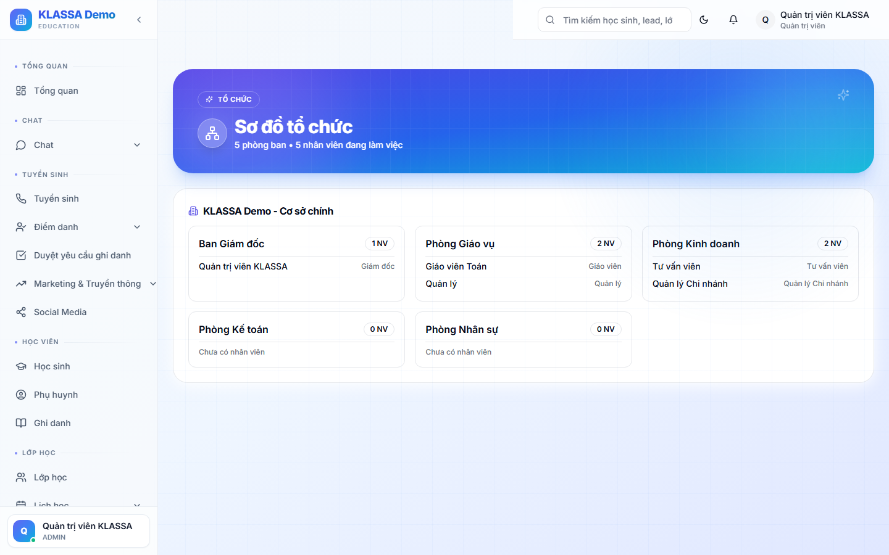

# Sơ đồ tổ chức (Org Chart)

## Khi nào dùng

- Hiển thị cấu trúc tổ chức trung tâm — ai cấp trên, ai cấp dưới
- Giới thiệu trung tâm với khách hàng / đối tác
- Onboarding nhân viên mới — họ biết mình thuộc phòng ban nào, báo cáo cho ai

## Truy cập

Menu trái → **Nhân sự → Sơ đồ tổ chức** (hoặc **/hr/org-chart**).

## Hiển thị

- **Hình cây phân cấp** từ Chủ trung tâm → Quản lý → Trưởng phòng → Nhân viên
- Mỗi ô = 1 nhân viên với:
  - Avatar
  - Họ tên
  - Chức vụ
  - Phòng ban
- Đường nối thể hiện quan hệ cấp trên - cấp dưới

## Tương tác

- **Bấm vào 1 ô** → mở hồ sơ chi tiết NV
- **Kéo thả** ô để đổi cấu trúc (chỉ HR/Quản lý có quyền)
- **Zoom in/out** + kéo để xem nhanh phần cụ thể
- **Tìm kiếm** theo tên → nhảy thẳng đến vị trí

## Cập nhật

Khi thay đổi:
- Tuyển mới → tự thêm vào sơ đồ
- Đổi chức vụ → ô tự cập nhật
- Nghỉ việc → ô được xoá khỏi sơ đồ (nhưng giữ lịch sử)

## Xuất file

- **PNG** — để chèn vào slide giới thiệu trung tâm
- **PDF** — in treo bảng văn phòng (khổ A3)

## Lưu ý

- **Sơ đồ tự sinh** từ dữ liệu phòng ban + chức vụ. Phải khai báo đúng "Cấp trên trực tiếp" của từng NV trong hồ sơ.
- **Trung tâm nhỏ** (<10 NV) sơ đồ không thực sự cần thiết — có thể bỏ qua tab này.

## Câu hỏi thường gặp

**Nhân viên chưa có cấp trên trực tiếp, hiển thị thế nào?**
Hệ thống đặt mặc định cấp trên = Chủ trung tâm. Có thể đổi trong hồ sơ NV.

**Tôi có thể tự vẽ sơ đồ theo ý mình không?**
Phiên bản hiện tại sinh tự động. Plugin "Org Chart Manual" sắp ra mắt cho phép vẽ tay.
