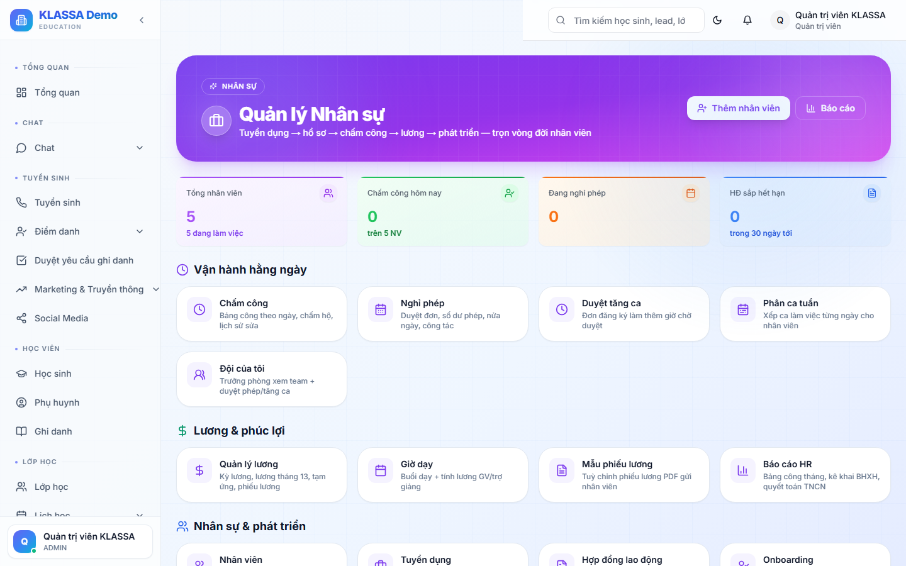

# Tổng quan HR

## Khi nào dùng

Mỗi sáng nhân sự / Quản lý mở trang này để nắm tình hình toàn bộ phòng nhân sự:

- Bao nhiêu nhân viên đang làm
- Hợp đồng nào sắp hết hạn
- Đơn phép chưa duyệt
- Lương tháng này đã chốt chưa

## Truy cập

Menu trái → **Nhân sự → Tổng quan** (hoặc **/hr/dashboard**).

## Khối số liệu

- **Tổng nhân viên** đang làm việc (theo trạng thái Active)
- **Hợp đồng sắp hết hạn** (trong 30 ngày)
- **Đơn phép chờ duyệt**
- **Quỹ lương dự kiến tháng** — tổng lương sẽ chi tháng này

## Biểu đồ

- Số nhân viên theo phòng ban
- Tỷ lệ nghỉ việc 12 tháng gần nhất
- Chi phí lương theo tháng (so với doanh thu)

## Cảnh báo

Trang sẽ hiện cảnh báo nếu phát hiện:

- Giáo viên có tỷ lệ vắng cao (nguy cơ nghỉ việc)
- Hợp đồng quá hạn chưa gia hạn
- Đơn phép chồng lịch dạy
- Bất thường chấm công (đi muộn > 3 lần / tuần)

## Liên kết nhanh

Từ trang tổng quan, bấm để mở:

- [Danh sách nhân viên](danh-sach-nhan-vien.md)
- [Bảng lương](bang-luong.md)
- [Chấm công](cham-cong.md)
- [Ngày phép](ngay-phep.md)

## Lưu ý

- **Chỉ HR + Quản lý** thấy module này.
- **Số liệu cập nhật theo thời gian thực** — không cần làm mới trang thủ công.

## Câu hỏi thường gặp

**Tôi không phải HR nhưng muốn xem nhân viên của tôi, làm sao?**
Quản lý chi nhánh xem nhân viên thuộc chi nhánh mình. Giáo viên xem hồ sơ cá nhân trong [Cổng Nhân viên](../cong-nhan-vien/gioi-thieu.md).
