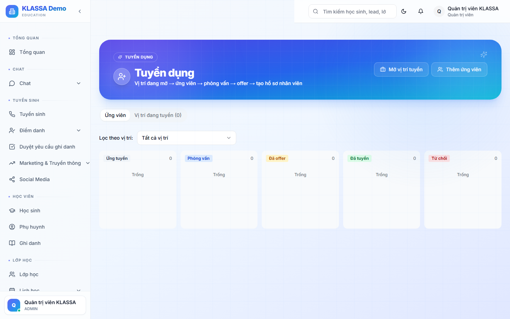

# Tuyển dụng

## Khi nào dùng

- Quản lý vòng đời ứng viên từ lúc nhận hồ sơ → phỏng vấn → ra offer → ký hợp đồng
- Theo dõi vị trí đang tuyển + số lượng ứng viên / vòng
- Tích hợp liền mạch với [Onboarding](onboarding.md) khi ứng viên trúng tuyển

## Truy cập

Menu trái → **Nhân sự → Tuyển dụng** (hoặc **/hr/recruitment**).

## Quy trình

### 1. Tạo vị trí tuyển dụng

Bấm **"+ Vị trí mới"**:
- Tên vị trí (Giáo viên Toán, Lễ tân, Kế toán...)
- Phòng ban + Cơ sở
- Số lượng cần
- Mức lương dự kiến
- Yêu cầu / mô tả công việc

### 2. Nhận ứng viên

3 cách thêm ứng viên:
- **Form công khai** — tạo link đăng ký, gắn vào website
- **Nhập tay** — HR nhập thông tin từ hồ sơ giấy
- **Nhập Excel** — danh sách từ headhunter

### 3. Theo dõi qua các giai đoạn

Mỗi ứng viên đi qua các stage:
- 🟡 **Mới** → ⚪ **Sàng lọc hồ sơ** → 🔵 **Phỏng vấn vòng 1** → 🟣 **Phỏng vấn vòng 2** → 🟢 **Trúng tuyển** / 🔴 **Loại**

Kéo thả ứng viên giữa các cột (Kanban) để đổi stage.

### 4. Ra offer

Ở stage "Trúng tuyển", bấm **"Tạo offer"**:
- Vị trí + Mức lương + Phúc lợi
- Sinh email offer + PDF tự động
- Gửi qua email

### 5. Chuyển sang onboarding

Ứng viên ký offer → bấm **"Tiếp nhận"** → tự sang [Onboarding](onboarding.md) → tạo hợp đồng + cấp tài khoản.

## Báo cáo

- Vị trí đang tuyển + tiến độ
- Thời gian tuyển trung bình (TTH — Time To Hire)
- Nguồn ứng viên hiệu quả
- Tỷ lệ chuyển đổi (ứng viên → trúng tuyển)

## Câu hỏi thường gặp

**Ứng viên cũ ứng tuyển lại được không?**
Được. Hệ thống nhận diện theo SĐT/email — gắn vào hồ sơ cũ thay vì tạo mới.

**Có thể chia sẻ ứng viên giữa các vị trí không?**
Có. Một ứng viên có thể được gán vào nhiều vị trí đang tuyển song song.
