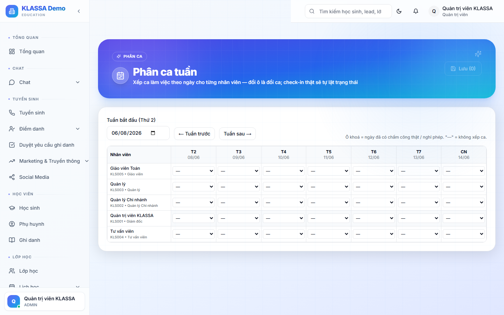

# Xếp ca chính thức (Roster)

## Khi nào dùng

Sau khi đã có **Đề xuất xếp ca** từ AI (xem [Đề xuất xếp ca thông minh](de-xuat-xep-ca.md)) hoặc trung tâm muốn xếp ca thủ công:
- Xác nhận lịch dạy / lịch trực chính thức cho từng nhân viên
- Phát lịch cho NV xem (qua Cổng Nhân viên, email, Zalo)
- Khoá lịch để không thay đổi tuỳ tiện

## Truy cập

Menu trái → **Nhân sự → Xếp ca** (hoặc **/hr/roster**).

## Bố cục

Bảng dạng **lịch tuần / tháng**:
- Cột = ngày trong tuần
- Hàng = nhân viên
- Ô = ca làm (ca sáng / chiều / tối) + lớp dạy

## Thao tác

### Tạo ca thủ công

- Bấm vào ô trống → chọn NV + thời gian + lớp (nếu là GV)
- Lưu

### Kéo thả đổi ca

Kéo ca từ NV A sang NV B → đổi người phụ trách.

### Sao chép tuần

Tuần này y hệt tuần trước → bấm **"Sao chép từ tuần trước"** → toàn bộ lịch tự copy.

### Import từ AI

Bấm **"Import từ Đề xuất AI"** → chọn 1 trong 3-5 phương án AI gợi ý → áp dụng.

## Phát lịch

Khi xếp xong, bấm **"Phát lịch"**:
- NV nhận thông báo trong Cổng Nhân viên
- Email kèm lịch tuần PDF
- Zalo nhắc giờ làm (1 giờ trước ca)

## Khoá lịch

Sau khi phát:
- Lịch chuyển trạng thái **"Đã chốt"**
- Quản lý vẫn sửa được nhưng phải ghi lý do (audit log)
- NV không sửa được, chỉ xin đổi qua [Đơn xin dạy thay](dan-day-thay.md)

## Lưu ý

- **Đặt deadline xếp ca** — VD chậm nhất Thứ 6 phải xong lịch tuần sau
- **Báo trước 7 ngày** — Luật Lao động yêu cầu báo lịch làm việc trước 7 ngày (với NV cố định)

## Câu hỏi thường gặp

**NV đã chấp nhận lịch nhưng đột xuất bận, xử lý sao?**
Dùng [Đơn xin dạy thay](dan-day-thay.md) → tìm NV khác thay → Quản lý duyệt.

**Khác gì với Lịch dạy ở Lớp học?**
[Lịch dạy](../lop-hoc/lich-day.md) là lịch BUỔI HỌC (mỗi buổi gắn với lớp). Xếp ca là **lịch CỦA NHÂN VIÊN** (mỗi NV có ca làm gì trong ngày). 2 hệ song song nhưng đồng bộ với nhau.
