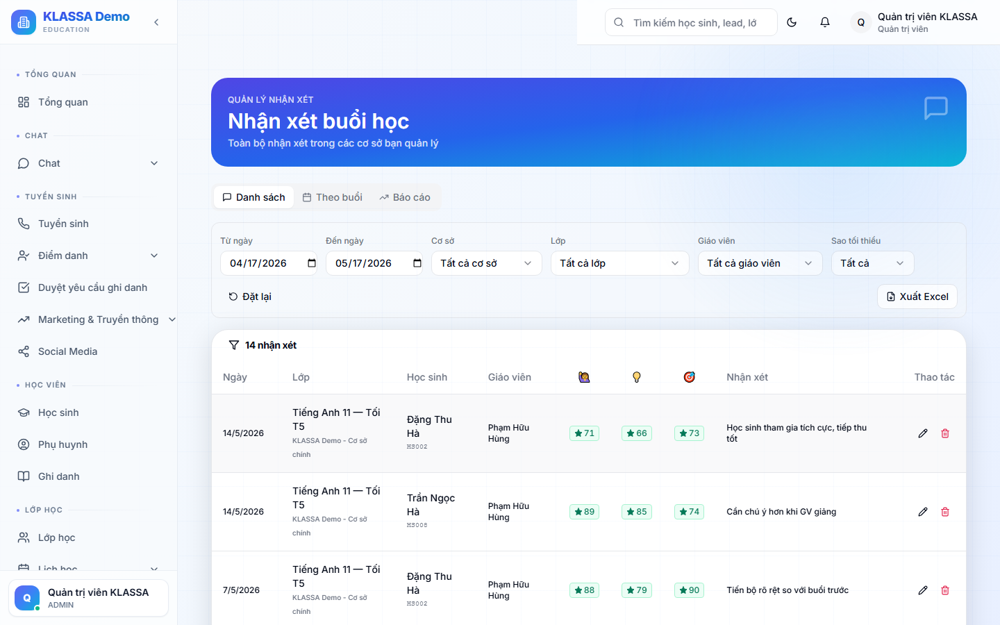

# Tiếp nhận phản hồi học sinh / phụ huynh

## Khái niệm

Module **Phản hồi** thu thập + xử lý ý kiến từ phụ huynh, học sinh, hoặc nhân viên về:

- Chất lượng giảng dạy
- Dịch vụ trung tâm
- Cơ sở vật chất
- Đề xuất cải thiện
- Báo lỗi phần mềm

## Truy cập

Menu trái → **Phản hồi** (hoặc **/feedbacks**).

## Nguồn phản hồi

- **Tự nguyện**: phụ huynh / HS gửi từ Cổng của họ
- **Khảo sát định kỳ**: trung tâm gửi form khảo sát qua Zalo / email
- **Phản hồi tại lớp**: GV ghi nhận trực tiếp
- **Tự động**: AI phân tích Zalo / Messenger phát hiện feedback ngầm

## Phân loại tự động

Phần mềm tự gán nhãn:
- 🟢 Tích cực
- 🟡 Trung tính
- 🔴 Tiêu cực

Và theo chủ đề: Giáo viên / Lễ tân / Cơ sở vật chất / Học phí / Khác.

## Bộ lọc

- Theo trạng thái xử lý
- Theo mức cảm xúc
- Theo đối tượng phản hồi
- Theo thời gian

## Câu hỏi thường gặp

**Tự động phát hiện feedback từ Zalo có chính xác không?**
~85% chính xác. Vẫn cần Quản lý xác nhận trước khi xử lý quan trọng.
