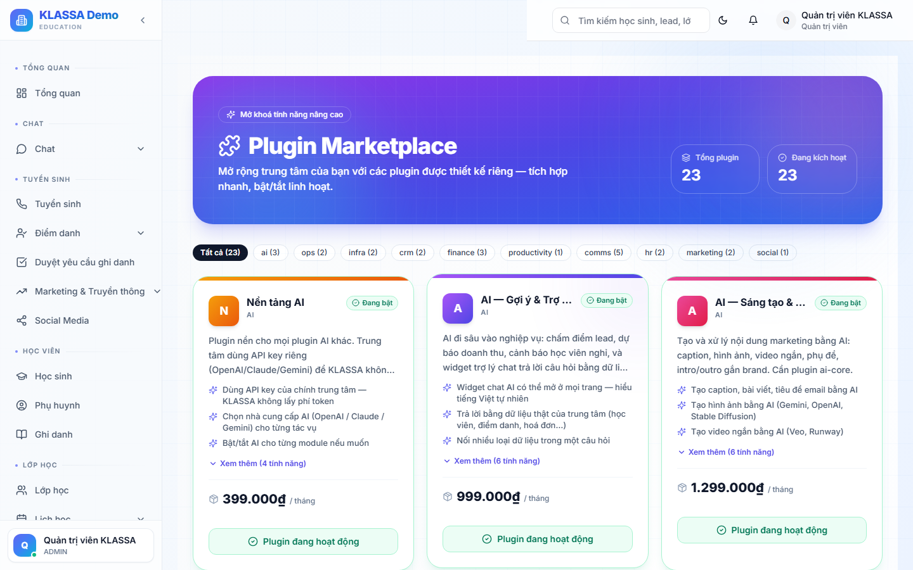

# Giới thiệu Plugin Marketplace

## Khái niệm

**Plugin** = module mở rộng tính năng KLASSA. Core KLASSA cung cấp tính năng cơ bản; plugin bổ sung các tính năng chuyên sâu.

## Truy cập

Menu trái → **Plugin** (hoặc **/plugins**).

## Các loại plugin

### Plugin core (miễn phí, bật sẵn cho mọi trung tâm)
- Quản lý cơ bản: HS, lớp, hoá đơn, lương
- Báo cáo cơ bản
- Tin nhắn Zalo OA

### Plugin nâng cao (trả phí)
- **Zalo Personal** — gửi qua Zalo cá nhân
- **AI HR Insights** — phân tích nhân sự
- **VoiceChat** — gọi voice/video nội bộ
- **e-Invoice** — hoá đơn điện tử
- **Casso** — đối soát ngân hàng nâng cao
- **Multi-branch RLS** — bảo mật theo cơ sở

### Plugin tích hợp bên ngoài
- Facebook Ads
- Google Analytics
- TikTok Pixel

## Mô hình giá

Phụ thuộc plugin:
- Một số gói tháng (vd 200k-500k/tháng)
- Một số trả theo lượng dùng (AI: theo lượt)
- Một số miễn phí

## Trial 7 ngày

Mọi plugin trả phí đều có **7 ngày dùng thử miễn phí** khi trung tâm mới tạo. Sau 7 ngày tự tắt nếu chưa mua.

## Câu hỏi thường gặp

**Tắt plugin có mất dữ liệu không?**
Không. Dữ liệu vẫn còn. Bật lại plugin → dữ liệu trở lại.
