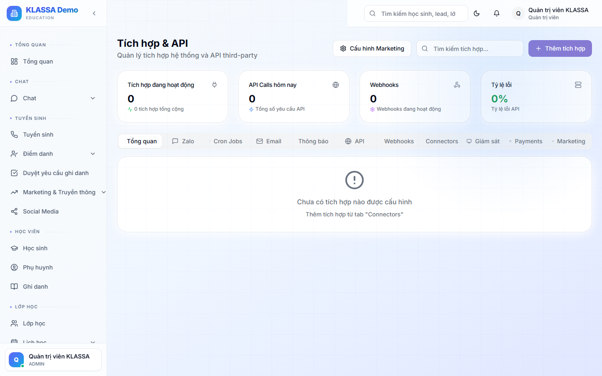

# Tổng quan tích hợp

## Khái niệm

**Tích hợp** = kết nối KLASSA với hệ thống / dịch vụ bên ngoài để mở rộng tính năng:

- Zalo OA / Zalo cá nhân → gửi tin phụ huynh
- Email SMTP → gửi hoá đơn / báo cáo
- SMS → gửi tin xác thực / nhắc nợ
- Ngân hàng → đối soát chuyển khoản tự động
- AI providers → kích hoạt tính năng AI
- Facebook / Google Ads → quảng cáo
- Bảng tính Google / Excel Online → đồng bộ dữ liệu

## Truy cập

Menu trái → **Tích hợp** (hoặc **/integrations**).

## Mô hình kết nối

Mỗi tích hợp = 1 plugin. Bật / tắt từng cái độc lập.

Trạng thái mỗi tích hợp:

- 🟢 Đã kết nối, hoạt động bình thường
- 🟡 Đã kết nối, có cảnh báo
- 🔴 Lỗi kết nối, cần kiểm tra
- ⚪ Chưa kết nối

## Bảo mật

- Token / API key được mã hoá lưu trong database
- Chỉ Chủ trung tâm + Quản lý có quyền cấu hình
- Có nhật ký truy cập mỗi lần tích hợp được sửa

## Lưu ý

- Một số tích hợp yêu cầu trung tâm có **tài khoản bên ngoài** trước (vd có Zalo OA, có ngân hàng đã đăng ký Internet Banking).
- Một số tích hợp tính phí (theo nhà cung cấp), một số miễn phí.

## Câu hỏi thường gặp

**Tích hợp mới đề xuất, làm sao có?**
Yêu cầu qua kênh hỗ trợ KLASSA. Đội phát triển sẽ đánh giá + bổ sung nếu phù hợp.
