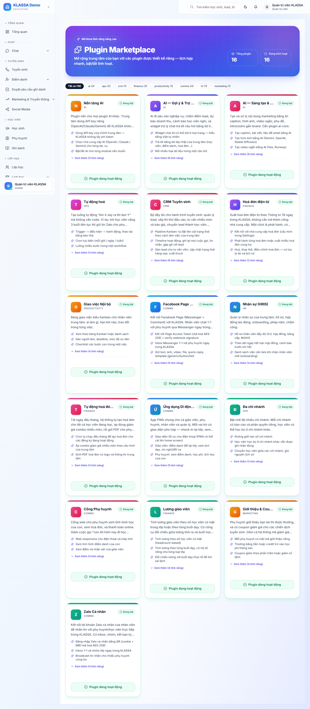
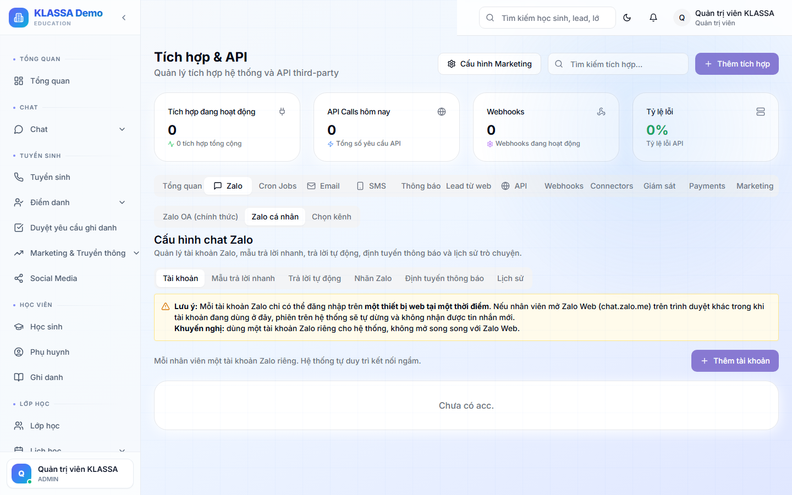

# Kết nối Zalo cá nhân

## Khái niệm

**Zalo cá nhân** là kênh chat **2 chiều** trong KLASSA — dùng chính số Zalo của nhân viên trung tâm để nhắn tin qua lại với phụ huynh, giống giao diện Messenger. Khác hẳn [Zalo OA](zalo-oa.md) (gửi 1 chiều theo template).

Cả Zalo cá nhân và Zalo OA nằm chung một plugin: **"Zalo (Cá nhân + OA)"**.

## Khi nào dùng

- Chăm sóc khách hàng 2 chiều: phụ huynh nhắn tin, nhân viên trả lời ngay
- Trung tâm chưa có Zalo OA, cần kênh Zalo miễn phí
- Nhắn nhóm lớp, gửi ảnh/voice/sticker, kết bạn, trả lời tự động theo từ khoá

## Bước 1 — Bật plugin

Plugin **"Zalo (Cá nhân + OA)"** **không tự bật được** từ phía trung tâm. Vào **Plugin Marketplace** (`/plugins`), thẻ plugin chưa bật chỉ có nút **"Liên hệ KLASSA"**.

Bấm **"Liên hệ KLASSA"** để yêu cầu → đội KLASSA kích hoạt → thẻ chuyển sang trạng thái **"Đang bật"**. Lúc đó tab cấu hình Zalo mới hiện.

## Bước 2 — Vào trang cấu hình

Menu trái → **Tích hợp & API** (`/integrations`) → tab **"Zalo"** → sub-tab **"Zalo cá nhân"** → tab con **"Tài khoản"**.

Các tab con khác: Mẫu trả lời nhanh · Trả lời tự động · Nhãn Zalo · Định tuyến thông báo · Lịch sử.

## Bước 3 — Thêm tài khoản + đăng nhập bằng QR

1. Bấm **"Thêm tài khoản"** → nhập **Tên gọi** (ví dụ "Sale Cam Linh") → bấm **"Tạo"**. Tài khoản hiện trạng thái **"Cần quét QR"**.
2. Trên thẻ tài khoản, bấm **"Quét QR"** → mở hộp thoại **"Quét QR đăng nhập"** hiển thị mã QR.

3. Trên điện thoại: mở **Zalo → Cài đặt → Quét QR** → quét mã trên màn hình → **xác nhận trên điện thoại**.
4. Đăng nhập thành công → trạng thái chuyển **"Đang hoạt động"**, hệ thống bắt đầu nhận tin.

> **Chỉ đăng nhập bằng QR** — không nhập số điện thoại / mật khẩu Zalo. Thông tin đăng nhập được lưu mã hoá an toàn.

### Các nút khác trên thẻ tài khoản
- **Chia sẻ** — cho nhiều nhân viên dùng chung một tài khoản Zalo
- **Profile** — đổi tên/ảnh/bio (chỉ khi đang hoạt động)
- **Đăng xuất** — thoát phiên, giữ lịch sử chat
- **Xoá** — xoá hẳn, mất lịch sử

## Bước 4 — Chat 2 chiều ở Inbox

Vào menu **Chat Zalo** (`/messaging/zalo`) → giao diện hộp thư kiểu Messenger: cột trái danh sách hội thoại, cột phải khung chat. Nhân viên gõ tin tự do, gửi ảnh/video/voice/sticker/danh thiếp, thả cảm xúc, ghim, trả lời, thu hồi, dùng mẫu trả lời nhanh + trả lời tự động theo từ khoá.

Chi tiết: [Gửi tin nhắn Zalo](../tin-nhan/zalo.md).

## Nhiều tài khoản + phân quyền

- Hỗ trợ **nhiều tài khoản** (mỗi nhân viên một số Zalo, chạy độc lập để tránh ảnh hưởng chéo). Tài khoản gắn theo cơ sở.
- **Ai được dùng:** Chủ trung tâm, Quản lý, Quản lý chi nhánh, Lễ tân/Tư vấn. Kế toán chỉ thấy hội thoại gắn nhãn hoá đơn. **Giáo viên, Trợ giảng, Nhân sự, Phụ huynh KHÔNG truy cập** Zalo.

## Giới hạn gửi & nguy cơ khoá tài khoản

- Gửi hoá đơn hàng loạt: hệ thống tự giới hạn **~30 tin/phút mỗi tài khoản** để giảm rủi ro bị Zalo khoá.
- Gửi broadcast thủ công: tối đa **200 người mỗi lần**, không tự giãn cách → nên tự chia nhỏ nếu gửi nhiều.
- Trạng thái tài khoản có **"Bị khoá"** / **"Hết phiên"** khi Zalo chặn hoặc rớt đăng nhập.

> **Cảnh báo quan trọng:** một số Zalo chỉ đăng nhập **1 thiết bị web tại một thời điểm**. Nếu mở Zalo Web (chat.zalo.me) ở trình duyệt khác, phiên trong KLASSA sẽ tự rớt. Nên dùng **một số Zalo riêng cho trung tâm**, không dùng số cá nhân của nhân viên.

## Câu hỏi thường gặp

**Quét QR xong nhưng bị rớt phiên liên tục?**
Kiểm tra xem có ai mở Zalo Web bằng cùng số đó ở nơi khác không. Một số chỉ giữ 1 phiên web. Đăng nhập lại bằng nút "Login lại" trên thẻ.

**Có bị Zalo khoá nick khi gửi nhiều không?**
Có rủi ro nếu gửi quá nhanh/quá nhiều. Hệ thống đã tự giới hạn ~30 tin/phút khi gửi hoá đơn hàng loạt. Tránh broadcast thủ công số lượng lớn dồn dập. Dùng số Zalo riêng để nếu có sự cố không ảnh hưởng số cá nhân.

**Zalo cá nhân khác Zalo OA chỗ nào?**
Cá nhân = chat 2 chiều, miễn phí, dùng nick nhân viên. OA = gửi 1 chiều theo template chính thức, trả phí. Xem [Kết nối Zalo OA](zalo-oa.md).
