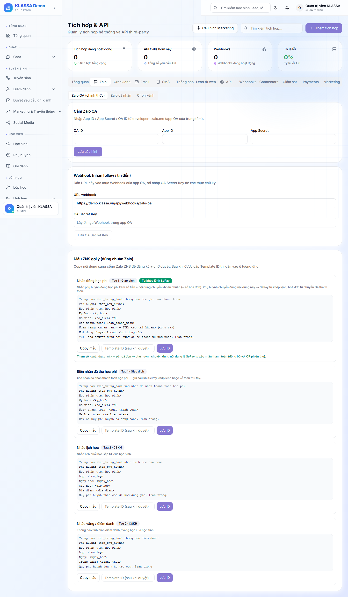
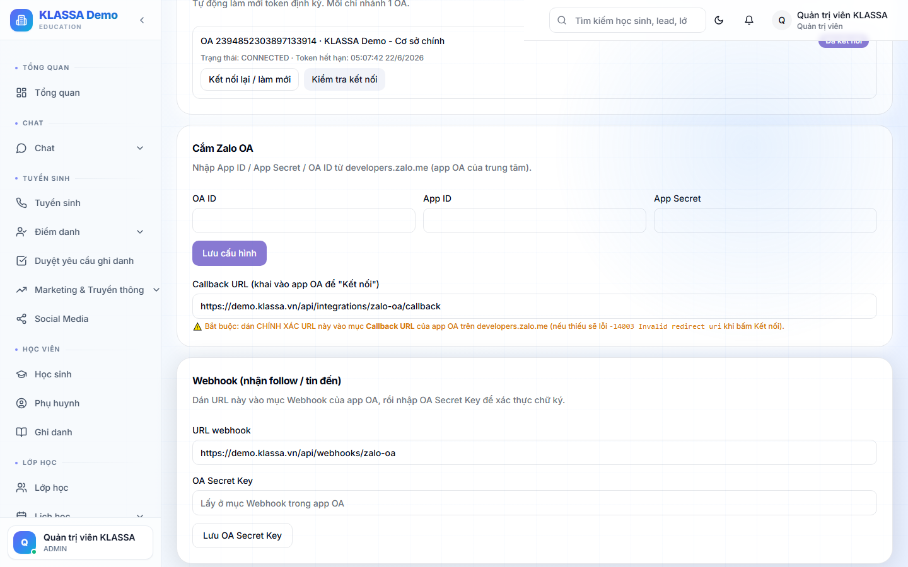
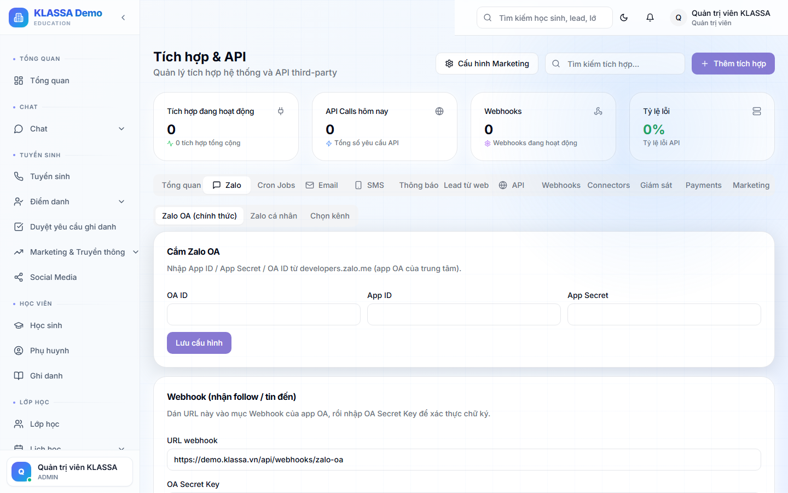
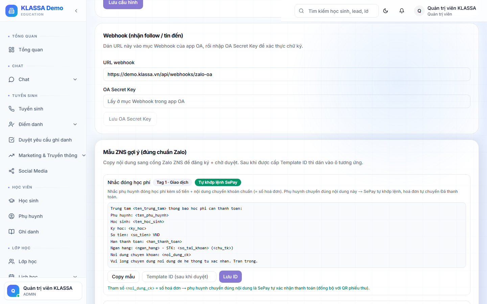
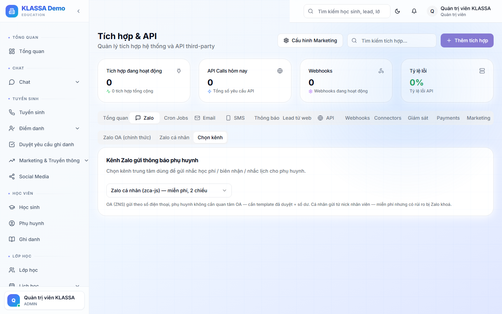

# Kết nối Zalo OA (Official Account)

## Hai hệ thống Zalo trong KLASSA

KLASSA có **2 kênh Zalo song song**, nằm chung trong một plugin **"Zalo (Cá nhân + OA)"**:

| | **Zalo OA (chính thức)** | **Zalo cá nhân** |
|--|--------------------------|-------------------|
| Bản chất | Gửi **1 chiều** qua API chính thức | Chat **2 chiều** kiểu Messenger |
| Gửi theo | Số điện thoại (ZNS) hoặc follower OA | Hội thoại trực tiếp |
| Mẫu tin | Template ZNS đã được Zalo duyệt | Tự do gõ tay |
| Chi phí | Trả phí ZNS theo Zalo | Miễn phí |
| Tài liệu | **Bài này** | [Kết nối Zalo cá nhân](zalo-ca-nhan.md) |

Bài này nói về **Zalo OA** — dùng để gửi thông báo tự động (nhắc học phí, biên nhận, nhắc lịch học, nhắc vắng) một cách chính thống.

## Điều kiện

- Trung tâm đã bật **plugin "Zalo (Cá nhân + OA)"** (xem [Plugin Marketplace](../plugin/gioi-thieu.md)). Plugin này gồm cả Zalo cá nhân lẫn Zalo OA — bật một lần dùng cả hai.
- Đã có **Zalo OA** (đăng ký tại oa.zalo.me) + **App** gắn với OA (tạo tại developers.zalo.me).

## Truy cập

Menu trái → **Tích hợp & API** (`/integrations`) → tab **"Zalo"** → sub-tab **"Zalo OA (chính thức)"**.

> KHÔNG có menu "Tích hợp → Zalo OA" riêng và KHÔNG cấu hình trong Cài đặt. Tất cả ở `/integrations` tab Zalo.

## Bước 1 — Nhập thông tin OA

Tại card **"Cắm Zalo OA"**, nhập 3 ô (lấy ở developers.zalo.me):

- **OA ID** — ID tài khoản Official Account của trung tâm
- **App ID** — App gắn với OA
- **App Secret**

Bấm **"Lưu cấu hình"**. Trạng thái lúc này là **"Chưa kết nối"**.

> **Toàn bộ cấu hình lưu an toàn trong hệ thống (mã hoá).** Anh chị KHÔNG cần nhập gì vào file môi trường (env). Không cần "Access Token" — phần mềm tự lấy ở bước sau.

## Bước 2 — Kết nối OA (uỷ quyền)

Bấm **"Kết nối OA"** → phần mềm chuyển sang trang cấp quyền của Zalo → anh chị đăng nhập Zalo và đồng ý cấp quyền cho OA → Zalo chuyển ngược về KLASSA → trạng thái thành **"Đã kết nối"**.

- **Access Token KHÔNG nhập tay** — phần mềm tự lấy qua bước uỷ quyền này.
- Token **tự làm mới mỗi 15 phút**, không cần can thiệp.
- Quyền uỷ quyền sống khoảng **90 ngày**; hết hạn thì bấm **"Kết nối lại"** một lần.

## Bước 3 — Cấu hình Webhook (nhận follow / tin đến)

Tại card **"Webhook"**:

- Copy **URL webhook** mà KLASSA tự sinh sẵn (ô chỉ đọc) → dán vào mục Webhook trong ứng dụng OA trên Zalo.
- Nhập **OA Secret Key** (lấy ở mục Webhook của app OA) → bấm **"Lưu OA Secret Key"**.

Webhook giúp KLASSA biết khi phụ huynh follow OA / nhắn tin → mở "cửa sổ tư vấn" để gửi tin miễn phí.

## Bước 4 — Đăng ký mẫu tin ZNS

ZNS (Zalo Notification Service) là tin theo template **phải được Zalo duyệt trước**. KLASSA gợi ý sẵn **4 mẫu** đúng chuẩn:

| Mẫu | Loại | Ghi chú |
|-----|------|---------|
| Nhắc đóng học phí | Tag 1 | Có mã hoá đơn → **tự khớp lệnh SePay** |
| Biên nhận đã thu học phí | Tag 1 | |
| Nhắc lịch học | Tag 2 | |
| Nhắc vắng / điểm danh | Tag 2 | |

Quy trình mỗi mẫu:
1. Bấm **"Copy mẫu"** → dán nội dung sang **cổng ZNS của Zalo** để đăng ký.
2. Chờ Zalo **duyệt** mẫu → Zalo cấp một **Template ID**.
3. Dán Template ID vào ô tương ứng trong KLASSA → bấm **"Lưu ID"**.

Mẫu "Nhắc đóng học phí" chứa tham số nội dung chuyển khoản = số hoá đơn → khi phụ huynh chuyển khoản, SePay tự khớp đúng hoá đơn.

## Bước 5 — Chọn kênh gửi

Sub-tab **"Chọn kênh"** → chọn kênh gửi thông báo cho phụ huynh (theo từng cơ sở):

- **Zalo cá nhân** (mặc định) — miễn phí, 2 chiều
- **Zalo OA** — chính thống, trả phí ZNS
- **Cả hai** — OA trước, cá nhân dự phòng
- **Tắt** — không gửi qua Zalo

## Cách OA gửi tin

OA gửi **tự động 1 chiều** theo sự kiện (đến hạn học phí, vừa thu tiền, sắp đến buổi học, vắng mặt…) dựa trên kênh đã chọn ở Bước 5. **KHÔNG có màn hình soạn / gửi / lập lịch tin OA bằng tay** — đó là điểm khác Zalo cá nhân.

- Trong "cửa sổ tư vấn" **48 giờ** kể từ lần phụ huynh tương tác cuối → gửi được tin tự do (miễn phí).
- Ngoài 48 giờ → bắt buộc dùng ZNS theo số điện thoại (template đã duyệt, trả phí).

## Câu hỏi thường gặp

**Tôi chưa có Zalo OA, dùng tạm cách khác được không?**
Được. Dùng [Zalo cá nhân](zalo-ca-nhan.md) (cùng plugin) — quét QR đăng nhập, chat 2 chiều, miễn phí. Phù hợp trung tâm nhỏ.

**Khác nhau giữa ZNS và tin tư vấn?**
ZNS gửi theo SĐT bất kỳ (phụ huynh không cần follow OA), trả phí, cần template duyệt. Tin tư vấn chỉ gửi cho follower trong cửa sổ 48 giờ, miễn phí.

**Có nút "gửi thử" để kiểm tra kết nối không?**
Trạng thái kết nối hiển thị bằng nhãn "Đã kết nối / Chưa kết nối". Hiện chưa có nút gửi thử trên màn hình — sau khi kết nối + đăng ký mẫu, hệ thống tự gửi theo sự kiện.

**Hết hạn uỷ quyền (90 ngày) thì sao?**
Vào lại tab Zalo OA, bấm **"Kết nối lại"** và cấp quyền một lần nữa. Cấu hình OA ID / App ID không phải nhập lại.
