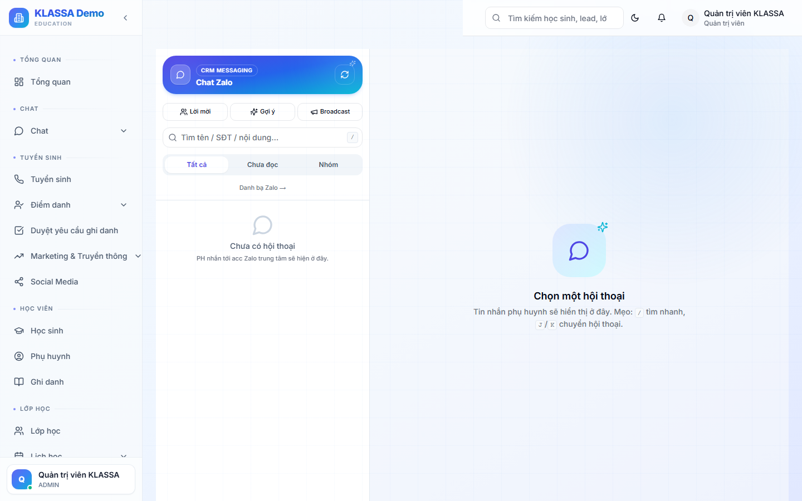

# Gửi tin nhắn Zalo

## Khi nào dùng

KLASSA gửi tin Zalo qua 2 kênh:

1. **Zalo Official Account (OA)** — gửi tin chính thức từ tài khoản OA của trung tâm, gửi được hàng loạt, có **giới hạn template** + hạn quote tin nhắn ngoài 24h
2. **Zalo cá nhân** (qua plugin zalo-personal) — dùng số Zalo của 1 nhân viên, gửi tự do nhưng giới hạn tốc độ

## Truy cập

Menu trái → **Tin nhắn → Zalo** (hoặc **/messaging/zalo**).

## Tính năng

- **Soạn tin nhanh** cho 1 phụ huynh
- **Gửi hàng loạt** theo danh sách (cả lớp, cả khoá)
- **Sử dụng mẫu** — chọn từ thư viện mẫu có sẵn
- **Lập lịch gửi** — đặt giờ cụ thể (vd 17:30 trước buổi học)
- **Theo dõi** — đã gửi, đã nhận, đã đọc, đã trả lời

## Mẫu tin có sẵn

- Nhắc đóng học phí
- Thông báo lịch học
- Báo cáo điểm danh tuần
- Chúc mừng sinh nhật
- Khai giảng khoá mới

## Lưu ý

- **Zalo OA cần kết nối trước** — xem [Tích hợp Zalo OA](../tich-hop/zalo-oa.md).
- **Tin ngoài giờ 24h kể từ phụ huynh nhắn cuối** — bắt buộc dùng template OA đã duyệt.

## Câu hỏi thường gặp

**Tôi không có Zalo OA, dùng tài khoản Zalo cá nhân của lễ tân được không?**
Được, nhưng cần plugin "Zalo Personal" — gửi nhiều dễ bị Zalo khoá tài khoản. Phù hợp gửi < 50 tin/ngày.
