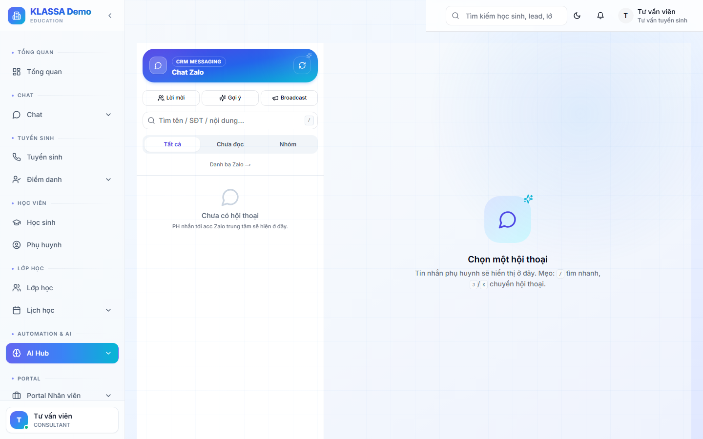

# Gửi tin nhắn Zalo

KLASSA gửi tin Zalo qua **2 kênh tách biệt** — đừng nhầm lẫn:

| | **Zalo cá nhân** | **Zalo OA (chính thức)** |
|--|------------------|--------------------------|
| Nơi thao tác | **Chat Zalo** (`/messaging/zalo`) — inbox 2 chiều | Tự động theo sự kiện (không gõ tay) |
| Cách gửi | Nhân viên gõ tin trực tiếp | Hệ thống tự gửi ZNS/template |
| Cấu hình | [Kết nối Zalo cá nhân](../tich-hop/zalo-ca-nhan.md) | [Kết nối Zalo OA](../tich-hop/zalo-oa.md) |

## 1. Tin Zalo cá nhân — gõ tay ở Inbox

Vào menu **Chat Zalo** (`/messaging/zalo`).

Đây là hộp thư **2 chiều** kiểu Messenger:
- **Cột trái** — danh sách hội thoại (lọc Tất cả / Chưa đọc / Nhóm; nút Lời mời / Gợi ý / Broadcast)
- **Cột phải** — khung chat: gõ tin, gửi ảnh/video/voice/sticker/danh thiếp, thả cảm xúc, ghim, trả lời, thu hồi

Tính năng hỗ trợ:
- **Mẫu trả lời nhanh** — soạn sẵn câu hay dùng, chèn 1 chạm
- **Trả lời tự động** — phụ huynh nhắn từ khoá (vd "học phí") → tự gửi câu trả lời
- **Nhãn Zalo** — gắn nhãn hội thoại (vd "đã đóng tiền", "cần gọi lại")
- **Broadcast** — gửi 1 nội dung cho nhiều người (tối đa 200/lần)

> Đây KHÔNG phải nơi gửi tin OA. `/messaging/zalo` chỉ dành cho Zalo cá nhân.

## 2. Tin Zalo OA — tự động theo sự kiện

Tin OA (ZNS / template) **KHÔNG soạn tay**. Hệ thống tự gửi khi có sự kiện:
- Hoá đơn đến hạn → nhắc đóng học phí
- Vừa thu tiền → biên nhận
- Sắp đến buổi học → nhắc lịch
- Học sinh vắng → nhắc điểm danh

Điều kiện: trung tâm đã [kết nối Zalo OA](../tich-hop/zalo-oa.md) + đăng ký mẫu ZNS + chọn kênh "Zalo OA" (hoặc "Cả hai") ở sub-tab Chọn kênh.

**4 mẫu ZNS chính thức**: Nhắc đóng học phí · Biên nhận đã thu · Nhắc lịch học · Nhắc vắng/điểm danh. (Không có mẫu "Báo cáo tuần / Sinh nhật / Khai giảng" trong ZNS — nếu cần gửi nội dung đó thì dùng Zalo cá nhân.)

## Lưu ý

- **Giới hạn gửi Zalo cá nhân**: ~30 tin/phút/tài khoản khi gửi hoá đơn hàng loạt; broadcast thủ công tối đa 200 người/lần. Tránh gửi dồn dập để không bị Zalo khoá.
- **Cửa sổ tư vấn OA**: gửi tin tự do miễn phí trong **48 giờ** kể từ lần phụ huynh tương tác cuối; ngoài 48 giờ dùng ZNS theo SĐT (trả phí).

## Câu hỏi thường gặp

**Tôi muốn gửi 1 tin cho cả lớp, làm thế nào?**
Dùng **Broadcast** trong Inbox Zalo cá nhân (chọn danh sách, tối đa 200/lần). Hoặc để hệ thống tự gửi ZNS theo sự kiện nếu đã bật Zalo OA.

**Phụ huynh không nhận được tin?**
Kiểm tra: kênh Zalo đã chọn đúng chưa (sub-tab Chọn kênh), tài khoản Zalo cá nhân còn "Đang hoạt động" không, hoặc với OA thì mẫu ZNS đã được Zalo duyệt + dán Template ID chưa.
