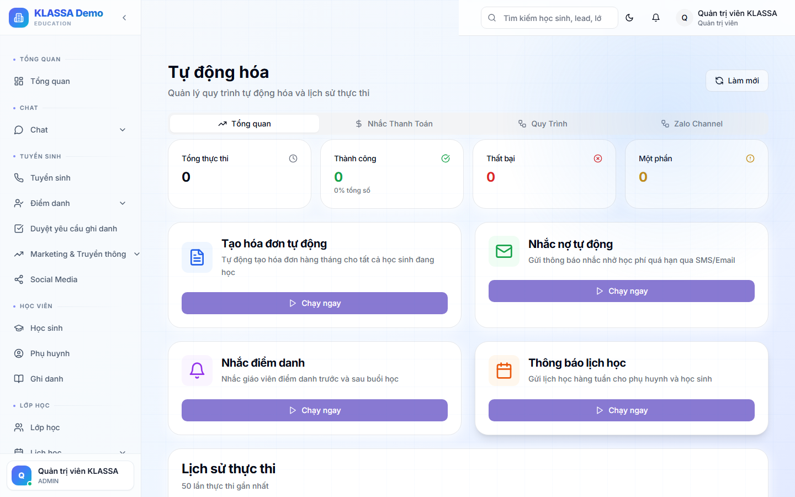

# Tự động hoá quy trình (Workflow)

## Khái niệm

**Workflow** = chuỗi hành động tự động khi một sự kiện xảy ra.

Ví dụ:

- **Khi học sinh nghỉ buổi 3 lần liên tiếp** → tự gửi Zalo nhắc phụ huynh + tạo task cho lễ tân gọi
- **Khi học sinh sắp hết hạn học phí (3 ngày)** → tự gửi nhắc + tạo hoá đơn nháp
- **Khi Lead mới tạo** → tự gán cho tư vấn viên đang trực + Zalo "Xin chào, em là..."

## Truy cập

Menu trái → **Tự động hoá** (hoặc **/automation**).

## Cấu trúc 1 workflow

3 phần:

### 1. Trigger (kích hoạt)

Sự kiện gây workflow chạy:
- HS ghi danh
- Hoá đơn quá hạn
- Lead chuyển giai đoạn
- Đến giờ X trong ngày
- Mỗi tuần T2 lúc 9h
- Có người nhắn Zalo

### 2. Điều kiện (filter)

Có chạy không tuỳ thuộc điều kiện:
- Chỉ HS thuộc cơ sở X
- Chỉ Lead nguồn Facebook
- Chỉ giáo viên cộng tác

### 3. Hành động (action)

Việc cần làm:
- Gửi Zalo / email / SMS
- Tạo task cho nhân viên
- Đổi giai đoạn Lead
- Tạo hoá đơn
- Gọi webhook bên ngoài

## Tạo workflow mới

Bấm **"+ Tạo workflow"** → chọn trigger → cấu hình điều kiện → chọn hành động → lưu.

Hoặc dùng [mẫu có sẵn](mau-co-san.md) để tiết kiệm thời gian.

## Lưu ý

- **Test trước** với 1-2 trường hợp trước khi bật cho toàn trung tâm.
- **Bật / tắt** workflow bất cứ lúc nào.
- **Theo dõi**: trang Workflow có lịch sử chạy, ai/cái gì kích hoạt, kết quả.

## Câu hỏi thường gặp

**Workflow chạy bao nhiêu lâu sau khi trigger?**
Mặc định trong 5 giây. Có thể đặt độ trễ (vd gửi tin lúc 19h dù trigger lúc 14h).

**Workflow chạy lỗi, làm sao biết?**
Trang Workflow có tab "Lịch sử" — hiển thị trạng thái mỗi lần chạy. Lỗi có log chi tiết.
