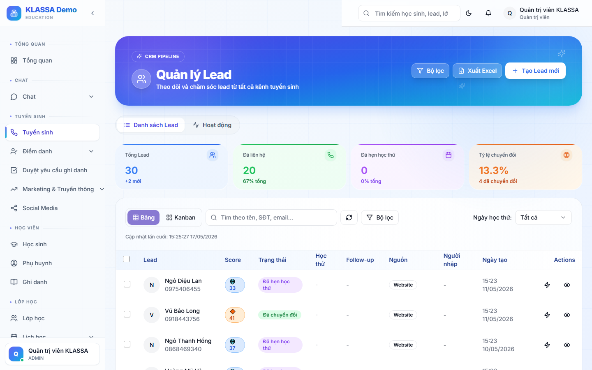

# Chi tiết Lead — lịch sử tư vấn

## Khi nào mở trang chi tiết

- Trước khi gọi điện cho khách → đọc nhanh xem ai đã liên hệ trước đó, khách đã nói gì
- Sau khi gọi → ghi lại nội dung cuộc gọi để lần sau không hỏi lại
- Khi cần đổi tư vấn viên phụ trách
- Khi chuyển Lead thành học sinh

## Cách mở

Từ **Danh sách Lead** hoặc **Phễu tuyển sinh** → bấm vào dòng Lead bất kỳ.

## Bố cục trang

### Cột trái — Thông tin Lead

- Họ tên, SĐT, email
- Lớp, môn quan tâm
- Nguồn Lead
- Ngày tạo Lead
- Tư vấn viên phụ trách
- Giai đoạn hiện tại

Bấm **"Sửa"** để cập nhật bất kỳ thông tin nào.

### Cột phải — Tab hoạt động

Mặc định mở tab **"Lịch sử"** — danh sách các tương tác đã có với Lead:

- ☎️ Cuộc gọi đi (ai gọi, lúc nào, ghi chú)
- 💬 Tin nhắn Zalo gửi đi
- ✉️ Email đã gửi
- 📌 Ghi chú nội bộ
- 🔄 Thay đổi giai đoạn

Các tab khác:

- **Hẹn tư vấn** — lịch hẹn với khách (xem [Lịch học thử](lich-hoc-thu.md))
- **File đính kèm** — báo giá, brochure đã gửi
- **Thẻ (tags)** — gắn nhãn để lọc nhanh ("VIP", "Khách quay lại", "Cần ưu đãi")

## Các thao tác nhanh

Trên đầu trang chi tiết có các nút:

- **☎️ Gọi điện** — bấm để gọi qua Zalo (nếu trung tâm kết nối Zalo OA)
- **💬 Gửi Zalo** — soạn tin nhanh
- **✉️ Gửi email** — soạn email từ mẫu có sẵn
- **📝 Thêm ghi chú** — ghi nhanh nội dung cuộc gọi vừa xong
- **🔄 Đổi giai đoạn** — chuyển Lead sang tầng khác trong phễu
- **🎓 Chuyển thành học sinh** — xem [Chuyển Lead thành Học sinh](chuyen-lead-thanh-hoc-sinh.md)

## Mẹo dùng hiệu quả

- **Ghi chú ngay sau cuộc gọi**, không đợi cuối ngày — dễ quên chi tiết
- **Dùng @tên đồng nghiệp** trong ghi chú để mention họ — họ sẽ nhận thông báo
- **Đặt nhắc nhở** ("Gọi lại sau 19h") — phần mềm sẽ ping anh chị đúng giờ
- **Đính kèm file báo giá** đã gửi để biết version nào — tránh gửi nhầm bản cũ

## Câu hỏi thường gặp

**Tôi xoá nhầm một ghi chú, lấy lại được không?**
Ghi chú đã xoá không khôi phục được. Nếu cần lấy lại, mở **Nhật ký truy cập** (chỉ Quản lý xem) để biết nội dung trước khi xoá.

**Nhiều người cùng sửa Lead một lúc thì sao?**
Phần mềm chỉ cho phép một người sửa một thời điểm. Người vào sau sẽ thấy cảnh báo "Lead đang được X chỉnh sửa".
