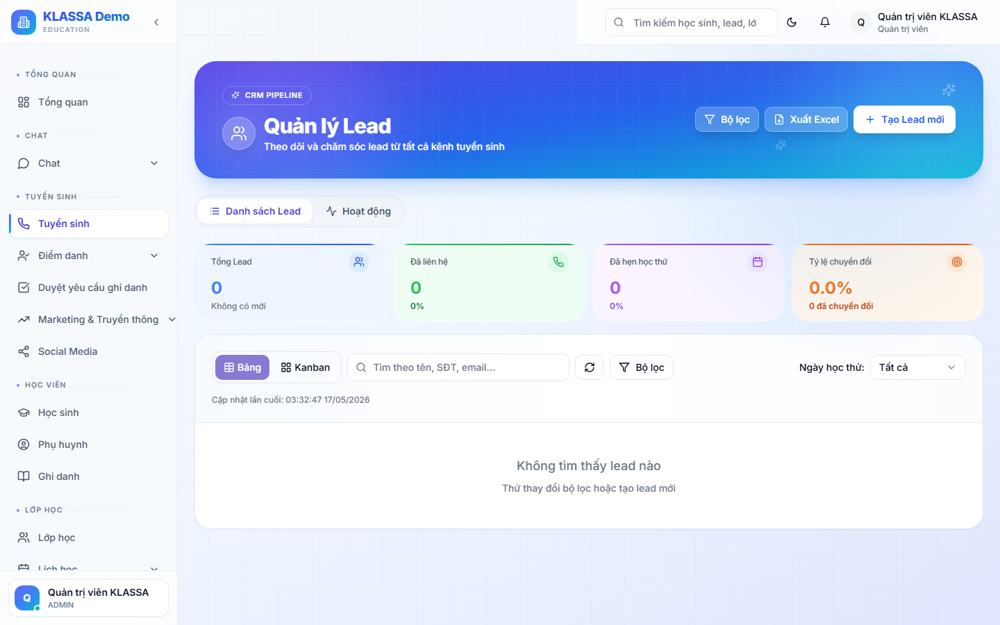

# Chuyển Lead thành Học sinh

## Khi nào dùng

Khi khách quyết định đăng ký và đóng học phí — đây là **bước cuối** của phễu tuyển sinh, đồng thời là bước **đầu** của hồ sơ học sinh.

## Các bước

### Bước 1 — Mở trang chi tiết Lead

Từ phễu hoặc danh sách, bấm vào Lead khách hàng vừa đăng ký.

### Bước 2 — Bấm "Chuyển thành Học sinh"

Nút này nằm ở góc trên bên phải trang chi tiết Lead.

### Bước 3 — Điền thông tin còn thiếu

Một cửa sổ hiện ra, phần mềm tự điền sẵn thông tin từ Lead. Anh chị chỉ cần bổ sung:

- **Mã học sinh** — phần mềm tự sinh, có thể đổi nếu trung tâm có quy tắc riêng
- **Ngày sinh học sinh** (bắt buộc)
- **Giới tính**
- **Trường học hiện tại**
- **Địa chỉ**
- **Thông tin phụ huynh** — họ tên, SĐT, mối quan hệ

### Bước 4 — Chọn lớp ghi danh

Bên dưới có phần **"Ghi danh vào lớp"**. Chọn:

- Khoá học
- Lớp cụ thể (theo ca, giáo viên)
- Ngày bắt đầu

Có thể chọn **"Để sau"** nếu chưa biết lớp — tạo hồ sơ học sinh trước, ghi danh sau.

### Bước 5 — Tạo hoá đơn (tuỳ chọn)

Bật công tắc **"Tạo hoá đơn ngay"** nếu khách đã đóng tiền hoặc cam kết đóng. Phần mềm sẽ:

- Tính học phí theo khoá đã chọn
- Áp dụng khuyến mãi nếu có (chọn từ danh sách)
- Sinh hoá đơn nháp để anh chị xem trước khi gửi khách

### Bước 6 — Bấm "Xác nhận chuyển đổi"

Phần mềm thực hiện đồng loạt:

- Tạo hồ sơ học sinh
- Tạo hồ sơ phụ huynh (nếu chưa có)
- Cấp tài khoản phụ huynh để xem điểm danh / hoá đơn
- Ghi danh vào lớp
- Tạo hoá đơn (nếu có chọn)
- Đóng Lead với trạng thái **"Đã chuyển đổi"**

## Lưu ý

- **Không thể đảo ngược** sau khi chuyển — Lead trở thành học sinh chính thức. Nếu nhập sai, sửa thông tin trong hồ sơ học sinh, không xoá rồi tạo lại.
- **Tài khoản phụ huynh** mặc định có mật khẩu chung `12345678` — phụ huynh đăng nhập sau sẽ được khuyến khích đổi.
- **Nếu phụ huynh đã có học sinh khác** trong trung tâm, hệ thống tự nhận diện theo SĐT và gắn cùng tài khoản — 1 phụ huynh quản lý nhiều con.

## Câu hỏi thường gặp

**Khách đã đóng cọc nhưng chưa đóng đủ học phí, có chuyển được không?**
Có. Tạo hồ sơ + ghi danh, nhưng để công nợ trong hoá đơn. Phần mềm sẽ nhắc lễ tân thu nốt.

**Một Lead có 2 con cùng đăng ký, làm sao?**
Chuyển Lead thành học sinh đầu tiên, rồi vào hồ sơ phụ huynh → bấm **"Thêm học sinh"** để tạo bé thứ 2 với cùng phụ huynh.

**Sau khi chuyển đổi, Lead có còn trong hệ thống không?**
Có. Lead vẫn được lưu với trạng thái "Đã chuyển đổi" — phục vụ thống kê tỷ lệ chuyển đổi của tư vấn viên.
