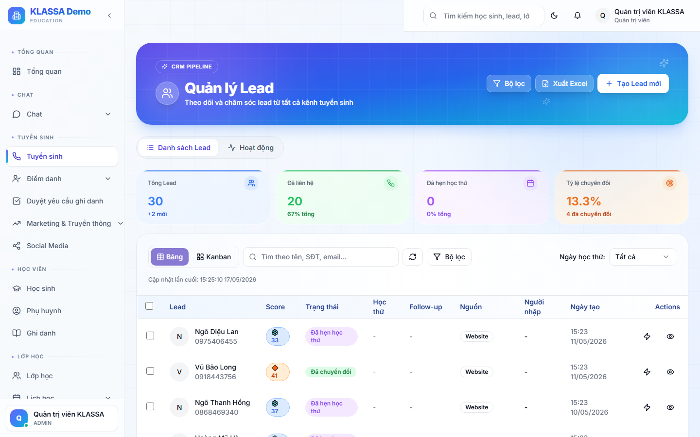
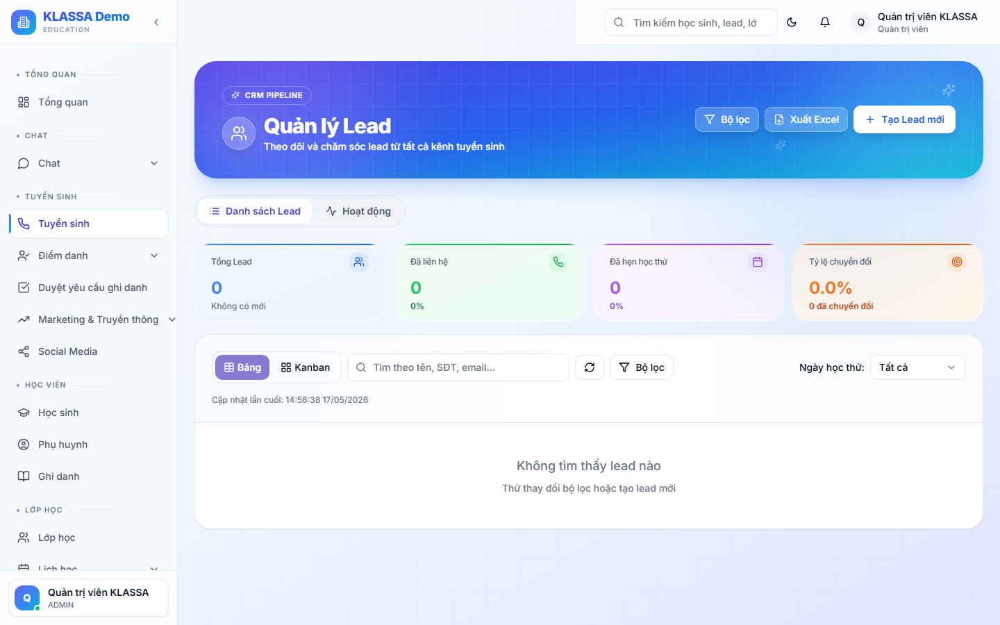

# Danh sách Lead (khách quan tâm)

## "Lead" là gì?

**Lead** là cách gọi tắt cho **khách quan tâm chưa đăng ký** — bất kỳ ai liên hệ với trung tâm để hỏi về khoá học nhưng chưa nộp học phí, chưa trở thành học sinh chính thức.

Lead có thể đến từ nhiều nguồn:

- Phụ huynh gọi điện hỏi
- Phụ huynh nhắn tin Zalo / Facebook
- Khách vào trang web trung tâm điền form đăng ký tư vấn
- Học sinh giới thiệu bạn
- Nhân viên gặp khách ở sự kiện ngoài trung tâm

Quản lý tốt danh sách Lead = biến nhiều khách quan tâm thành học sinh thật = tăng doanh thu.

## Khi nào dùng

- Lễ tân tiếp nhận khách mới → ghi vào danh sách Lead
- Tư vấn viên gọi điện hẹn lịch tư vấn
- Quản lý theo dõi tình hình tuyển sinh trong tháng
- Báo cáo cho chủ trung tâm tỷ lệ chuyển đổi Lead → Học sinh

## Các bước truy cập

### Bước 1 — Vào menu Tuyển sinh

Ở thanh menu bên trái, bấm **Tuyển sinh → Danh sách Lead**.

### Bước 2 — Quan sát màn hình

Màn hình danh sách Lead chia làm 3 phần chính:

#### A. Khối số liệu tổng quan (phía trên)

- **Tổng Lead** — tổng số khách quan tâm tính từ đầu trung tâm
- **Lead mới tháng này** — số khách quan tâm vừa được thêm trong tháng hiện tại
- **Tỷ lệ chuyển đổi** — bao nhiêu phần trăm Lead biến thành học sinh thật
- **Lead cần gọi lại** — số Lead chưa được tư vấn viên liên hệ quá 2 ngày

#### B. Bộ lọc và tìm kiếm

- **Ô tìm kiếm** — gõ tên, số điện thoại, email để tìm nhanh
- **Lọc theo giai đoạn** — chỉ hiện các Lead đang ở một bước cụ thể (mới, đã gọi, đã hẹn, đã đến trung tâm…)
- **Lọc theo nguồn** — chỉ hiện Lead đến từ Zalo, Facebook, hoặc khách giới thiệu
- **Lọc theo tư vấn viên** — chỉ hiện Lead của một nhân viên cụ thể (hữu ích khi chia ca trực)

#### C. Bảng danh sách Lead

Mỗi dòng là một khách quan tâm với các cột:

- **Tên + SĐT** — thông tin liên lạc
- **Quan tâm môn / khoá** — ví dụ "Toán lớp 9", "Tiếng Anh giao tiếp"
- **Nguồn** — Lead đến từ đâu
- **Giai đoạn** — đang ở bước nào trong quá trình tư vấn
- **Tư vấn viên** — ai phụ trách Lead này
- **Liên hệ gần nhất** — bao nhiêu ngày trước

Bấm vào dòng Lead bất kỳ để vào trang chi tiết.

## Hai tab trên trang Lead

Phần trên màn hình có hai tab:

- **Lead** (mặc định) — bảng danh sách như mô tả ở trên
- **Hoạt động** — nhật ký các cuộc gọi, tin nhắn, ghi chú của tư vấn viên gắn với Lead

Tab Hoạt động giúp quản lý nắm nhanh "hôm nay nhân viên tư vấn đã gọi bao nhiêu cuộc, kết quả thế nào" mà không phải bấm vào từng Lead xem riêng.

## Lưu ý

- **Lễ tân và Tư vấn viên** thấy danh sách Lead. **Giáo viên, Kế toán, Phụ huynh** không thấy (xem [Vai trò người dùng](../bat-dau/vai-tro-nguoi-dung.md)).
- **Số liệu cập nhật ngay** — vừa thêm Lead mới, khối tổng quan đã tăng số.
- **Không xoá Lead vội** — kể cả khách không quan tâm nữa, giữ lại để biết nguồn nào hiệu quả thấp.

## Câu hỏi thường gặp

**Tôi không thấy menu "Tuyển sinh" trong sidebar, là sao?**
Tài khoản của anh chị chưa được cấp quyền xem Lead. Liên hệ Chủ trung tâm hoặc Quản lý để được cấp vai trò Lễ tân / Tư vấn viên trở lên.

**Lead hiển thị quá nhiều, tôi muốn xem riêng Lead của mình thôi?**
Dùng bộ lọc "Tư vấn viên" → chọn tên mình. Phần mềm sẽ chỉ hiển thị Lead đang được giao cho anh chị.

**Tại sao có Lead không có số điện thoại?**
Có thể khách điền form trên web mà chỉ để lại email, hoặc nhắn tin Zalo nên không có SĐT. Phần mềm vẫn nhận, anh chị có thể gọi qua Zalo / gửi email để xin SĐT sau.
