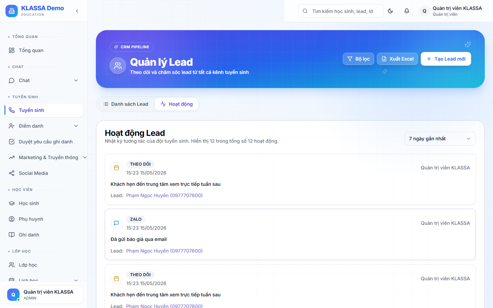

# Hoạt động tư vấn — nhật ký cuộc gọi

## Khái niệm

**Hoạt động tư vấn** là nhật ký tổng hợp **mọi tương tác** với Lead — cuộc gọi, tin nhắn, email, ghi chú, đổi trạng thái. Khác với trang chi tiết Lead (xem từng Lead), tab này xem **theo nhân viên** hoặc **theo ngày**.

## Khi nào dùng

- Quản lý xem hôm nay nhân viên đã làm gì (KPI gọi/ngày)
- Tư vấn viên xem lại lịch sử cuộc gọi cuối ngày
- Báo cáo tháng cho chủ trung tâm: tổng cuộc gọi, tỷ lệ thành công

## Cách dùng

### Mở tab Hoạt động

Vào **Tuyển sinh → Hoạt động** (hoặc bấm tab **"Hoạt động"** ở trang Danh sách Lead).

### Bộ lọc

- **Theo ngày** — chọn ngày / tuần / tháng cụ thể
- **Theo tư vấn viên** — xem riêng từng nhân viên
- **Theo loại hoạt động** — chỉ xem cuộc gọi, hoặc chỉ tin nhắn
- **Theo kết quả** — thành công / không bắt máy / từ chối / hẹn lại

### Bảng hoạt động

Mỗi dòng có:

- Thời gian
- Tư vấn viên
- Tên Lead (bấm để mở chi tiết)
- Loại (cuộc gọi / tin nhắn / email)
- Kết quả ngắn gọn
- Ghi chú

### KPI ở đầu trang

Phần mềm tự tính:

- **Tổng cuộc gọi hôm nay** (theo nhân viên đang chọn)
- **Tỷ lệ bắt máy** — bao nhiêu cuộc thành công / tổng cuộc gọi
- **Lead mới chuyển sang Đã liên hệ** — đo hiệu quả gọi
- **Cuộc gọi trung bình / Lead** — Lead khó cần gọi mấy lần mới chuyển?

## Lưu ý

- **Hoạt động được ghi tự động** khi anh chị bấm các nút "Gọi", "Gửi Zalo", "Đổi giai đoạn" trong trang chi tiết Lead — không cần tự gõ tay.
- **Nếu gọi ngoài phần mềm** (qua điện thoại cá nhân), nên vào trang Lead bấm **"Thêm ghi chú"** để hệ thống có ghi nhận, không thiếu lịch sử.

## Câu hỏi thường gặp

**KPI ngày hôm trước có lưu lại không?**
Có. Đổi bộ lọc ngày để xem lại bất kỳ ngày nào trong quá khứ.

**Xuất Excel danh sách hoạt động được không?**
Được. Bấm nút **"Xuất Excel"** ở góc phải bảng.
