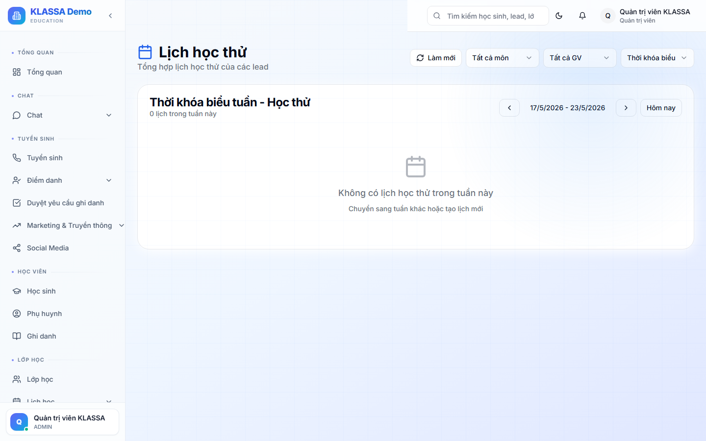

# Lịch học thử (trial test)

## Khái niệm

**Học thử** là buổi học miễn phí hoặc giảm giá để khách quan tâm trải nghiệm trước khi đăng ký chính thức. Nhiều trung tâm dùng học thử như **bước trung gian** giữa "Đã hẹn" và "Đã chuyển đổi" trong phễu.

## Khi nào dùng

- Khách muốn xem lớp học thực tế trước khi đăng ký
- Trung tâm tổ chức "Ngày trải nghiệm" tập trung nhiều Lead cùng đến
- Đo trình độ học sinh để xếp lớp phù hợp

## Các bước

### Bước 1 — Mở trang Lịch học thử

Vào **Tuyển sinh → Lịch học thử**.

### Bước 2 — Tạo buổi học thử mới

Bấm **"+ Tạo buổi học thử"**.

Điền:

- **Tên buổi** — ví dụ "Học thử Toán lớp 9 — sáng T7"
- **Ngày, giờ bắt đầu, giờ kết thúc**
- **Phòng học**
- **Giáo viên phụ trách**
- **Sức chứa tối đa** — bao nhiêu Lead có thể đăng ký
- **Mô tả** — nội dung buổi (làm bài test đầu vào, học thử…)

### Bước 3 — Mời Lead

Sau khi tạo, từ trang chi tiết buổi:

- Bấm **"+ Thêm Lead"** → chọn từ danh sách Lead có sẵn
- Hoặc dán link đăng ký → gửi qua Zalo cho khách tự bấm

### Bước 4 — Ngày học thử

Trước buổi 1 ngày, phần mềm tự nhắc các Lead đã đăng ký qua Zalo / email (nếu trung tâm đã kết nối).

Tại buổi học:

- Điểm danh Lead đến / không đến trong trang chi tiết buổi
- Sau buổi, tư vấn viên gọi follow-up từng Lead

### Bước 5 — Sau học thử

- Lead đến và quan tâm → chuyển giai đoạn sang **"Đã đến"** trong phễu
- Lead đến và đăng ký → [Chuyển thành Học sinh](chuyen-lead-thanh-hoc-sinh.md)
- Lead không đến → ghi chú lý do, hẹn buổi khác

## Lưu ý

- **Không vượt sức chứa**: phần mềm khoá đăng ký khi đủ số.
- **Đặt phòng**: nếu phòng đang dùng cho lớp khác, hệ thống cảnh báo trùng lịch.
- **Hợp tác với giáo viên**: thông báo trước để giáo viên chuẩn bị bài test phù hợp.

## Câu hỏi thường gặp

**Lead chưa có trong hệ thống nhưng muốn đăng ký học thử qua link, có được không?**
Được. Link đăng ký công khai cho phép khách tự điền thông tin — phần mềm tự tạo Lead mới và gắn vào buổi.

**Tỷ lệ chuyển đổi từ học thử thì xem ở đâu?**
Mục **Báo cáo → Phễu tuyển sinh** có chỉ số "Đã đến → Đã chuyển đổi" cho biết hiệu quả buổi học thử.
