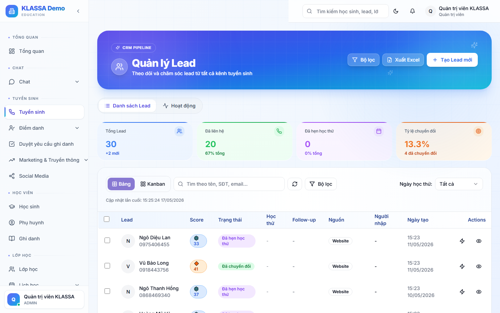

# Phễu tuyển sinh — theo dõi giai đoạn

## Phễu tuyển sinh là gì?

Phễu (funnel) là cách phần mềm hiển thị **Lead theo từng giai đoạn** — giống như rót nước qua phễu, mỗi tầng số lượng ít dần đi vì có khách rơi giữa chừng.

5 giai đoạn chuẩn:

1. **Mới** — vừa tiếp nhận, chưa liên hệ
2. **Đã liên hệ** — tư vấn viên đã gọi / nhắn
3. **Đã hẹn** — khách đồng ý đến trung tâm hoặc học thử
4. **Đã đến** — khách đã đến trung tâm xem trực tiếp
5. **Đã chuyển đổi** — khách đăng ký và đóng học phí

Ngoài ra có 2 trạng thái phụ:

- **Đang theo dõi** — khách chưa quyết định, hẹn liên hệ lại
- **Không quan tâm** — khách từ chối, đóng Lead

## Khi nào dùng

- Tư vấn viên kéo Lead qua các tầng khi tiến độ thay đổi
- Quản lý nhìn phễu để biết khâu nào đang tắc
- Báo cáo cuối tháng cho chủ trung tâm

## Cách dùng

### Mở trang Phễu

Vào **Tuyển sinh → Phễu** từ menu trái.

### Đọc số liệu phễu

Mỗi tầng có 2 con số:

- **Số Lead** đang ở tầng đó
- **Tỷ lệ chuyển tiếp** (%) — bao nhiêu phần trăm Lead tầng trước qua được tầng này

Ví dụ: tầng "Đã hẹn" có **30 Lead** với tỷ lệ **60%** — nghĩa là 60% Lead đã liên hệ đồng ý đặt hẹn.

### Kéo Lead giữa các tầng

Bấm vào một Lead → giữ chuột → kéo sang tầng khác. Phần mềm tự cập nhật ngay và yêu cầu anh chị **ghi chú lý do** (tuỳ chọn).

## Mẹo đọc phễu

**Tỷ lệ thấp ở đâu = vấn đề ở đó.**

- "Mới → Đã liên hệ" thấp = tư vấn viên không kịp gọi (cần tuyển thêm hoặc giảm Lead)
- "Đã liên hệ → Đã hẹn" thấp = kịch bản tư vấn yếu, cần luyện lại nhân viên
- "Đã đến → Đã chuyển đổi" thấp = giá không cạnh tranh hoặc dịch vụ chưa đủ thuyết phục

## Câu hỏi thường gặp

**Tôi muốn thêm giai đoạn riêng (ví dụ "Đã tặng voucher"), được không?**
Hiện tại 5 giai đoạn cố định. Có thể dùng **Ghi chú** trên từng Lead để theo dõi thông tin phụ.

**Lead bị "kẹt" ở một tầng quá lâu, làm sao biết?**
Phần mềm tự gắn nhãn ⚠ cho Lead đã ở một tầng >7 ngày không di chuyển. Lọc theo nhãn này để xử lý nhanh.
