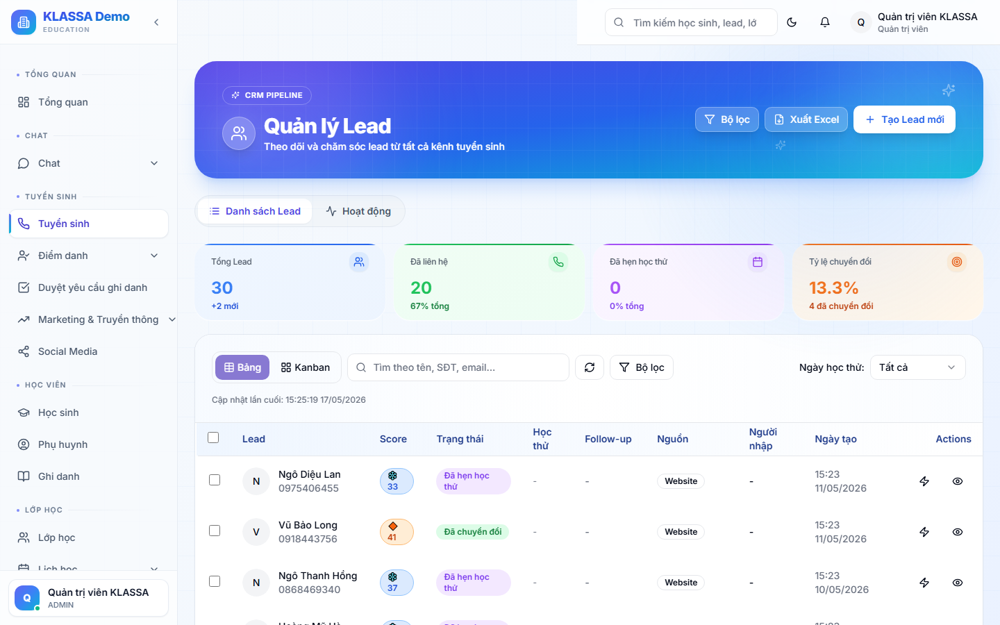
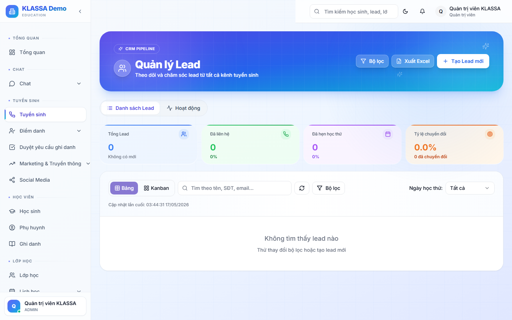

# Tạo Lead mới

## Khi nào dùng

- Phụ huynh vừa gọi điện đến trung tâm hỏi thông tin → ghi vào hệ thống ngay
- Khách nhắn Zalo → lễ tân tạo Lead để theo dõi
- Khách đến trung tâm xem trực tiếp → ghi nhận luôn để không quên gọi lại
- Tự nhập danh sách Lead từ file Excel (ví dụ kết quả chạy quảng cáo)

**Quy tắc vàng**: bất kỳ ai chạm đến trung tâm dù chỉ một lần đều nên có một Lead trong hệ thống. Lead không tốn chi phí, mất khách mới tốn.

## Cách 1 — Tạo thủ công (1 khách)

### Bước 1 — Mở form thêm mới

Tại trang **Danh sách Lead**, bấm nút **"+ Thêm Lead"** ở góc trên bên phải.

### Bước 2 — Điền thông tin

Một cửa sổ hiện ra với các trường:

#### Thông tin bắt buộc (có dấu *)

- **Họ tên khách / phụ huynh** — ví dụ "Nguyễn Văn A"
- **Số điện thoại** — bắt đầu bằng 0, ví dụ "0987654321"

#### Thông tin nên điền (không bắt buộc nhưng có ích)

- **Email** — để gửi tài liệu hoặc thông tin khoá học
- **Tên học sinh** — nếu khác tên người đăng ký (phụ huynh đăng ký cho con)
- **Lớp / Khối lớp** — ví dụ "Lớp 9", "Lớp 12"
- **Môn quan tâm** — Toán, Tiếng Anh, Văn… chọn từ danh sách có sẵn
- **Khoá học cụ thể** — nếu khách hỏi một khoá xác định
- **Nguồn Lead** — Facebook Ads, Zalo, Khách giới thiệu, Tự đến…
- **Ghi chú** — bất kỳ thông tin nào khác đáng nhớ ("Khách cần xem trực tiếp trước", "Hẹn gọi lại sau 19h")

### Bước 3 — Gán tư vấn viên (tuỳ chọn)

Nếu trung tâm chia ca trực, chọn **tư vấn viên** phụ trách Lead này. Nếu không chọn, Lead sẽ được gán mặc định cho người đang đăng nhập (chính là anh chị).

### Bước 4 — Bấm "Lưu"

Lead mới sẽ xuất hiện ngay đầu danh sách với trạng thái **"Mới"**. Phần mềm tự thông báo cho tư vấn viên được giao.

## Cách 2 — Nhập hàng loạt từ Excel

Phù hợp khi trung tâm vừa nhận file kết quả quảng cáo (hàng chục, hàng trăm Lead).

### Bước 1 — Bấm "Nhập từ Excel"

Tại trang **Danh sách Lead**, bấm vào nút **"Nhập từ Excel"** kế bên nút "+ Thêm Lead".

### Bước 2 — Tải file mẫu

Bấm **"Tải file mẫu"** để tải về file Excel chuẩn. Mở file, điền dữ liệu theo các cột có sẵn (không đổi tên cột, không xoá hàng tiêu đề).

### Bước 3 — Tải file đã điền lên

Bấm **"Chọn file"**, chọn file Excel đã điền. Phần mềm sẽ:

- Kiểm tra dữ liệu (số điện thoại có đúng định dạng không, có trùng Lead cũ không…)
- Hiển thị bản xem trước
- Cho anh chị xác nhận trước khi lưu

### Bước 4 — Xác nhận

Nếu mọi thứ ổn, bấm **"Nhập"**. Các Lead trong file sẽ được thêm vào hệ thống đồng loạt.

## Lưu ý

- **Số điện thoại trùng**: phần mềm cảnh báo nếu SĐT đã có trong hệ thống. Có thể là khách quay lại lần 2 — kiểm tra xem nên tạo Lead mới hay cập nhật Lead cũ.
- **Đừng để trống "Nguồn Lead"**: sau này anh chị cần biết kênh quảng cáo nào hiệu quả nhất để phân bổ ngân sách.
- **Tên môn không có trong danh sách?** Quản trị viên có thể thêm môn mới trong **Cài đặt → Môn học**.
- **Nhập lại Lead cũ**: nếu khách đã tư vấn nhưng không đăng ký, sau vài tháng quay lại — đừng tạo Lead mới, mở Lead cũ rồi đổi trạng thái về "Mới" để theo dõi lại.

## Câu hỏi thường gặp

**Tôi vừa tạo Lead nhưng không thấy trong danh sách, sao vậy?**
Kiểm tra bộ lọc — có thể danh sách đang lọc theo "Giai đoạn" hoặc "Tư vấn viên" nên Lead mới bị ẩn. Xoá tất cả bộ lọc, Lead sẽ hiện ra.

**Tạo nhầm Lead, xoá đi được không?**
Được, nhưng chỉ Quản lý trở lên mới xoá được. Tư vấn viên có thể đánh dấu Lead là **"Không hợp lệ"** thay vì xoá — vẫn ghi nhận để báo cáo.

**Tôi đã lưu Lead nhưng vẫn muốn sửa thông tin, làm sao?**
Bấm vào Lead trong danh sách → mở trang chi tiết → bấm nút **"Sửa"** ở góc trên bên phải.

**Có cách nào để khách tự điền form Lead trên web không?**
Có. Trung tâm có thể tạo form đăng ký riêng và nhúng vào website. Xem hướng dẫn trong mục **Cài đặt → Form thu Lead**.
