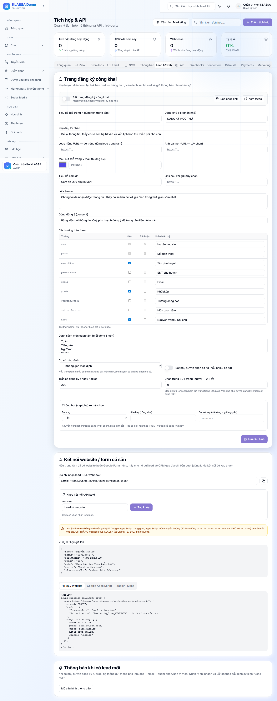
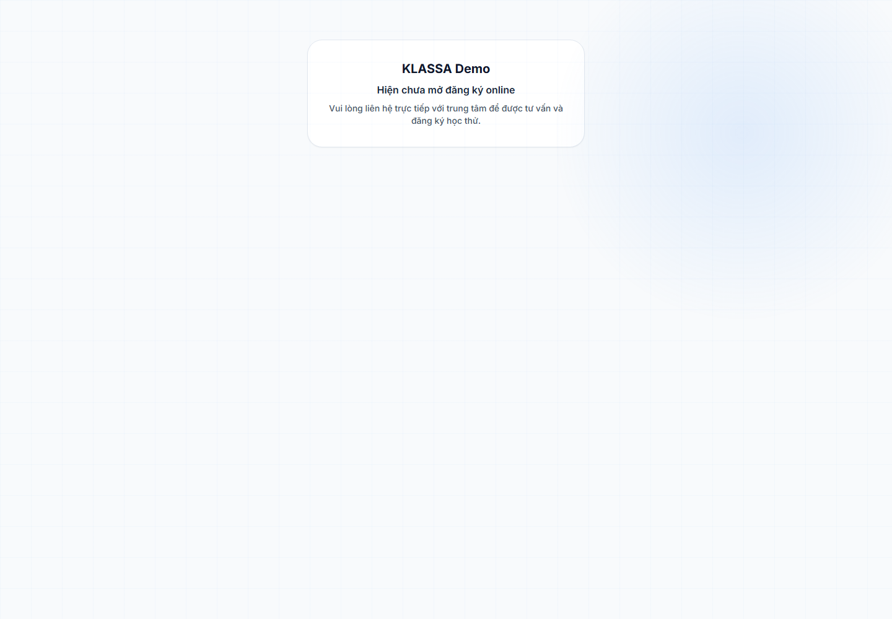

# Thu lead từ web (form đăng ký công khai)

## Khái niệm

KLASSA có sẵn **trang đăng ký công khai** để phụ huynh tự điền thông tin từ website / quảng cáo → tự động tạo **Lead** trong hệ thống mà không cần nhân viên nhập tay.

- **Trang công khai**: `/dang-ky-hoc-thu` (không cần đăng nhập) — phụ huynh điền họ tên con, SĐT, môn quan tâm…
- **Cấu hình** trang này tại: **Tích hợp & API** (`/integrations`) → tab **"Lead từ web"**.

> Khác Lead thường (nhân viên nhập): lead từ web là khách **chủ động liên hệ trước**, mức quan tâm cao hơn — cần gọi lại nhanh.

## Bước 1 — Cấu hình trang đăng ký

Vào **Tích hợp & API** → tab **"Lead từ web"**.

Tại đây tuỳ biến:

- **Bật/tắt** trang đăng ký công khai
- **Thương hiệu** (logo, tiêu đề, lời mời) hiển thị trên trang
- **Các trường** muốn thu (tên con, khối lớp, môn quan tâm, SĐT phụ huynh…) — bật/tắt + đặt bắt buộc
- **Môn học** cho phụ huynh chọn
- **Chống spam** (giới hạn, xác thực)
- **Webhook** — đẩy lead sang hệ thống ngoài nếu cần

## Bước 2 — Phụ huynh điền form

Gửi link `/dang-ky-hoc-thu` (hoặc nhúng vào website / chạy quảng cáo trỏ về). Phụ huynh điền và gửi → KLASSA tạo Lead mới với nguồn ghi rõ "từ web", đồng thời kích hoạt sự kiện **"Lead mới"** trong hệ thống thông báo (nhân viên trực nhận cảnh báo).

## Bước 3 — Xử lý lead mới

Lead từ web vào thẳng [Danh sách Lead](danh-sach-lead.md) với giai đoạn "Mới". Tư vấn viên gọi lại, đẩy qua [phễu tuyển sinh](pheu-tuyen-sinh.md), rồi [chuyển thành học sinh](chuyen-lead-thanh-hoc-sinh.md) khi đăng ký.

## Lưu ý

- **Phản hồi nhanh**: lead càng tươi càng dễ chuyển đổi — nên gọi trong vòng 30 phút.
- **Chống spam**: nếu form công khai, bật giới hạn/xác thực trong tab "Lead từ web" để tránh bot.
- Lead từ web tính vào **báo cáo phễu theo nguồn** — đo hiệu quả kênh website/quảng cáo.

## Câu hỏi thường gặp

**Làm sao đưa form lên website trung tâm?**
Dùng thẳng link `/dang-ky-hoc-thu` (gửi Zalo / gắn nút trên website / trỏ quảng cáo về). Cấu hình giao diện trong tab "Lead từ web".

**Phụ huynh điền sai SĐT thì sao?**
Lead vẫn được tạo. Khi gọi không liên hệ được, đổi trạng thái Lead sang "Không hợp lệ".

**Lead từ web có tự thành học sinh không?**
Không. Lead từ web vẫn cần tư vấn rồi [chuyển thành học sinh](chuyen-lead-thanh-hoc-sinh.md) thủ công như lead thường.
