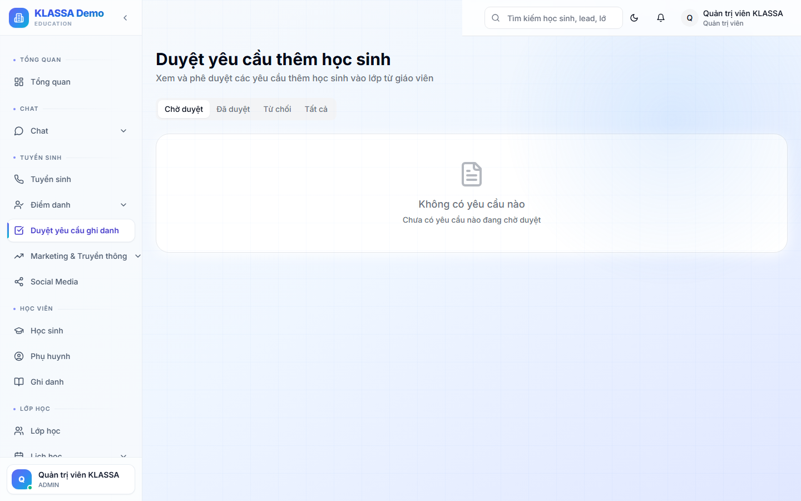

# Yêu cầu đăng ký từ form web

## Khái niệm

Phụ huynh điền **form đăng ký** trên website trung tâm hoặc trang Facebook → thông tin tự động chuyển vào KLASSA dưới dạng **"Yêu cầu đăng ký"** chờ duyệt.

Khác với Lead thường (do nhân viên nhập): yêu cầu đăng ký là khách **chủ động liên hệ trước**, mức quan tâm thường cao hơn.

## Khi nào dùng

- Khách điền form trên web → cần xử lý nhanh trong vài giờ
- Trung tâm chạy quảng cáo + landing page có form → xử lý hàng loạt
- Khách quét QR code ngoài trung tâm điền nhanh

## Cách dùng

### Mở danh sách yêu cầu

Vào **Cài đặt → Yêu cầu đăng ký** (hoặc Tuyển sinh nếu menu được tuỳ chỉnh).

### Trạng thái yêu cầu

- **Chờ duyệt** — vừa nhận, chưa xử lý
- **Đã chấp nhận** — đã tạo Lead trong hệ thống
- **Đã từ chối** — không quan tâm (ví dụ trẻ không đúng độ tuổi)
- **Spam** — đánh dấu thông tin giả

### Xử lý 1 yêu cầu

Bấm vào yêu cầu → xem:

- Thông tin khách điền
- Nguồn (URL form, ngày gửi)
- Có trùng SĐT với Lead cũ không

Bấm nút:

- **✅ Chấp nhận** — tạo Lead mới, tự gán giai đoạn "Mới"
- **❌ Từ chối** — đóng yêu cầu, ghi lý do
- **🚫 Đánh dấu Spam** — nếu thông tin rõ ràng giả mạo

### Tự động chấp nhận

Trong **Cài đặt → Form web**, có thể bật **"Tự động chấp nhận tất cả yêu cầu"** — khi đó form web sẽ trực tiếp tạo Lead, bỏ qua bước duyệt.

Nên dùng khi:

- Trung tâm đã quen với việc nhận Lead, không sợ spam
- Tư vấn viên có lịch gọi điện ngay khi Lead xuất hiện

## Lưu ý

- **Phản hồi nhanh**: Lead càng tươi càng dễ chuyển đổi — nên gọi trong vòng 30 phút sau khi nhận yêu cầu.
- **Lọc spam**: nếu form công khai, có thể nhận spam bots — bật reCAPTCHA hoặc duyệt thủ công.

## Câu hỏi thường gặp

**Làm sao gắn form vào website của trung tâm?**
Trong **Cài đặt → Form web** có sẵn đoạn code HTML để nhúng. Hoặc dùng link công khai gửi qua Zalo.

**Phụ huynh điền sai SĐT, tôi xử lý sao?**
Vẫn chấp nhận yêu cầu, tạo Lead. Khi gọi không liên hệ được, đổi trạng thái Lead sang "Không hợp lệ".
